# Preferences and Customization

Marva has a large number of preference options that you can use to customize and individualize the Marva experience.

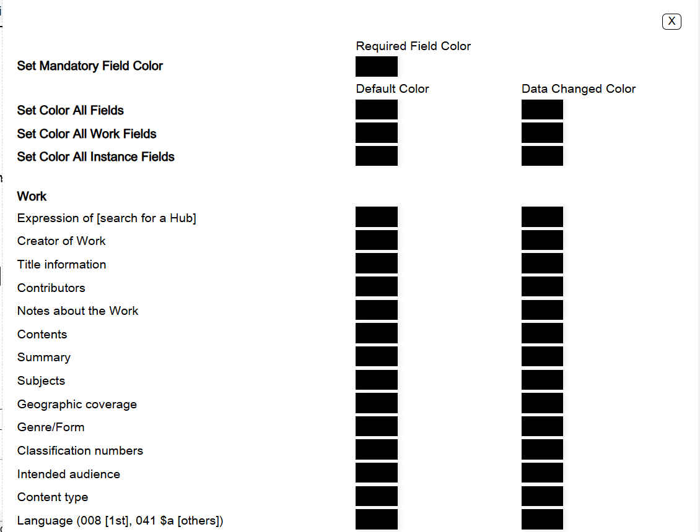

## ScriptShifter, Diacritic Macros, Text Macros

See [Appendix C: ScriptShifter](./c-scriptshifter.md) for ScriptShifter details. Diacritic Macros and Text Macros are also accessible under Preferences in the Navigation Bar.

## Field Colors

Field colors are used to customize individual components in Marva. For example, you can set a mandatory field color that will distinguish between BIBFRAME entities, for example Work and Instance. The default color is black.

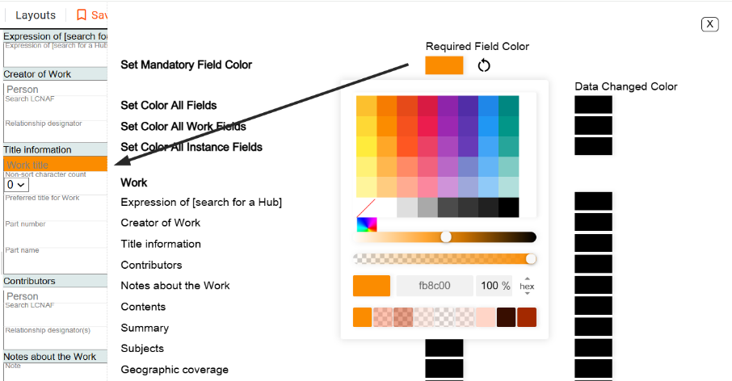

### Set Mandatory Field Color

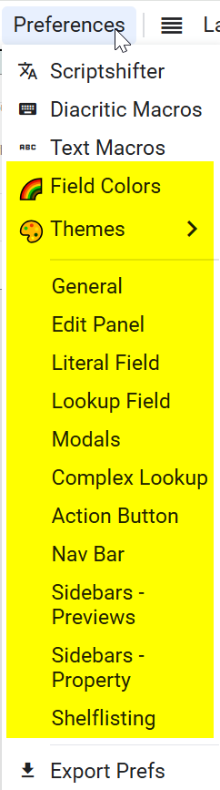

This will let you use a color of your choice as the background font for mandatory fields. Click on the Required Field Color icon and a palette will pop up from which you can choose the required field color. Only the required fields for the profile you selected will be in the color you chose.

If you want to change back to the default color black, click on the undo icon (the circle with the arrow).

### Set Color All Fields

#### Default Color

This option will set the background color for all the components in all the profiles you are working with.

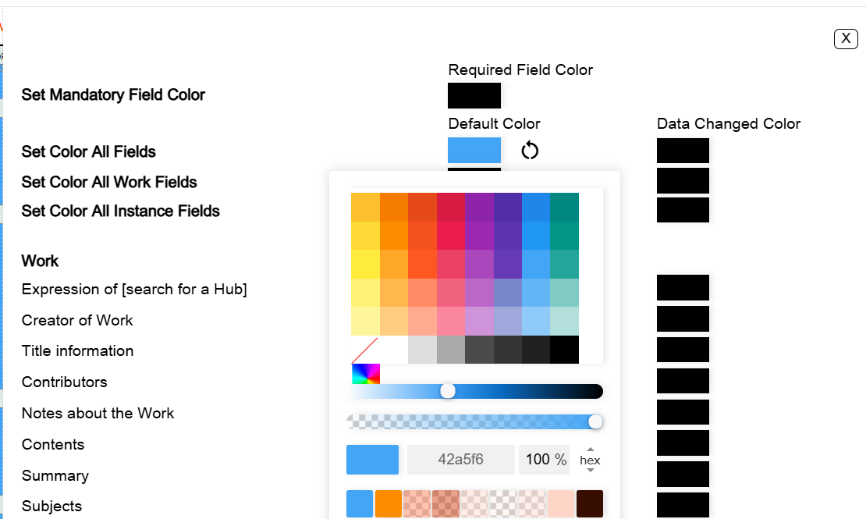

Click on the Default Color icon and a palette will pop up from which you can choose the default component color.

If you want to change back to the default color black, click on the undo icon (the circle with the arrow).

#### Data Changed Color

This option will change the color of the component or field that you have populated with data.

Click on the Default Color icon and a palette will pop up from which you can choose the default component color.

If you want to change back to the default color black, click on the undo icon (the circle with the arrow).

### Set Color All Work Fields

#### Default Color

This option will set the background color for all Work components.

Click on the Default Color icon and a palette will pop up from which you can choose the default Work component color.

If you want to change back to the default color black, click on the undo icon (the circle with the arrow).

#### Data Changed Color

This option will change the color of the Work component or field that you have populated with data.

Click on the Data Changed Color icon and a palette will pop up from which you can choose the default component color for Work components that you have populated with data.

If you want to change back to the default color black, click on the undo icon (the circle with the arrow).

### Set Color All Instance Fields

#### Default Color

This option will set the background color for all Instance components.

Click on the Default Color icon and a palette will pop up from which you can choose the default Instance component color.

If you want to change back to the default color black, click on the undo icon (the circle with the arrow).

#### Data Changed Color

This option will change the color of the Instance component or field that you have populated with data.

Click on the Data Changed Color icon and a palette will pop up from which you can choose the default component color for Instance components that you have populated with data.

If you want to change back to the default color black, click on the undo icon (the circle with the arrow).

### Work Components and Instance Components

These options allow you to set background colors for each Work and Instance component, and to set colors for each component or field that you have populated with data.

#### Default Color

This option will set the background color for the components that you select.

Click on the Default Color icon and a palette will pop up from which you can choose the default component color for any Work or Instance component that you have populated with data.

If you want to change back to the default color black, click on the undo icon (the circle with the arrow).

#### Data Changed Color

This option will change the color of the components that you select when you have populated the component with data.

Click on the Data Changed Color icon and a palette will pop up from which you can choose the default component color for any Work or Instance component that you have populated with data.

If you want to change back to the default color black, click on the undo icon (the circle with the arrow).

## Themes

Themes can be used to customize the entire Marva "skin."

**Default** is white background with black font.
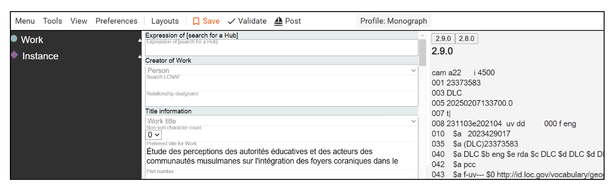

**Dark** is black background with white font.

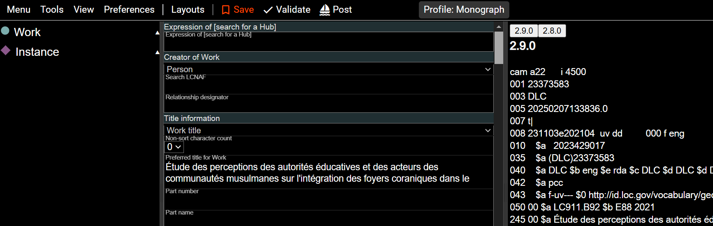

**Gray** turns the default white background to gray, but keeps the black font.

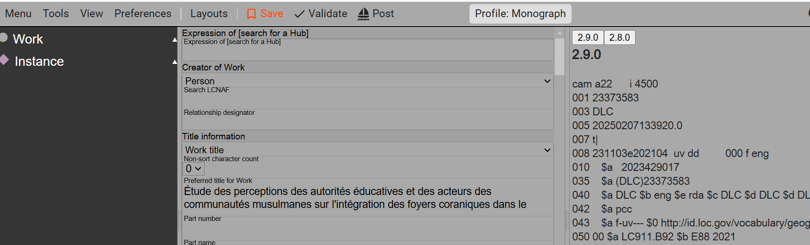

## General

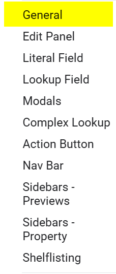

General Preferences allow you to set the view for the Work, Instance, and Item icons in the Navigation panel and as the skin color in the Edit panel. Click on the color bar to the right of each option to set the preferred color.

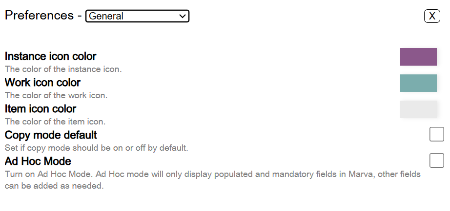

**Ad Hoc Mode** is used for reducing the number of components in Marva to those components that have data in them, and those components that are mandatory. Ad Hoc Mode is a very good way to eliminate extraneous space in Marva and to reduce scrolling. Once Ad Hoc Mode is on, if you want to add a component that is not present, it can be added by clicking on the component in the Navigation Panel.

## Edit Panel, Literal Field, Lookup Field, Modals, Complex Lookup, Action Button, and Nav Bar

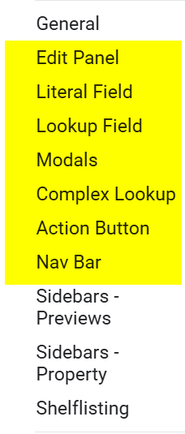

These options under the General tab allow customization of Marva views, including colors and font sizes, in a much more granular way, down to the level of each component, application, or feature.

### Edit Panel

Options for the entire Edit Panel.

### Literal Field

Options for fields that contain transcribed or recorded text.

### Lookup Field

Options for fields that use drop-down lists or searches to external vocabularies.

### Modals

Modals are interfaces for searching external vocabularies. For example, searches in the LCNAF, LCSH, or LCDGT use modals. This option in Preferences allows you to customize the way a modal looks.

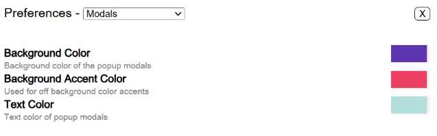

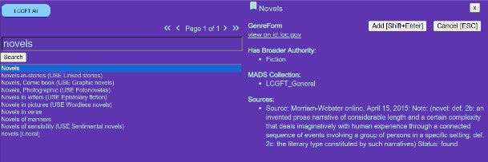

### Complex Lookup

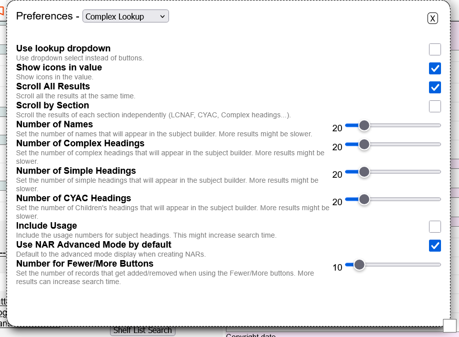

Complex Lookups are the way results show up in Modals, primarily for building pre-coordinated LCSH strings.  The options are documented in the modal.  It is here, for example, where you can customize how many results are displayed for names or subject headings.

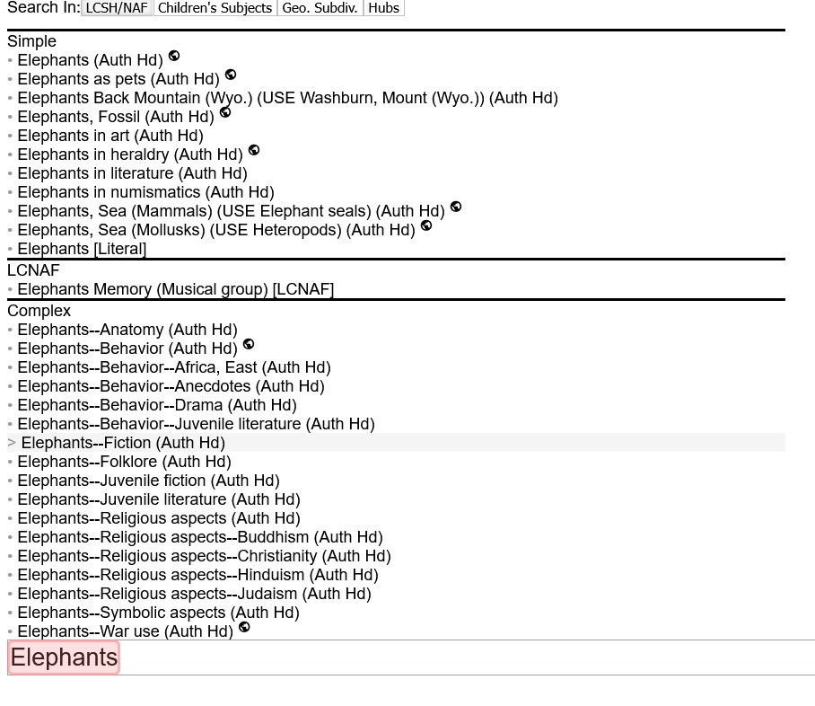

### Action Button

The Action Button is also referred to as the Lightning Bolt, because the lightning bolt is the default icon for the Action Button.

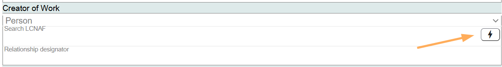

There are many configurations you can use to customize the way the Action Button looks and functions:

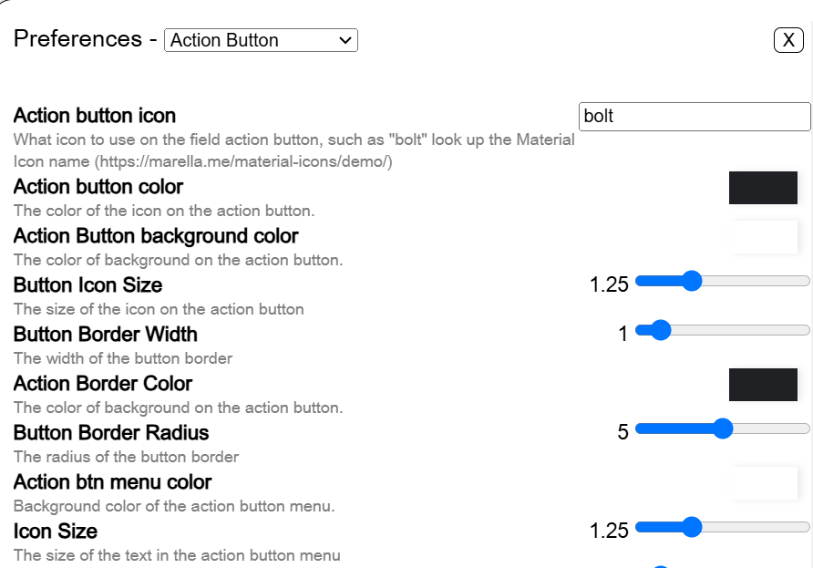

### Nav Bar

The Nav Bar is at the top of Marva.

The Nav Bar can be customized with these options:

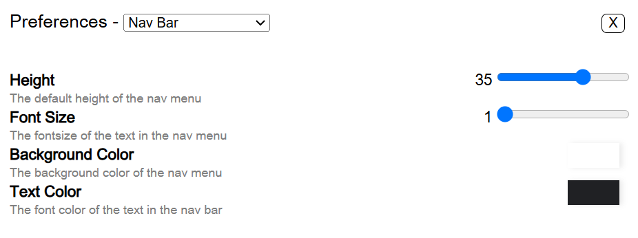

## Sidebars -- Previews, Sidebars -- Properties, and Shelflisting

### Sidebars -- Previews

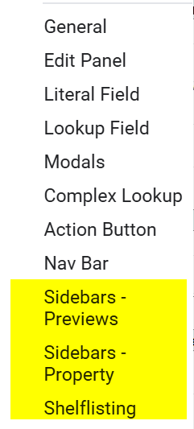

The right-hand panel in Marva is called the Preview Sidebar. A Preview can be selected from the View icon in the Nav Bar:

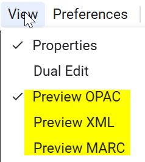

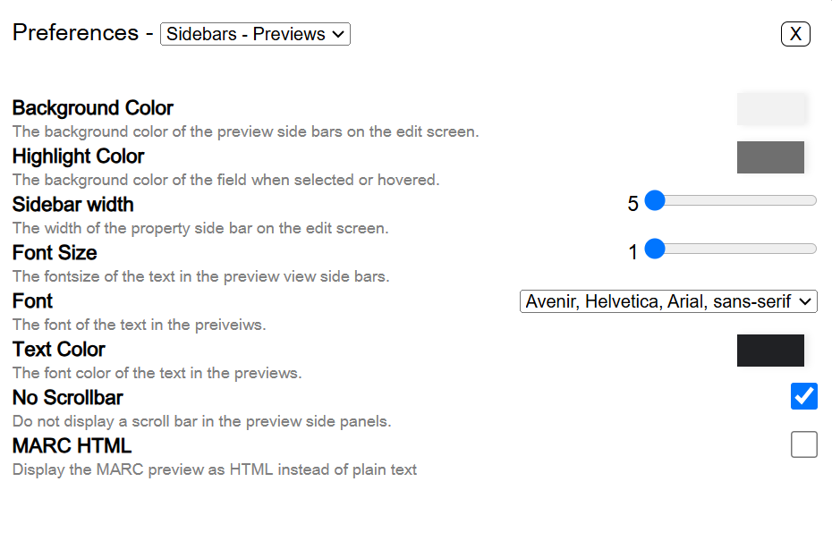

**Hint:** to wrap the Preview Sidebar, click on the MARC HTML option at the bottom of the Preferences panel.

### Sidebars -- Properties

The left-hand panel in Marva is called the Property Sidebar. The Property Sidebar can be customized using options in the Preferences panel.

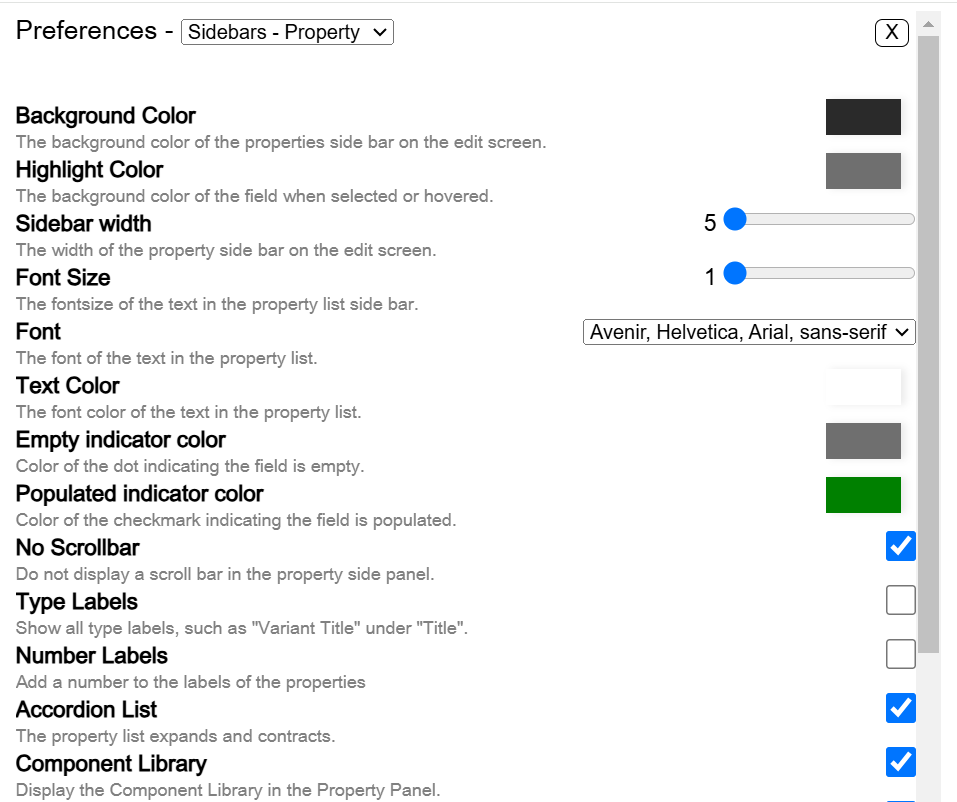

### Shelflisting

Shelflisting tools available in the Classification numbers component Tool Box can be edited here. The default documents in the Tool Box are the Cutter Table, the Biography Table, and the Translation Table. You can remove any of those documents, or add additional ones. For example, the Regions and Country Table is added here.

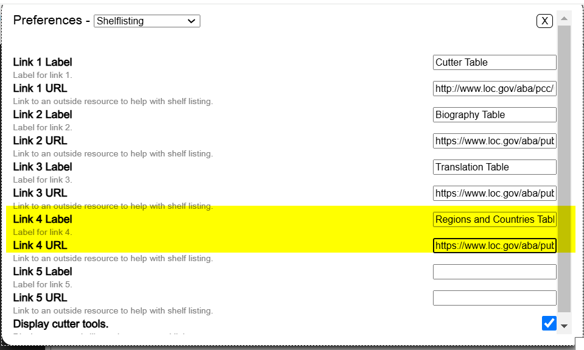

**Display Cutter Tools** is checked to show the Cutter Calculator in the Classification numbers component.

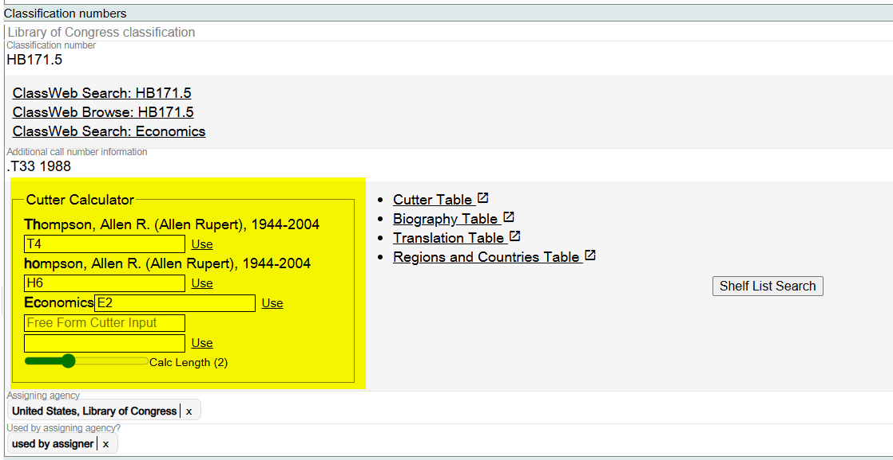

> **Note:** The Cutter Calculator only appears when there is a Creator or Title in the Work description.

## Saving Preferences

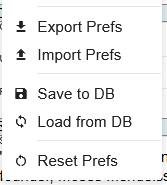

### Export Prefs

You can export a specific set of Preferences that you have created and share with other Marva users. The export will create a .json file that can be saved locally or shared.

### Import Prefs

You can import a .json file with Marva Preferences. The pop-up box that appears when you click on Import will allow you to select any or all of the Preferences in the file.

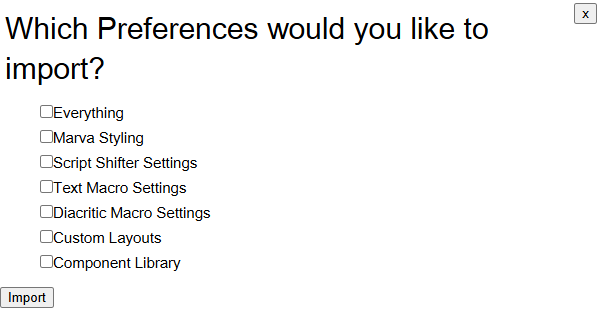

### Save to DB

You can save preferences to Marva's backend. This will maintain your preferences in Marva's database and not require managing any files locally.

Doing this will also mean that you can load your preferences into Marva if you are using another computer or browser. The preferences will be saved in the database based on your login information.

### Load from DB

If you have saved your preferences to the database, you can reload them from there as well.

## Reset Prefs

Sets all Preferences to the Marva default.

## Keeping Marva Customization

Marva has many Preference options for customization. You do not want to lose your customization when you close Marva and restart it. To prevent loss of personalized customization:

1. Remember the importance of a **Hard Refresh** (Ctrl+Shift+R)! This will generally solve most personalized customization issues.

2. Go to this address in Chrome (copy and paste into URL field):

   **chrome://settings/content/siteData**

   And make sure the first setting is selected:

   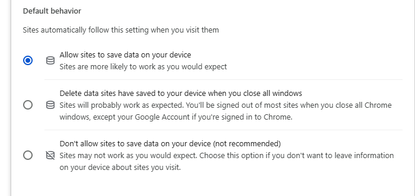

   And not the "Delete data sites" options.

### Keep in Mind

**Import Preferences:** When you Import Preferences, most preferences import as expected, but the customized Component Library will only import after a **Hard Refresh** (Ctrl+Shift+R).

**Empty Records:** "Your Records" does not show until you load at least one record.

---

[Back to Table of Contents](../index.md)
