# Configuration: Using the Component Library

The **Component Library** is a tool that allows you to save and reuse data components across records. The Component Library consists of a **Default Component Library** and a **Component Library** that you can personalize. You can use one or the other, or both. Access the Component Library in the Property Panel of Marva.

## Default Component Library

The Default Library can be added to the Property panel by checking the box at Preferences --> Sidebars -- Property.

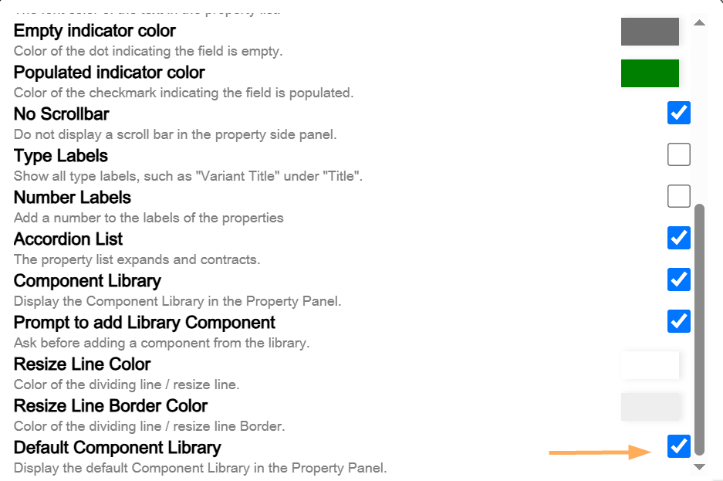

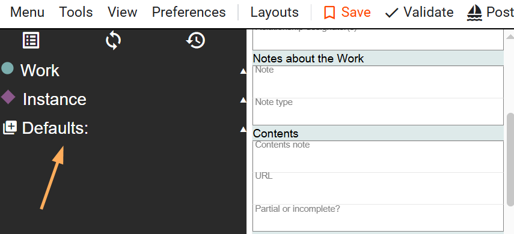

The Default Component Library contains a selection of often-used values in bibliographic descriptions. You can add these values to bibliographic descriptions by activating the values in the Component Library.

Using Add Bib/Index as an example, if you are describing a resource in Marva that has bibliographical references and index, there need to be controlled values **bibliography** and **index** in the Work entity, and a literal note **Includes bibliographical references and index** in the Instance entity. The Default Component Library can be used to populate these values with one click.

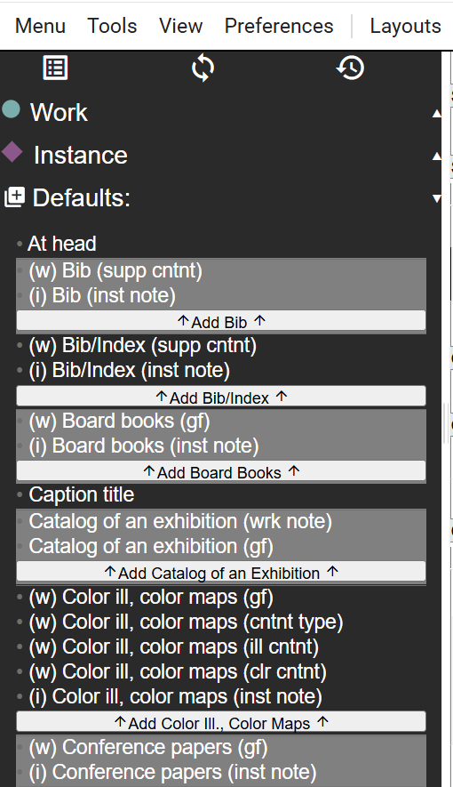

Marva will prompt you to add the Default values every time you use the Default Component Library.

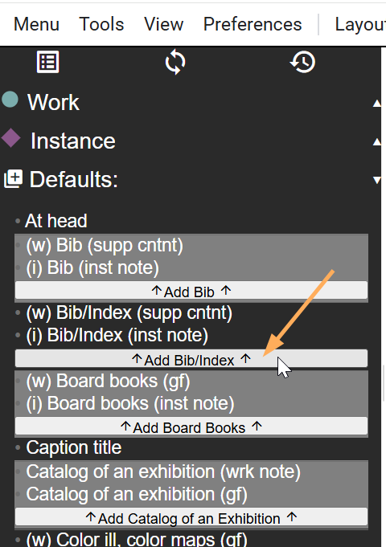

> **Note:** You can remove this prompt by unchecking the **Prompt to add Library Component** box at Preferences --> Sidebars -- Property.

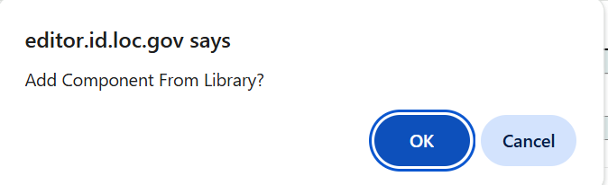

Once the Default Component Library selection is confirmed, the values are added to the description.

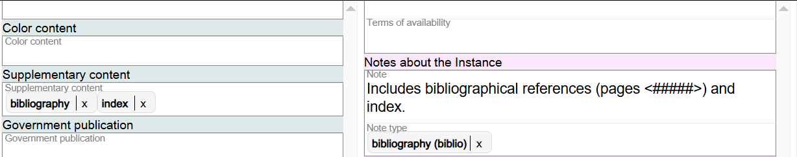

If there are pages associated with the bibliographical references, add them to the note in the Instance. If there are no pages, just delete the parenthetical information in the note.

If you just want to only add information about bibliographical references and index in the Work component, or in the Instance component, select the appropriate value from the Default Library.

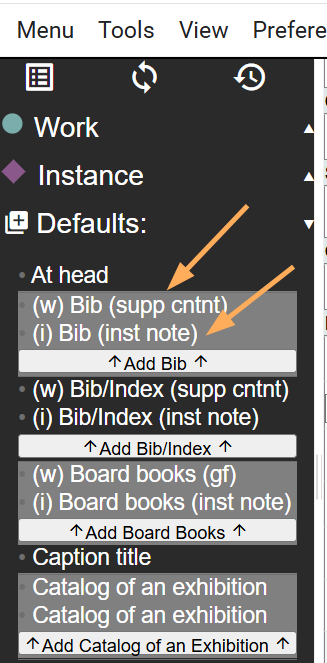

All the options in the Default Component Library are listed in the Property panel when the Default Component Library option is checked in Preferences --> Sidebars -- Property.

## Component Library

The Component Library is a customized and personalized library that you can use for standard or repeated metadata values that you use regularly in cataloging.

The Component Library can be added to the Property panel by checking the box at Preferences --> Sidebars -- Property.

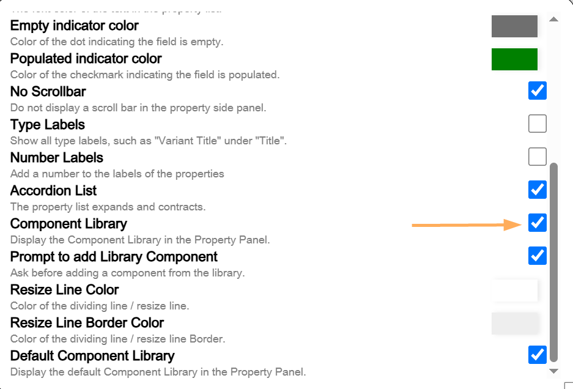

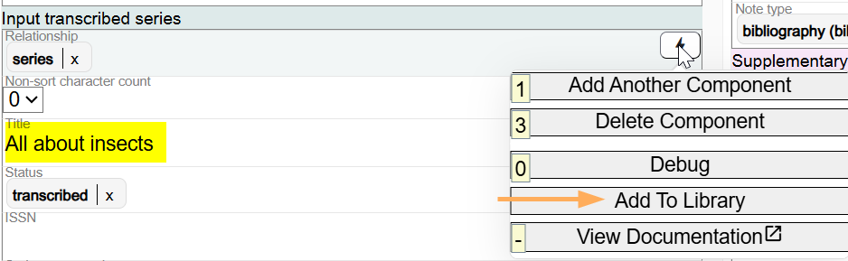

To add values to the Component Library, add the values in the Edit Panel of a bibliographic description, then use the Lightning Bolt feature to save the values to the Component Library.

For example, you are cataloging a juvenile series on insects where the series, subjects, and some of the publication information is the same for each resource.

### Step 1: Add the Series Statement

In the Edit panel of Marva, add the series statement, click on the Lightning Bolt feature, and click on Add to Library.

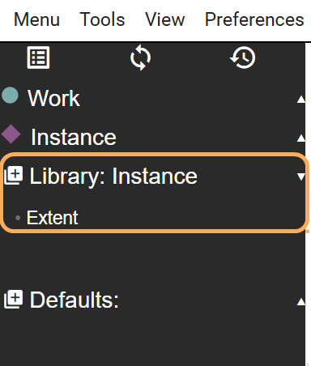

Marva will prompt you to name the component for the Library. The default name will be the name of the component. You can change that name to something else if you want.

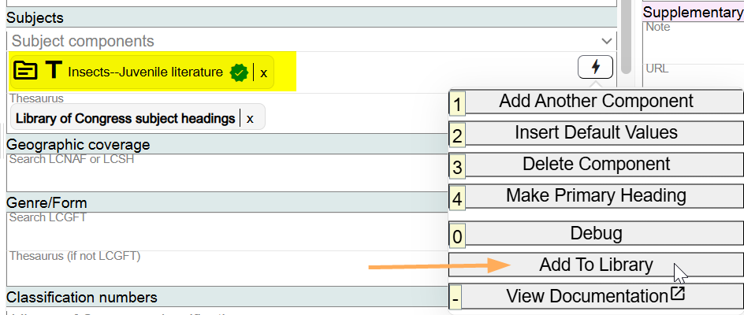

### Step 2: Add the Pre-coordinated LCSH String

In the Edit panel of Marva, add the pre-coordinated LCSH string, click on the Lightning Bolt feature, and click on Add to Library.

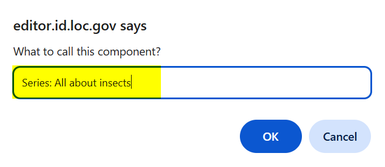

Marva will prompt you to name the component for the Library. The default name will be the name of the component. You can change that name to something else if you want.

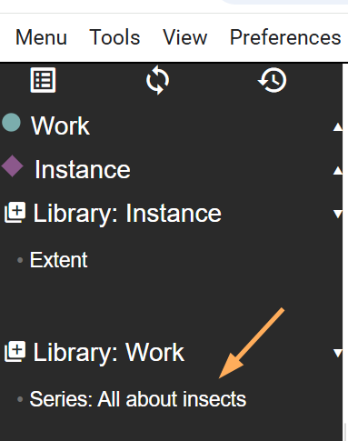

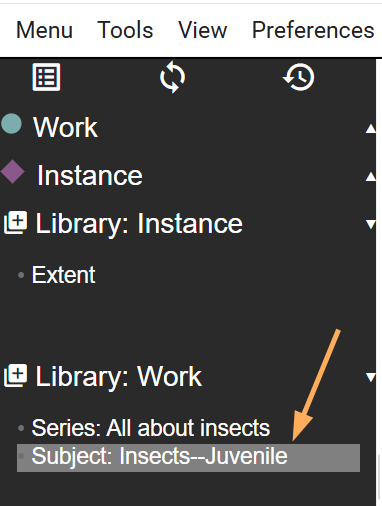

### Step 3: Add the Provision Activity Information

In the Edit panel of Marva, add the Provision Activity information, click on the Lightning Bolt feature, and click on Add to Library.

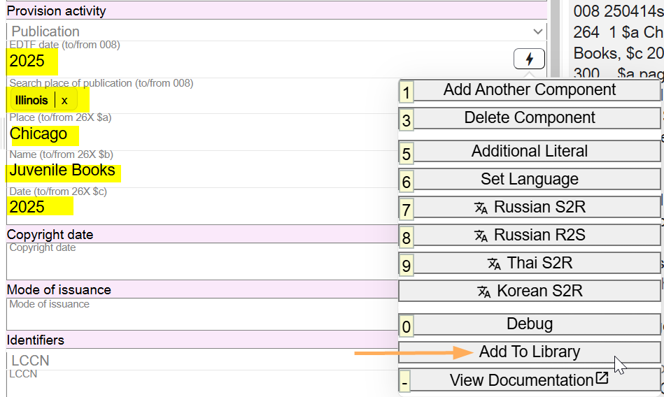

Marva will prompt you to name the component for the Library. The default name will be the name of the component. You can change that name to something else if you want.

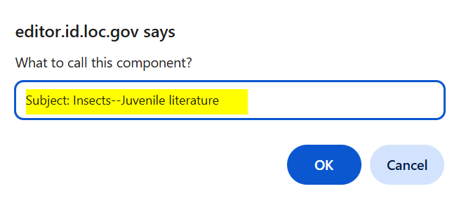

### Grouping Components

You probably will want to add all three components in one bibliographic description. To group them, select one of the components and click on the wrench icon, and select a Group letter to name the set.

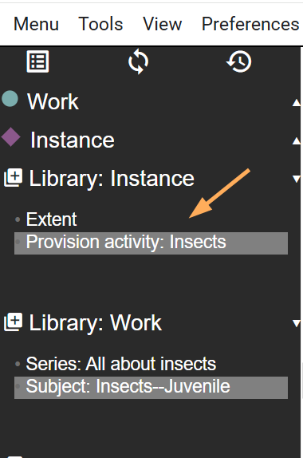

Select the second component, click on the wrench icon, and add the value to the same group. Select the third component, click on the wrench icon, and add the value to the same group.

All three values will be added to a group. Because this group contains information from the Work and the Instance, the Library will identify it as a Multi Library Component.

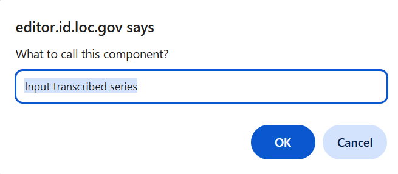

Each of the values in the group can be added separately by clicking on the value and selecting the Add Component From Library? prompt (if you have selected the option to see this prompt). To override, uncheck the box at Preferences --> Sidebars -- Property.

To add all three components in the group, click on **Add Group A** (or whatever letter you selected for the group) from the Component Library. The prompt will ask you if you want to add all three.

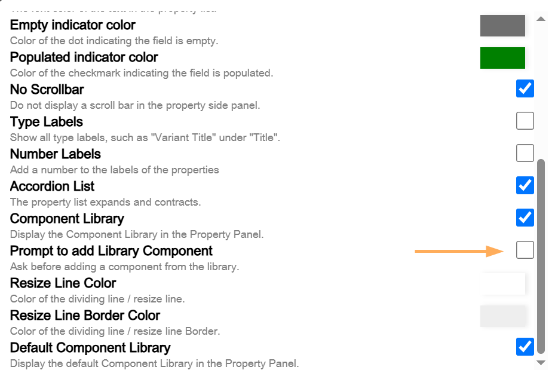

Click OK and the three components will populate the Marva description.

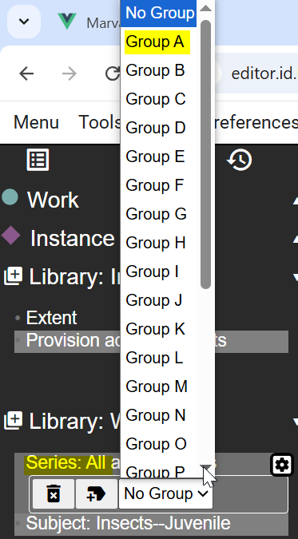

## Component Availability

Your saved components are available across all records using the same profile (e.g., components saved in a **Monograph** profile will not appear in a **Serials** profile).

## Managing Components

1. **Access the Management Menu:**
   - Hover over a component's name in the library to reveal a gear icon. Click it to manage the component.

   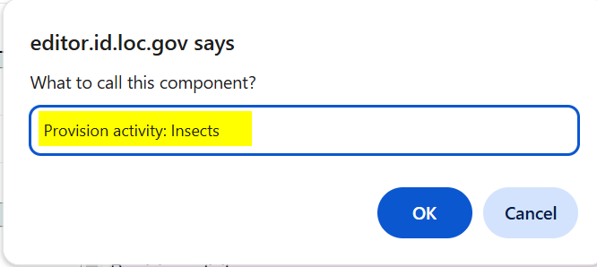

2. **Management Options:**

   - **Remove:** Delete the component from the library.

     

   - **Rename:** Change the name of the component.

     

   - **Assign to a Group:** Group multiple components together to add them all at once.

---

[Back to Table of Contents](../index.md)
