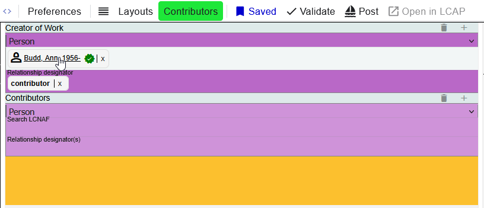
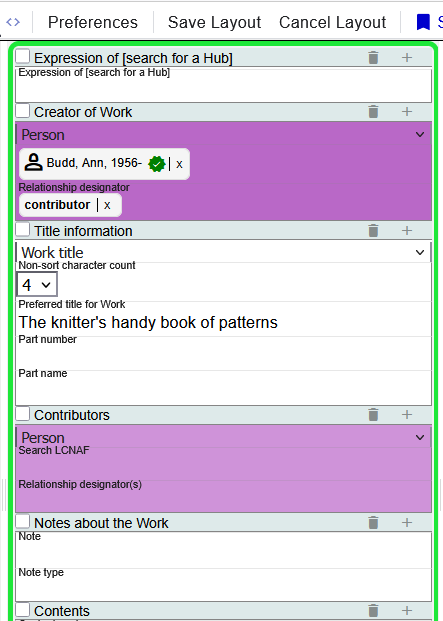
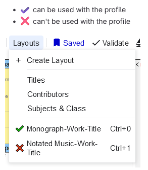

# Layouts
Layouts provide a way to group and display components to help a cataloger get to enter the data more quickly. When a layout is selected on the components that belong to that layout will be displayed.

They are available in the navigation under `Layouts`. There are 3 layouts available by default:
1) Titles: contains the title components in the `Work` and `Instance`
2) Contributors: contains the Primary Contributor and the Contributors in the `Work`
3) Subjects & Class: contains Subject and classification components

Selecting one will turn on the layout. The name of the layout appears in Green to the right of the `Layout` option.

### Turn off a Layout
To turn a layout off, press the  button. There is also a shortcut to turn off the current active layout: `ctrl+backspace`. 

Alternatively, you can select another layout to switch to it. You'll only see the fields in the new layout, but the data from the old layout will still be in Marva, only hidden.

## Custom Layouts
In addition to the default layouts, it is possible to create a custom layout. Custom layouts are Profile specific. If you create a layout for a Monograph, it will not work with Notated Music

### Creating a Custom Layout
Menu: `Layouts` > `+ Create Layout`

When creating a custom layout, there will be a green border around the form in Marva and each component will have a check box next to it. Any other panel will become slightly opaque, but can still be interacted with.

The `Layouts` option in the navigation menu is replaced with `Save Layout` and `Cancel Layout`

Use the check boxes to select the components you want to include in the layout. When you are done, select `Save Layout`. You'll be prompted to name the layout. Otherwise, if you want to stop working on the layout, you can use `Cancel Layout`.

Once created, the custom layout will appear under the `Layouts` menu. They can be accessed by clicking on them, or using the shortcut.

Below there are 2 custom layouts. The icon to the left of the name indicates if it can be used with the current Profile.

### Edit/Delete a Custom Layout
If you need to make a change to a custom layout or delete one, select that layout. This will change `+ Create Layout` to `Edit Layout` and `Delete Layout`.

`Delete Layout` will ask if you are sure. Selecting `OK` will remove it.

`Edit Layout` will behave like `Create Layout` except the components that are part of that layout will be preselected. When you've made the change you want to make click `Save Layout`. You'll be asked to provide a name just like when creating a layout from scratch, but this time the name of the layout will prepopulate the field. If you keep the name the same, the new layout will override the existing one. However, if you change the name, you'll keep the original and have this new layout. This could be useful if you need layouts that are similar. You can create 1, edit it and save with a different name.