# Save, Validate, Post, and send to LCAP

## Save 

Saves a draft of your record within Marva. Your updates will not be added to the BFDB until the record is posted 

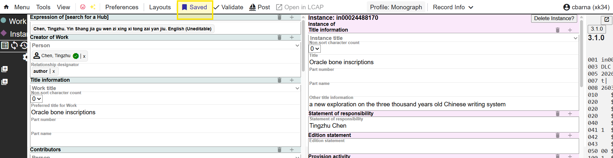

You can also select the Auto Save option which will automatically save your record as you type. You can find this option in Preferences--General

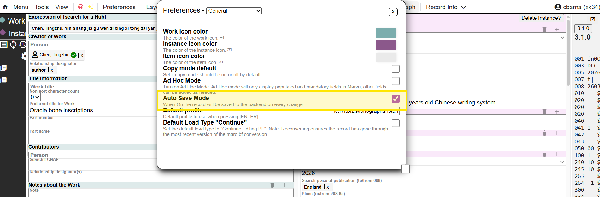

You can retrieve the record from the Records panel on the main site

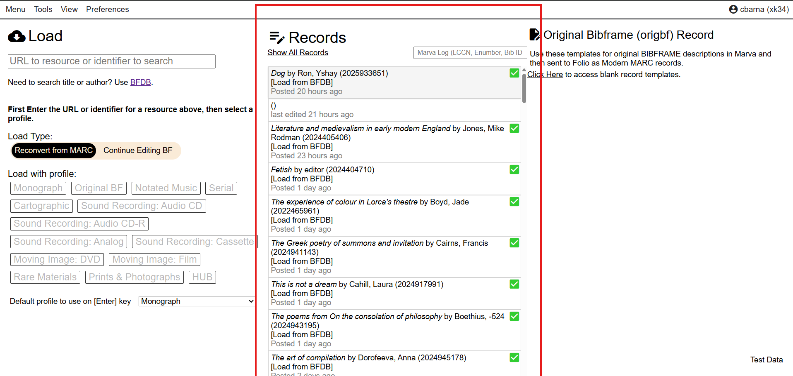

## Validate

This tool looks for empty fields and missing field values. Records can be saved even if the system generates a warning. If there are no issues, you will get a success message

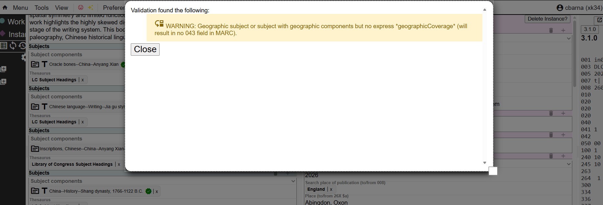

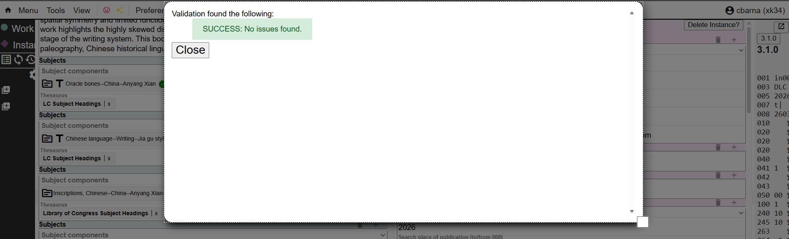

## Post

Sends the record to the BFDB. Once a record has been posted to BFDB, a pop-up message confirms that the record has been updated in BFDB. To continue processing your record in Folio, you can either click Open in LCAP from the pop-up hyperlink or from the Marva tool bar. Note if you exit the record, you will need to repeat the save, validate, post process in order to open the record in Folio from Marva 

The Post button will change to a green checkmark to show that the record has been posted

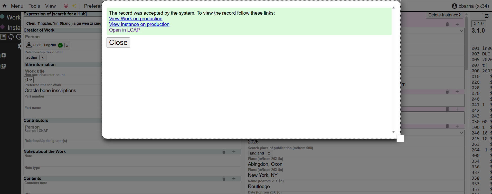

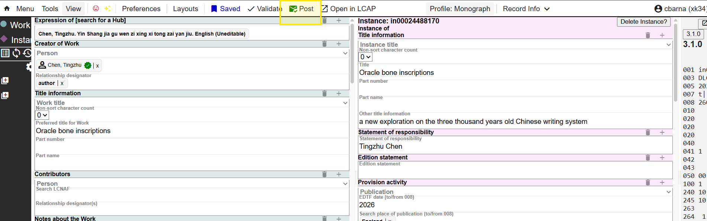

## Send to LCAP

Be sure to Save, Validate, and Post the description before you send it back to Folio as a Modern MARC record.

There are two ways to get the BIBFRAME description back to Folio as a Modern MARC record:

#### Method 1: Marva Import App

Use the Marva Import app in the LCAP Productivity Toolkit to send the description back to Folio. Use the Local Identifier in the Marva Import app. You can find the Local Identifier in the Admin Metadata components in Marva.

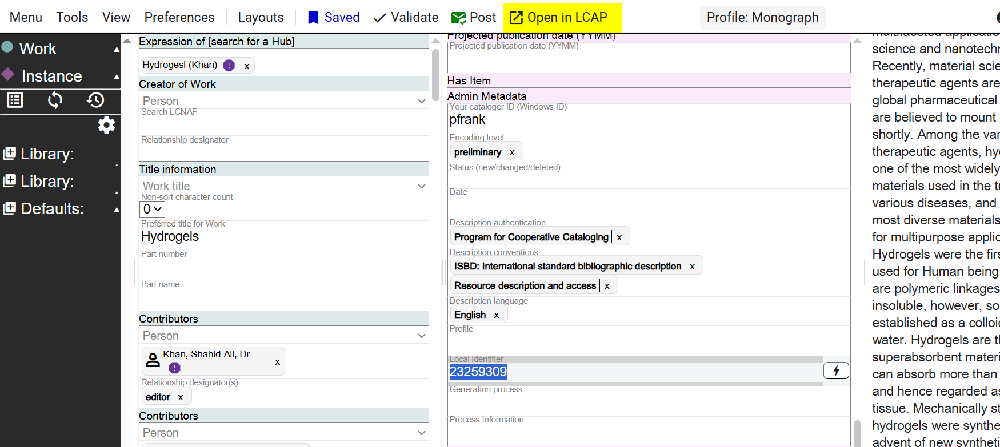

> **Tip:** even though it will look like you can't copy the Local Identifier, you actually can copy it for pasting into the Marva Import app.

#### Method 2: Open in LCAP

Click on the **Open in LCAP** icon in the Navigation Bar.

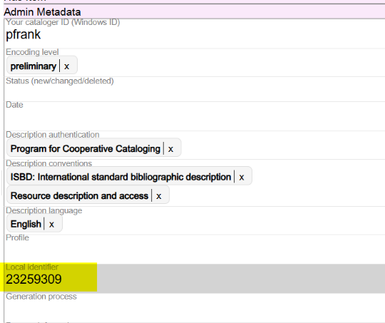

Whichever method you use, both the original MARC record and the Modern MARC record will appear together in a single window in the Productivity Toolkit. This is not the Folio Inventory app!

### Comparing Records in the Productivity Toolkit

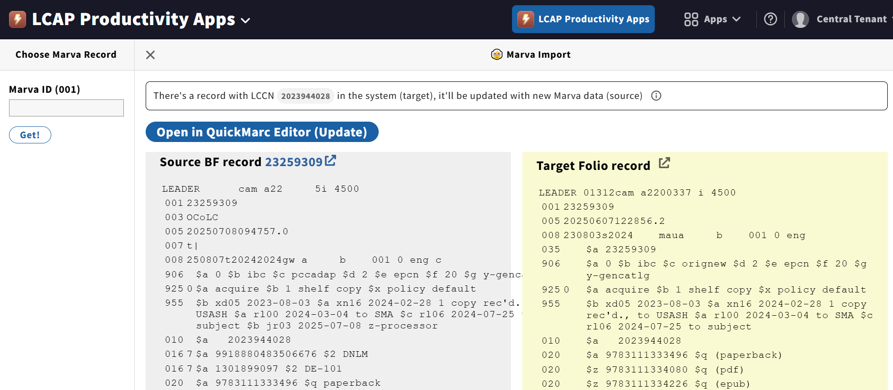

Compare the two versions of the record, and when you are satisfied with the Modern MARC version, click on Open in QuickMARC Editor (Update). You can't edit or save the Modern MARC record in this Productivity Toolkit view.

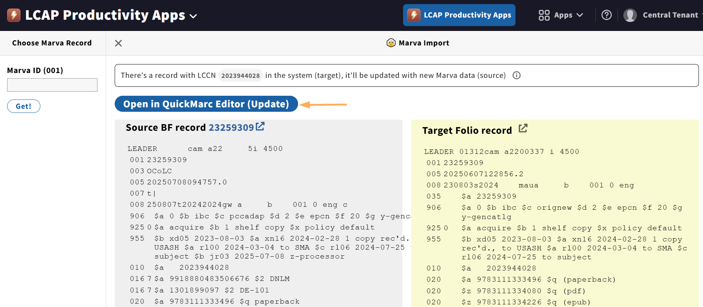

### Completing the Record in Folio

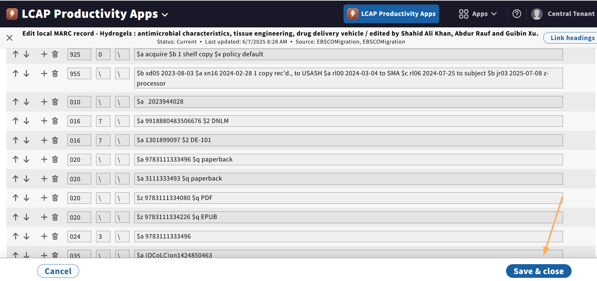

This image shows the record in the Folio Inventory app.

Complete Holdings and Items in Folio.

