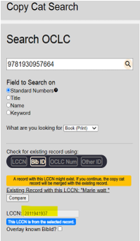

# Copy cataloging and cdsdel records

If there is a copycat record in Folio that has an ISBN, but the record does not exist in the BFDB:

1.	In Folio, search for the record by ISBN
a.	If the resulting record has an 001 that begins with "cdsdel_"
b.	Open the bib record in Folio
c.	Delete the LCCN
d.	Save the record
2.	Derive a copy of the record
a.	Add the LCCN to the newly derived record	
b.	Save the new record
3.	Mark the original record (the one without an LCCN) for deletion
4.	Go back to MARVA Copy Cat Search
a.	In OCLC, search for the ISBN and check for an existing record by searching the LCCN

b.	If the derived record does not show up, do a record sync

Background: Over the years, various records (including many epcn records for which no books were received), were marked for deletion, and the original system numbers were replaced with numbers beginning with "cdsdel_". After the migration to Folio, these records were suppressed and were not added to BFDB.
