# Creating Name Authority Records (NARs)

The ability to create a new name authority record (NAR) in Marva was added in April 2025. NARs created in Marva will migrate to the LC/NACO Authority File (the NAF) in Folio. The synch time is approximately 10 minutes. Once a NAR is created in Marva and migrates to Folio, any updates needed to the NAR are done in Folio. NARs cannot be updated in Marva.

BIBFRAME and linked data work on the principle of providing actionable URIs for data. When an authorized access point in name authority record from the LC/NACO Authority File is used as a Creator or Contributor in Marva, a link to the URI associated with the name is added. In some cases, a name authority record in the LC/NACO Authority File will not exist for a Creator or Contributor. Minimal Level Cataloging (MLC) practices allow an access point for a Creator or Contributor to be provided without creating a supporting name authority record, as long as the access point is unique within the LC/NACO Authority File. The ability to create a name authority record in Marva was added with MLC in mind, so that these uncontrolled access points could be brought under authority control and be assigned an actionable URI.

But the Create NAR function in Marva may be used for any situation where a new name authority record is needed.

All instructions and policies that apply to NAR creation in MARC apply in Marva. Follow the guidance in the RDA Toolkit, the LC-PCC Policy Statements, the Descriptive Cataloging Manual Z1, Name and Series Authority Records, and the LC Guidelines Supplement to the MARC 21 Format for Authority Data.

---

## Accessing the Create NAR Function

Options for creating a Personal Name Authority Record in Marva are found in the Creator or Work component and the Contributors component in the Work entity.

The Lightning Bolt has a Create NAR link.

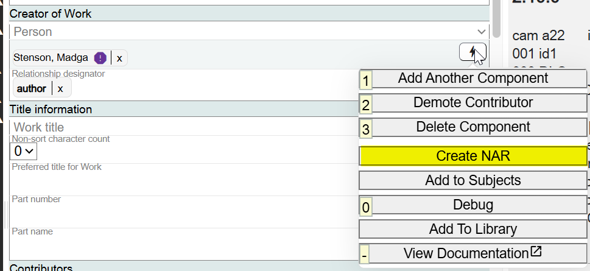

The lookup modal in the Creator of Work component and the Contributors component in the Work entity also has a Create NAR link.

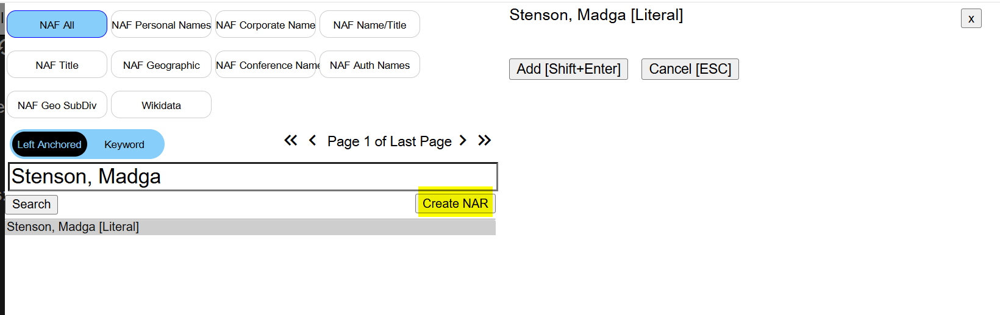

## Required Fields for 670 Source Citation

In order to populate the MARC 670 (Source citation) field when using the Create NAR option in Marva, the resource being described must contain these values in Marva:

- Preferred title for Work (Work)
- Statement of Responsibility (Instance)
- Provision Activity (Instance)
- LCCN (Instance)

---

## Example 1: Creating a Personal Name Authority Record with No Variant Access Points in Marva

In this example, there is no associated name authority record for Stenson, Magda.

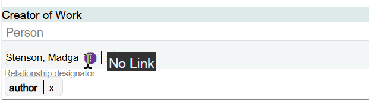

Click on the name Stenson, Magda to search the name authority file.

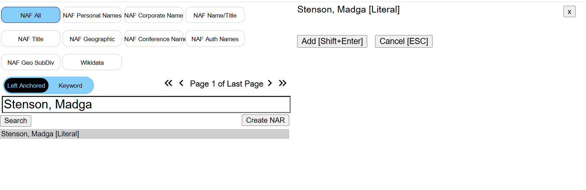

No name authority record is found. Thorough searching is essential! Just to be sure, you can try truncating the forename and searching on the letter "M" only.

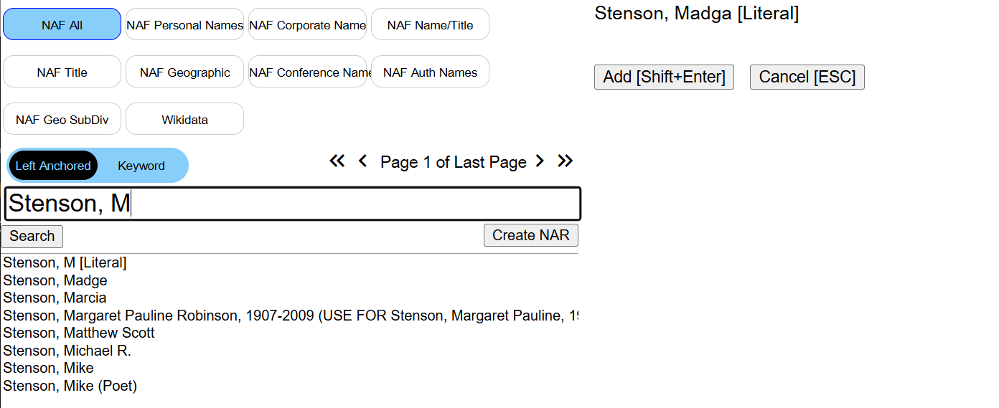

A NAR is needed. Click on Create NAR.

The NAR template will be prepopulated with the authorized access point and information for the 670 Source citation field. The 670 data will be pulled from the Preferred title for Work (670 subfield $a), Provision activity Date (670 subfield $a), and Statement of responsibility (670 subfield $b).

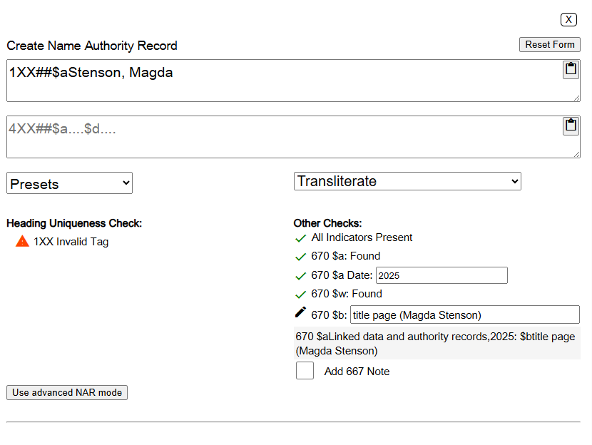

### Selecting the Preset

Use the Presets dropdown to select the correct MARC tag and indicators for the authorized access point.

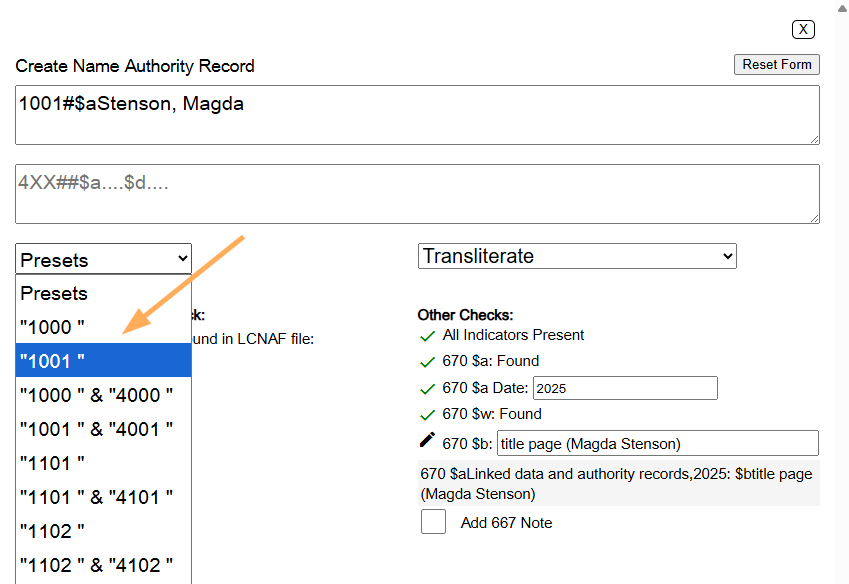

This authority record is for a personal name and there are no variant access points, so the Preset "1001" is selected.

### Heading Uniqueness Check

Marva will run a search in the LC/NACO Authority File to be sure that the authorized access point being established does not conflict with any other entries in the file.

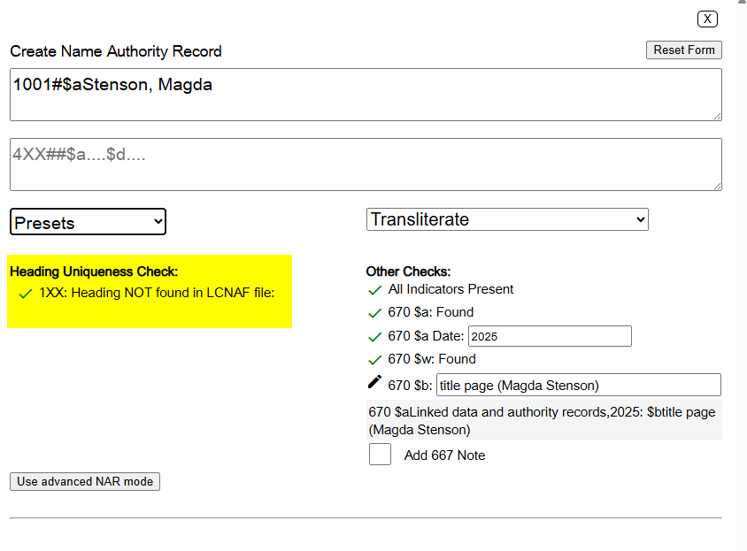

### Checking the 670 Source Citation

Check the 670 Source citation data to be sure that it is correct. Sometimes a name being established does not appear in the Statement of Responsibility or on the title page of the resource. You might need to change values in the 670 field. Be sure that everything added to the authorized access point is justified in the 670 field! If you need to add an additional 670 field, wait for the record to synch over to Folio (in 10 minutes), and add the additional 670 field in Folio.

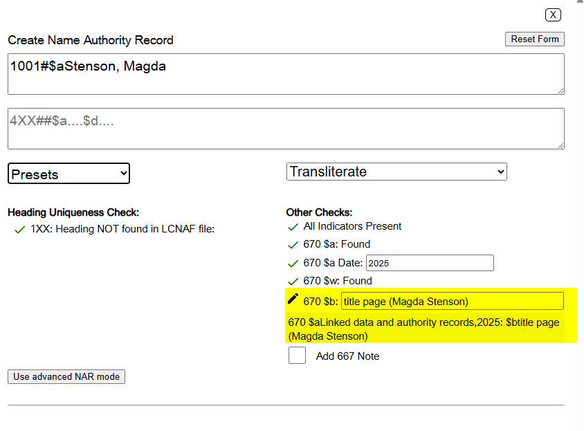

### Previewing the NAR

Once you are ok with the look of the new NAR, click on Preview NAR to see the complete MARC view.

```text
         111111111122222222223333333333
    123456789012345678901234567890123456789
LDR        nz  a22     ni 4500
008   250506n| azannaabn          |n aaa
001   n2025500340
003   DLC
005   20250506095917.0
010   $a n 2025500340
040   $a DLC $b eng $e rda $c DLC
100 1# $a Stenson, Magda
670   $a Linked data and authority records, 2025:  $b title page (Magda
Stenson) $u http://id.loc.gov/resources/instances/e2397673
```

Marva has some initial validation for NARs. The focus of the validation is that nothing is missing and fields/subfields aren't empty. The validation appears beneath the MARC preview when creating a NAR.
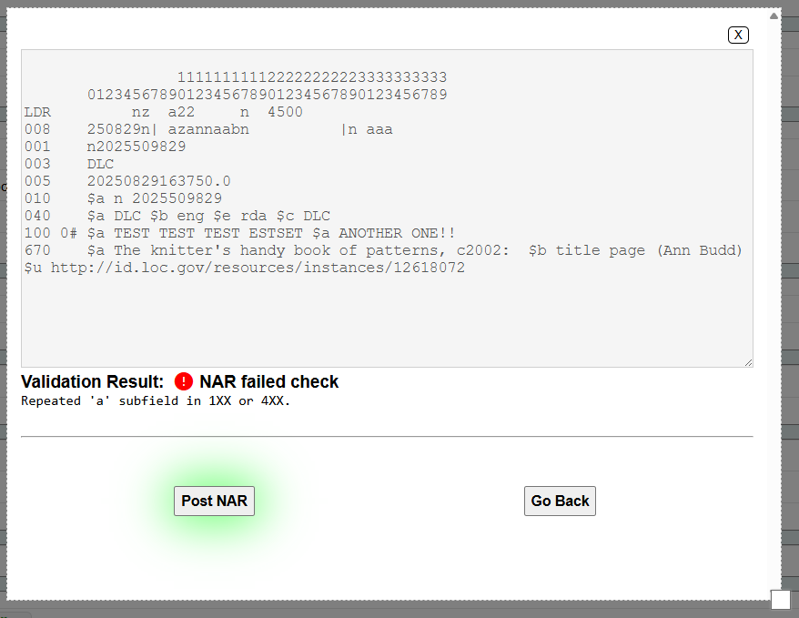

### Posting the NAR

If you want to change something, click on Go Back and make any edits. If everything looks ok, click on Post NAR. When you click on Post NAR, Marva will assign an LCCN to the new NAR, and a copy will be accessible in ID.LOC.GOV immediately.

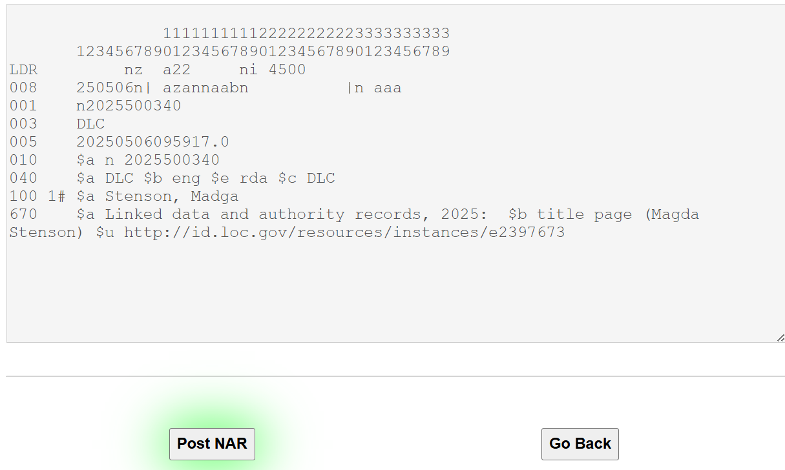

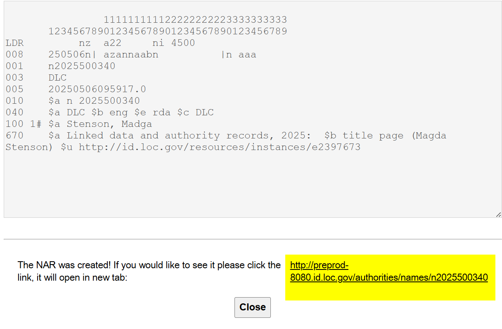

Wait 10 minutes for the new NAR to synch over to Folio.

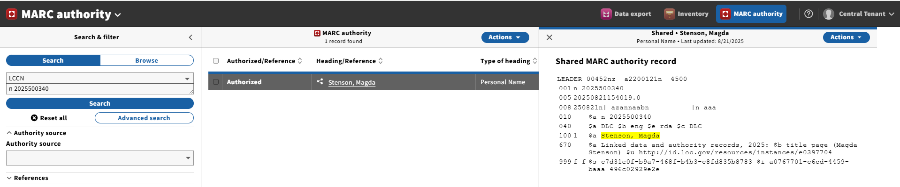

---

## Using Advanced NAR Mode

The advanced NAR mode can be used as a MARC input device when you want to add fields in addition to the authorized access point (1XX) field and any variant access point (4XX) field(s). You can also edit the 670 field in the advanced NAR mode. The fields can be added in any order and will be arranged in numerical order when the NAR is previewed and posted.

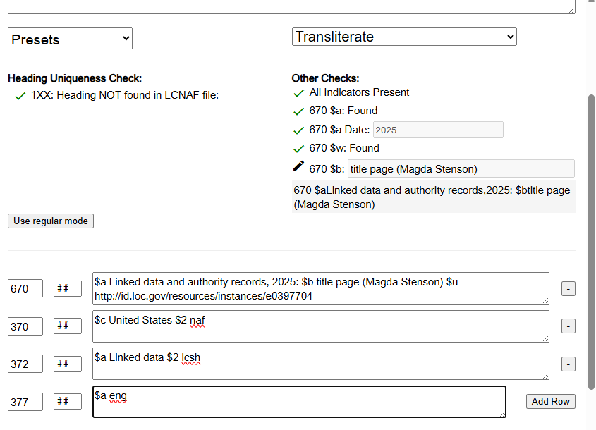

### Preview of Advanced NAR

```text
         111111111122222222223333333333
    123456789012345678901234567890123456789
LDR        nz  a22     n  4500
008   250821n| azannaabn          |n aaa
001   n2025508374
003   DLC
005   20250821120102.0
010   $a n 2025508374
040   $a DLC $b eng $e rda $c DLC
100 1# $a Stenson, Magda
370   $c United States $2 naf
372   $a Linked data $2 lcsh
377   $a eng
670   $a Linked data and authority records, 2025: $b title page (Magda Stenson)
$u http://id.loc.gov/resources/instances/e0397704
```

---

## Example 2: Creating a Corporate Name Authority Record with a Non-Latin Variant

In this example, there is no associated name authority record for the association. The association is being used as a Contributor, with the relationship Editor of compilation, for this Russian compilation.

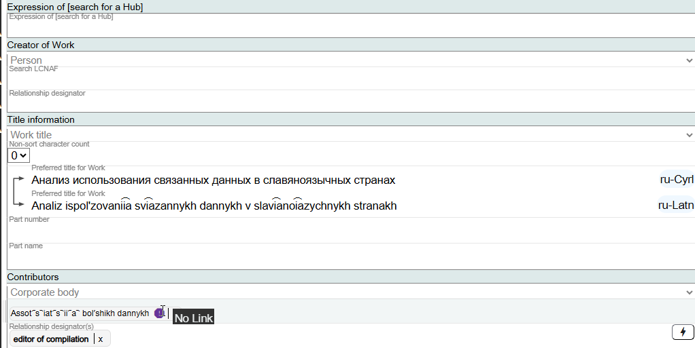

The name of the association appears in the resource in Russian, but because authorized access points for non-Latin entities must be in romanized form, the systematically romanized form of the association is used in the Marva search modal.

Marva does not find an authorized access point for the association in this form.

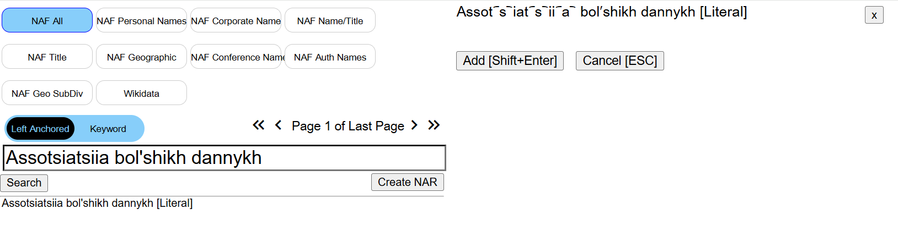

You might want to search using other terms, just to be sure. You could use the initialism ABD, or ABD (in Cyrillic), or even try searching for the full Russian form just in case.

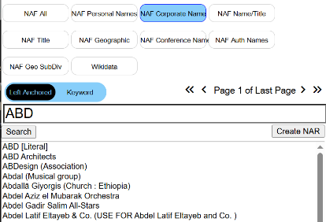

No NAR is found with any of these searches, so you can create a new NAR in Marva.

### Searching for the Corporate Name

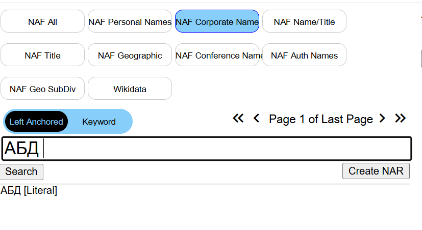

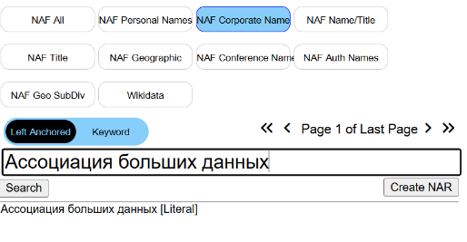

### Creating the Corporate NAR

The NAR template will be prepopulated with the authorized access point and information for the 670 Source citation field.

This authority record is for a Russian corporate name with a romanized form in the authorized access point. There is a non-Latin variant form (the Russian form) that can be added as well, so for the Presets, select "1102" & "4102".

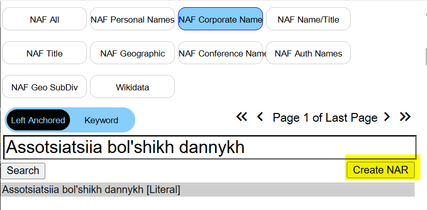

Marva will run a search in the LC/NACO Authority File to be sure that the authorized access point being established does not conflict with any other entries in the file.

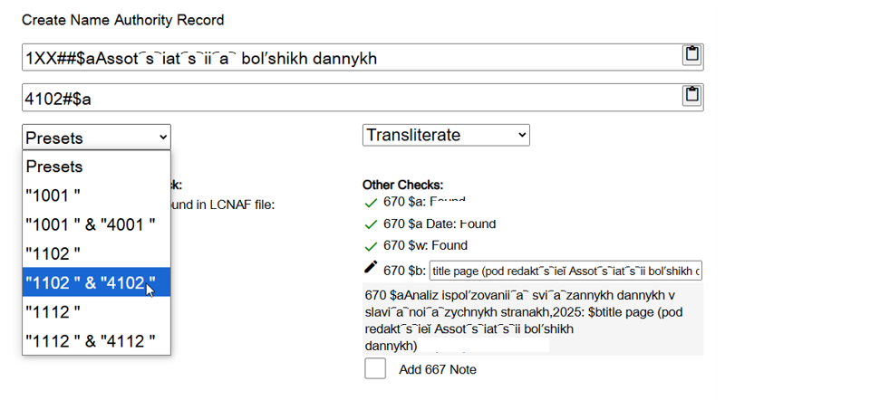

### Adding the Non-Latin Variant

To add the non-Latin variant, click on the dropdown Transliterate. This will connect to the scripts you have selected to use in [ScriptShifter](./c-scriptshifter.md).

Select 1XX -> 4XX: Russian. This will convert the romanized form in the 110 to the original non-Latin script form and add it as a variant access point.

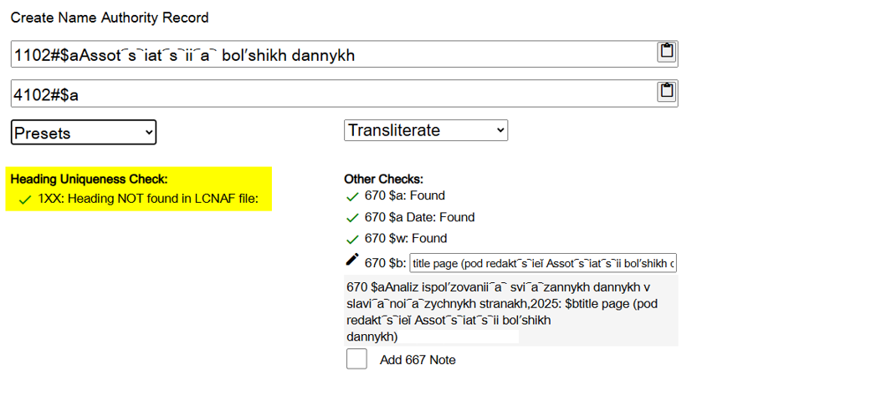

The required 667 note (Non-Latin script references not evaluated) will be added automatically.

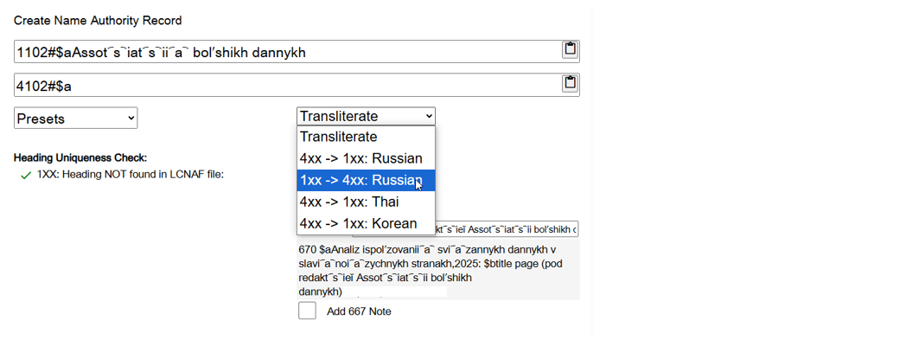

### Checking the 670 Source Citation

Check the 670 Source citation data to be sure that it is correct. In this case, some modifications are needed to conform to the policies on showing systematically romanized forms of names in 670 fields. You can make the modifications directly in the template.

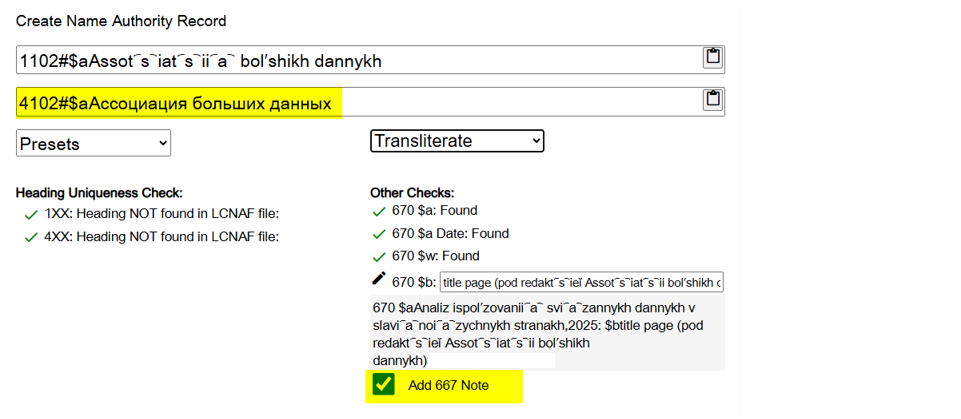

Be sure that everything added to the authorized access point is justified in the 670 field! If you need to add an additional 670 field, wait for the record to synch over to Folio (in 10 minutes), and add the additional 670 field there.

### Previewing and Posting the Corporate NAR

Once you are ok with the look of the new NAR, click on Preview NAR to see the complete MARC view.

```text
         111111111122222222223333333333
    123456789012345678901234567890123456789
LDR        nz  a22     ni 4500
008   250508n| azannaabn          |b ana
001   n2025500373
003   DLC
005   20250508085034.0
010   $a n 2025500373
040   $a DLC $b eng $e rda $c DLC
110 2# $a Assotsiatsiia bol'shikh dannykh
410 2# $a Ассоциация больших данных
667   $a Non-Latin script references not evaluated.
670   $a Analiz ispol'zovaniia sviazannykh dannykh v slavianoiazychnykh
stranakh, 2025:  $b title page ( ... Ассоциации больших данных = Assotsiatsiia
bol'shikh dannykh)  $u http://id.loc.gov/resources/instances/e1408527
```

If you want to change something, click on Go Back and make any edits. If everything looks ok, click on Post NAR. When you click on Post NAR, Marva will assign an LCCN to the new NAR, and a copy will be accessible in ID.LOC.GOV immediately.

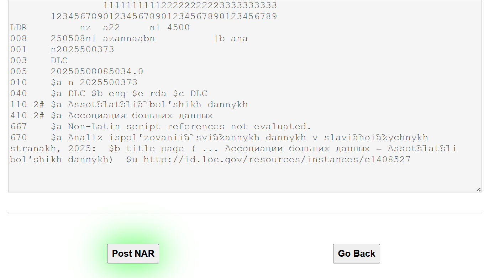

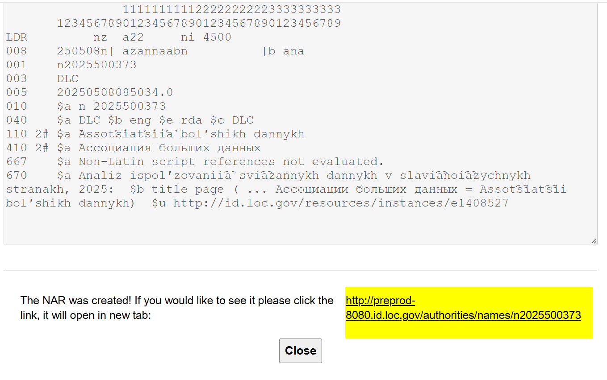

Wait 10 minutes for the new NAR to synch over to Folio.

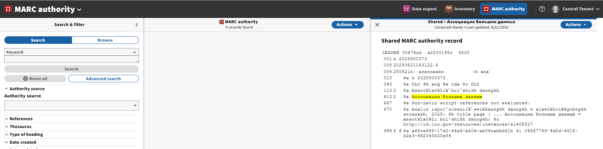

---

[Back to Table of Contents](../index.md)
