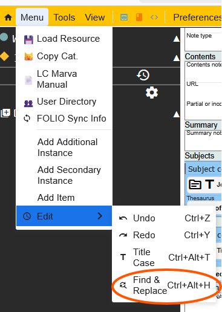
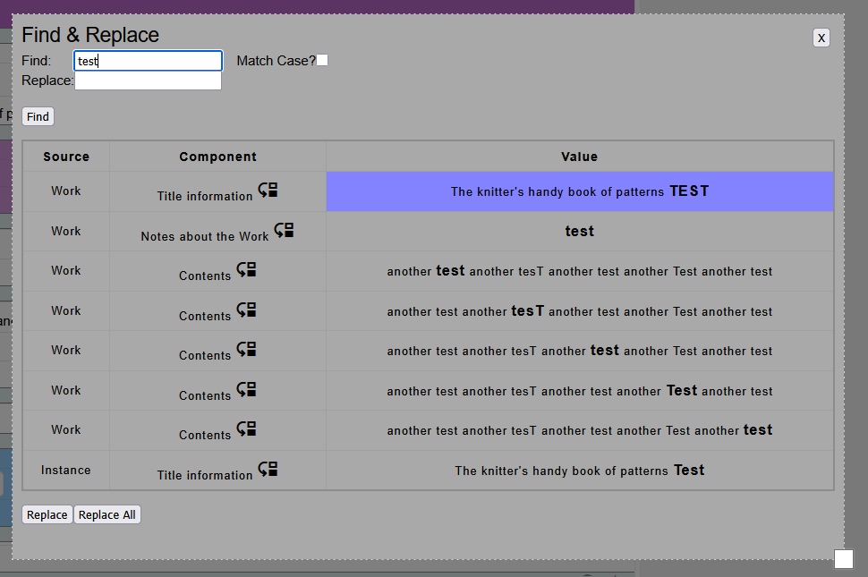
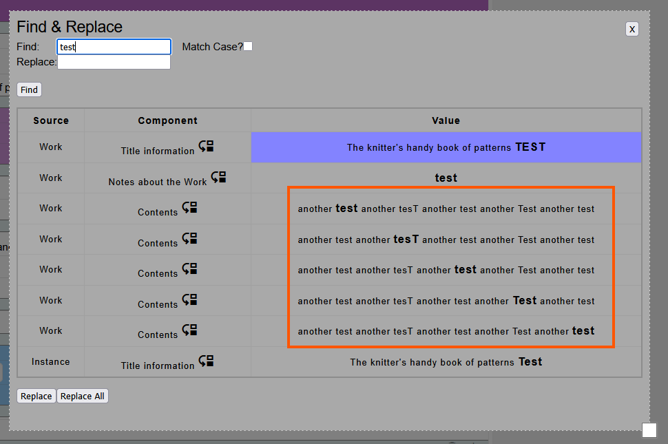
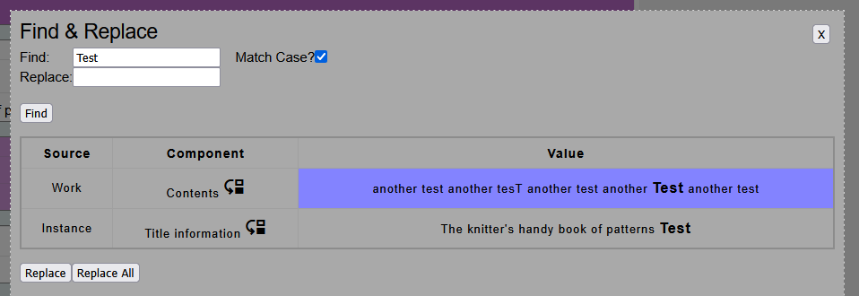
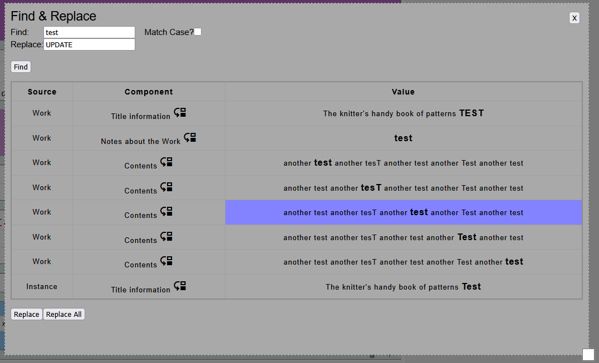
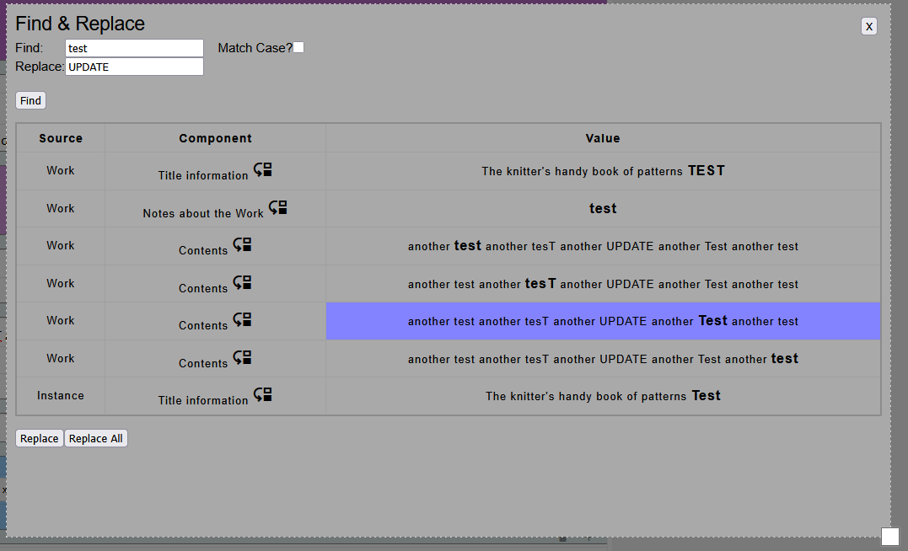

# Find and Replace

Marva supports Find & Replace on literal fields.

The option is available from `Menu` > `Edit` > `Find & Replace`.

Or through the shortcut `ctrl+alt+h`.

## Searching

When you search for a term, Marva will show a table will all of the fields that contain that value searched on. If there is more than one match in the same field, each will be shown independently.

Each result also has the source and component that the value was found in. Clicking on the component will close the Find & Replace window and jump to that component.

It's also possible to match with case.

## Replacing

You can replace on individual matches or on all matches. The currently select match is highlighted. Replacing text respects the casing of the replacing value.

Pressing "Replace" will only replace this instance.

"Replace All" will perform the replacement on all of the results.