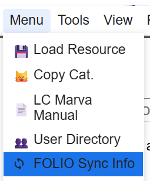
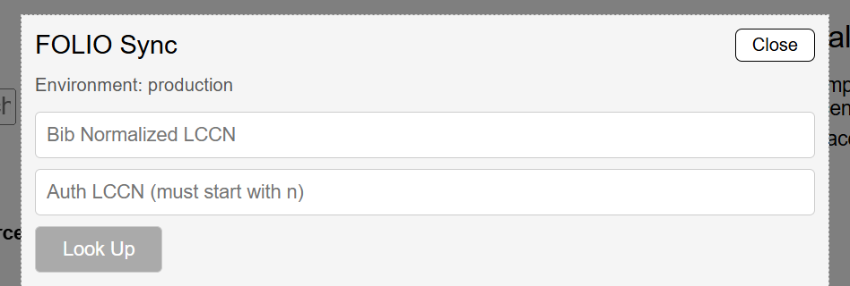
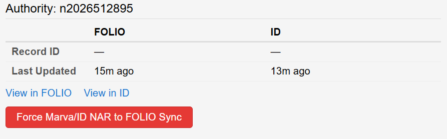

# FOLIO Sync Tool

Shows you the date and time a Bib record or NAR record was last updated in FOLIO and Marva (ID/BFDB)

To access it click Menu -> FOLIO Sync Info nav menu

Then enter a Bib LCCN (normalized, numeric only)
Or A NAR LCCN (starts with a "n")

Once entered for either it will provide you with the dates a record was updated last:

There is also a button to force a SYNC between the two systems. This is a one direction based on the record:

Bib Records -> Force sync from FOLIO to Marva (ID/BFDB)
NAR Records -> Force sync from Marva (ID/BFDB) to FOLIO

This is a tool to help manage record flow if something gets "stuck" in Marva or FOLIO.