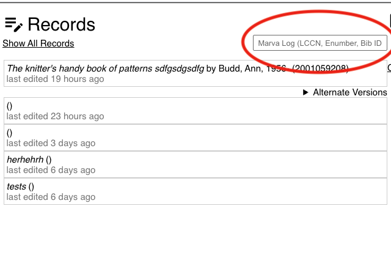
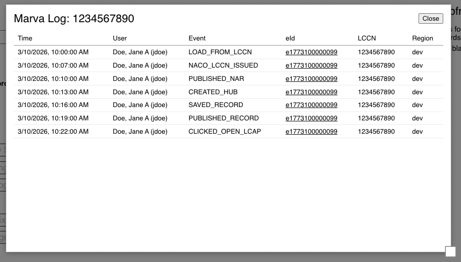

# Marva History Log

This feature allows someone to look up what actions were taken on a record in Marva.

To use it enter one of three standard identifier into the field under the center "Records" column:

You can enter:
 - LCCN
 - eNumber (the number Marva uses when editing a record, appears in the URL)
 - Bib Id (001 number)

This will show what actions were taken on accounts that match your identifier:

 

Some things to keep in mind:

- There may be multiple eNumbers if the same LCCN was loaded multiple times
- Some actions start off without a LCCN (like create a new origbf record) the system will try to match LCCNs added later to earlier pre-LCCN actions
- These are just actions that happen inside Marva not FOLIO
- Data only started on Wed March 11 2026. No historical data before that.
