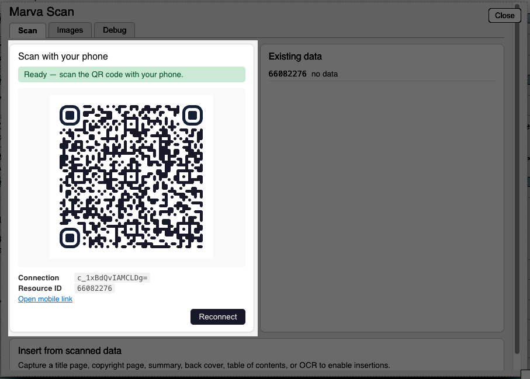
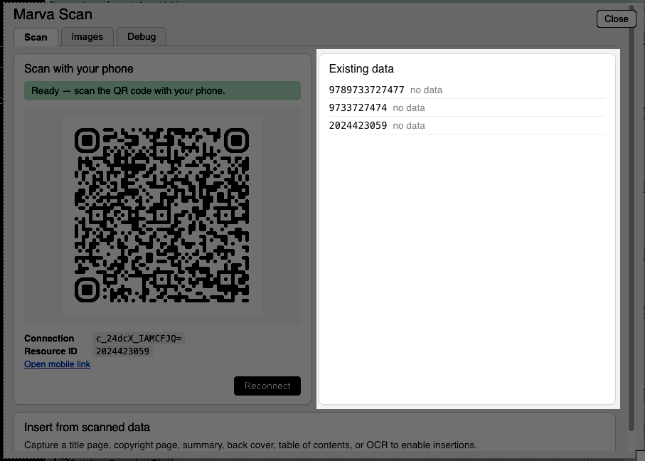
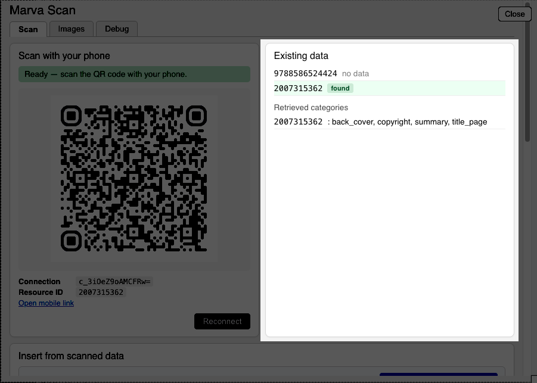
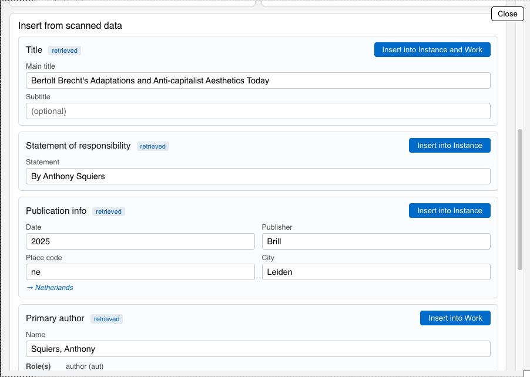
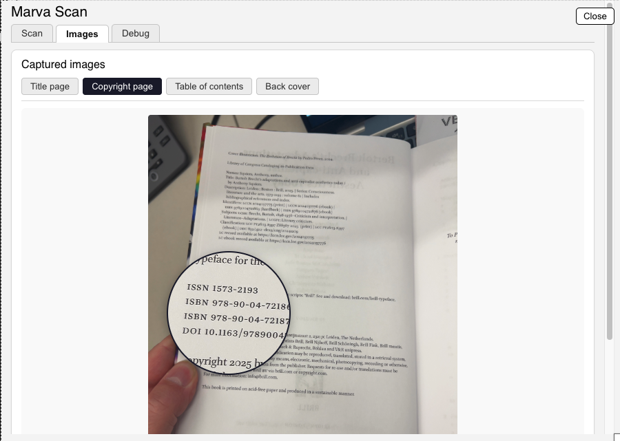

# Marva Scan Experiment

Testing possible workflows and use cases for scanning resources with mobile phone. Marva Scan connects your phone (or previous scans made with it) to the record you are editing. It uses a visual LLM to extract structured data from images taken with the phone.

⚠️ We don't have LC devices to test with, if using your personal device make sure to be on WiFi to prevent cell data usage. 

## Areas of Testing
- Is this even useful? Is there ever printed information only in the resource in hand that is not in the record, oclc, booksellers, etc. already?
- Do the workflows below make sense? Are they based in reality and how people work? What workflows are missing?
- What Data Patterns below are missing and should be added?
- How does it work with non-Latin resources? (what changes need to be made to the prompt to better extract data)
- Does it make any mistakes? 
- Other comments / ideas welcome.

## Workflows

1. **You have a book in hand and want to get some printed information from the book into Marva. Calling this "Live Mode"**
    - [Watch a video of this workflow (4min)](https://thisismattmiller.s3.us-east-1.amazonaws.com/marva-scan-demo-with-phone.mp4)
    - Basic Flow:
      - Open Marva Scan in Marva
      - If your phone is already on the Marva Scan mobile page Scan the QR code OTHERWISE use your phone's native camera open the QR code
      - The mobile webpage will open and be connected to your Marva record
      - Use the buttons at the bottom of the mobile page (Back Cover, Cover, Title Page, etc) to take images of the specified page.
      - The data and scans will appear in your Marva editor window

2. **You have a stack of books to be worked at some later point. You want to scan the book in a row to have the data and scans available to you later in Marva when you work that record. Calling this "Offline Mode"**.
    - [Watch a video of this workflow (7min)](https://thisismattmiller.s3.us-east-1.amazonaws.com/marva-scan-offline-demo-with-phone.mp4)
    - Basic Flow:
      - If your phone is already on the Marva Scan mobile page press "Back" and "Home" to get to the the option to select "Off-line mode"
      - If your phone is not already on the Marva scan mobile page open the page on your phone via the QR code in the Marva Scan window, then press "Back" and "Home" to get to the page where you can select "Offline capture"
      - This mode has a barcode scanner viewer, it should work with LCCN stickers and ISBN back cover barcodes.
      - Once a barcode is scanned it will give you the camera interface with the buttons at the bottom, take your scans pictures using the appropriate button.
      - When done click "New book" at the bottom to start with a new book (it will return to the barcode scanner camera)
      - Next time you are in Marva and that LCCN or ISBN scanned is associated with the resource it will show your scans and data in the Marva Scan window.

## Data Patterns Extracted:

- Title and Subtitle (from title_page scans)
- Statement of responsibility (from title_page scans)
- Publication Provision Activity (from title_page and copyright page scans)
- Primary Contributor and role (from title_page, does not reconcile name to LCCN)
- Other Contributors and their roles (from title_page, does not reconcile name to LCCN)
- Summary (from back_cover scans or summary scans)
- Contents (from toc scans)
- What else?

## Basics

To access the interface in Marva open `Tools -> Marva Scan`  (If you don't see you need to be given access)

The main section of the Window has 3 areas:
#### QR Code:

This section of the window provides you with the QR code to scan with your phone to get your phone to the mobile site to scan. It also connects your phone to this Marva record so anything you scan will be associated with this record via its LCCN (preferred) or ISBN (backup) that are entered in the record.
 

#### Existing Data:

This section will check if there are already existing scans made previously based on LCCN or ISBNs

If there is data present it will look like this:

The green indicates it found previous scans. In this case it found data scanned and stored by LCCN, and it shows what type of pages were scanned / processed.

If there are scans and data processed it will show you components you can review / edit / insert into the record.

### Images Tab
You can access previous scans from this tab, a mangifying glass widget enlarges where you move your mouse cursor.

## The Mobile Page

The mobile page scanning tool is pretty self-explanatory, watch the videos above to see it, but some things to remember:
 
1. You need to get the phone to the webpage, the easiest way is to use your native camera to open the QR code. Even if you want to do offline captures you can still use any QR code generated to get your phone to the site and the use the "Back" and "Home" buttons to get to the menu.
2. The scans don't need to be perfect, it does a good job at extracting data as long as the text is large enough.
3. All of the page buttons take one image and overwrites the last one of that category, so if you take a bad back cover image, just take another and it will replace the last one.
4. There is one Multi-Page mode for table of contents (TOC) page type. For this page type you click the button to take the first image, the counter will appear at the bottom of the page, turn the page, take the next picture, repeat as needed, then click "send all" to upload the group.

