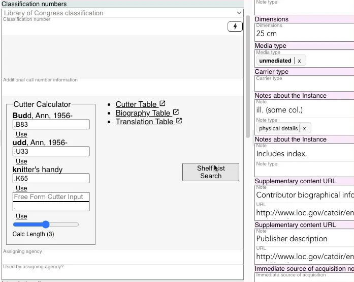

# MLC Number Generator

The MLC Number Generator generates a unique sequential number to be used as the LCC classification in MLC cataloging. The tool requests the number from the FOLIO number generator meaning Marva's MLC numbers are in sequence with FOLIO.

Marva's MLC tool takes advantage data in the record to complete the MLC number so it is best to invoke it once these fields are filled out:

 - Instance -> Dimensions 
 - Work -> Primary LCSH heading
 - Work -> Genre/Form

To add a MLC number use the Action button in a LCC field to request a new number

If you have filled out the Dimensions field then the system will parse it and automatically select the correct suffix for you S, M, L, or F
If the system cannot parse the field or it is empty it will ask you to supply the size you want to use

If you have a filled out the Genre/Form field and it falls in the P LCC class it will add a "(P)" to the end of the number

If it does not have a P Genre/Form it will look to see if it has a Subject. If it does it will look at the first subject primary component to see if it has a 050 value of corresponding LCC if it does it will use the first letter of that Class

*see below for logic of how it does this*

There are division/section/team letters that can be added to the MLC number for example `K - Korean Section, Asian Division` or `A - South Asia materials, Asian Division`

If you modify the MLC number to use one of these suffixes for example:

MLC generates `MLCM 2026/00148 (P)` and you go in and modify to be `MLCMK 2026/00148 (P)` (adding the K)
It will now always add the `K` into the MLC number when generating a new one. Likewise if you remove the `K` on the next number it will stop adding the `K` on future numbers.

## Genre/Form and LCSH Logic for adding (P) and other Class (X) suffixes

LCSH 050 LCC class mapping is derived from the **first subject heading** in the Work.

1. The first subject's URI is resolved (either the top-level `@id`, or the `@id` of the first entry in `madsrdf:componentList`).
2. That URI (e.g. `http://id.loc.gov/authorities/subjects/sh85072708`) is converted to an XML lookup URL by switching to `https` and appending `.madsrdf_raw.xml`.
3. The returned XML is parsed looking for a `<madsrdf:classification>` element:
   - If it has an `rdf:resource` attribute (e.g. `http://id.loc.gov/authorities/classification/TT819-TT829`), the last path segment is extracted (`TT819-TT829`).
   - If it contains a literal `<lcc:ClassNumber><madsrdf:code>Z666.5</madsrdf:code></lcc:ClassNumber>`, the text content is used (`Z666.5`).
4. If no `<madsrdf:classification>` is found but a `<madsrdf:componentList>` exists, the first component's `rdf:about` URI is followed and the same lookup is repeated (one level deep only).
5. The **first character** of the resulting classification string becomes `useLCC` (e.g. `"T"` or `"Z"`).
6. If no classification is found at any step, `useLCC` is `null`.

---

Fiction / P-Class Detection

Derived from **all genreForm entries** in the Work. If **any** genreForm matches one of the following rules, `(P)` is used.

### URI matches

Any genreForm whose URI (top-level `@id` or first `componentList` `@id`) matches one of these:

| URI | Meaning |
|-----|---------|
| `gf2014026339` | Fiction  |
| `gf2014026243` | Bildungsromans |
| `gf2014026259` | Choose-your-own stories |
| `gf2018026099` | Light novels |
| `gf2015026019` | Novellas |
| `gf2014026456` | Novelle |
| `gf2015026020` | Novels |
| `gf2014026518` | Romans à clef |
| `gf2014026542` | Short stories |
| `gf2014026559` | Stories in rhyme |
| `gf2014026297` | Drama (letter code: d) |
| `gf2014026094` | Essays (letter code: e) |
| `gf2014026110` | Humor (letter code: h) |
| `gf2014026141` | Personal correspondence (letter code: i) |
| `gf2014026054` | Business correspondence (letter code: i) |
| `gf2014026488` | Prose poems (letter code: p) |
| `gf2014026481` | Poetry (letter code: p) |
| `gf2011026363` | Speeches (letter code: s) |

### Label matches (case-insensitive unless noted)

- Contains **"fiction"** but NOT **"nonfiction"** (excludes "Nonfiction")
- Contains **"(Fiction)"** (case-sensitive)
- Contains **"humor"**
- Contains **"poetry"**
- Contains **"speeches"**

 
