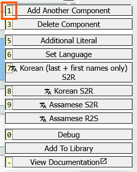
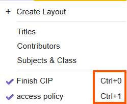

# Marva Shortcuts

Marva has some shortcuts to help with different actions.

---

## Action Button

The action button, found at the end of a field in Marva, contains a lot of functionality.

Some of these have shortcuts listed to the left of the action, if it has one.

With the action menu open, press the key indicated and the action will be performed.

---

## Subject Builder
When working on a subject, the  different search options at the top of the search box can be selected with shortcuts:

- LCSH/NAF: `ctrl+alt+1`
- Children's Subjects: `ctrl+alt+22`
- Geo. Subdiv.: `ctrl+alt+3`
- Hubs: `ctrl+alt+4`
- Entities: `ctrl+alt+5`

---

## Save, Undo, Redo

Marva has the ability to save with a shortcut as well as undo a change and redo a change.

- Save: `ctrl+s`
- Undo: `ctrl+z`
- Redo: `ctrl+y`

---

## Copy & Paste

Marva has the ability to copy and paste components. This can be used in a record or between records.

Shortcuts:
- Turn on Copy Mode: `ctrl+alt+c`
- Copy: `alt+c`
- Paste: `alt+v`
- Select all: `alt+a`

---
## Layouts

If you've created a custom layout in Marva, you can turn it on with a shortcut. The key combination will be shown next to the layout's name.

They follow the pattern `ctrl+<number>`.
To turn off an active layout, use `ctrl+backspace`

Information on [Creating Layouts](../configuration/layouts.md)

