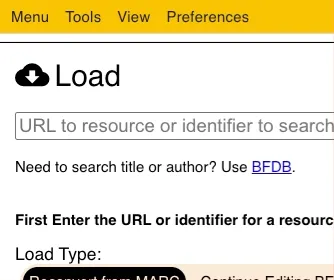
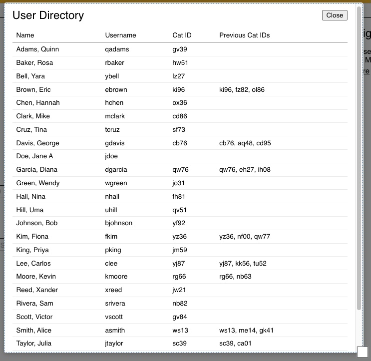

# User Directory

The User Directory displays the names of users and the Cataloger Code that they use and have used in Marva

To open use the Nav Bar -> Menu -> User Directory

This will open a new pop-up that shows the list of Marva users and what Cataloger IDs associated with them.

