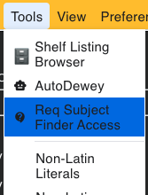
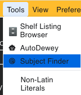
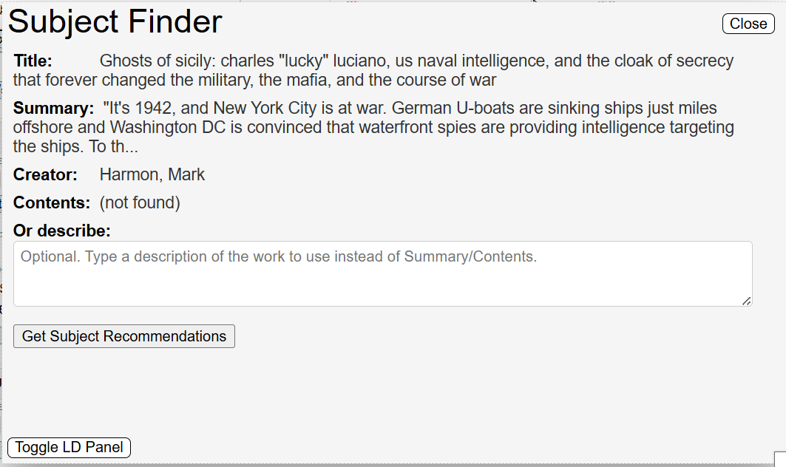
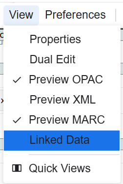
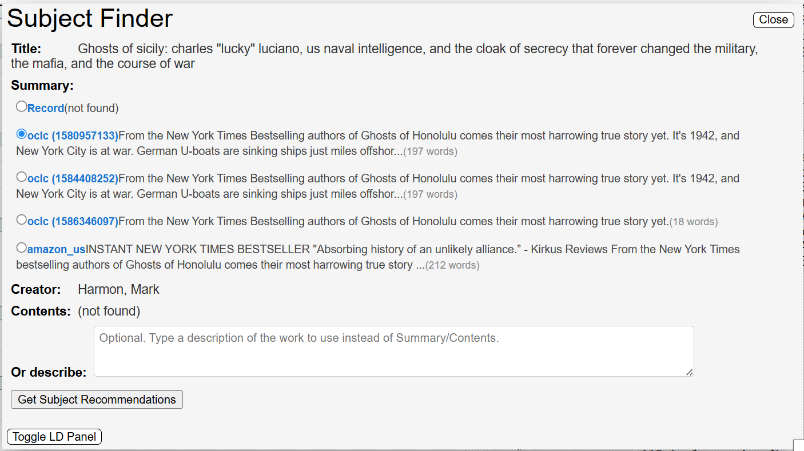
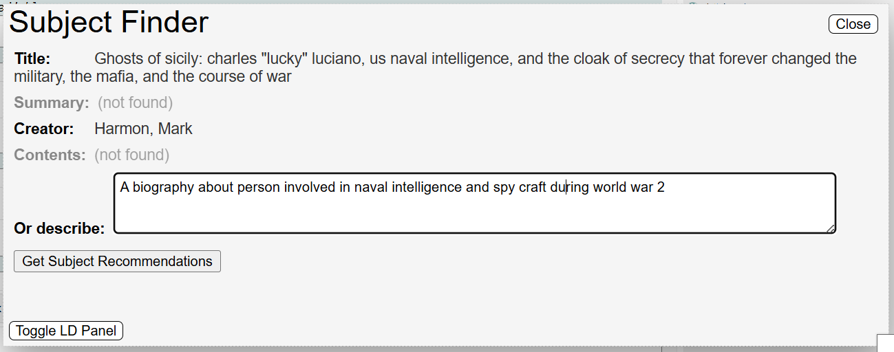
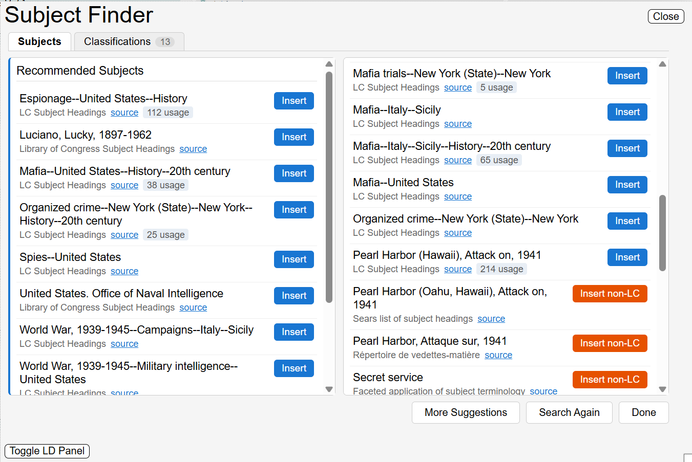
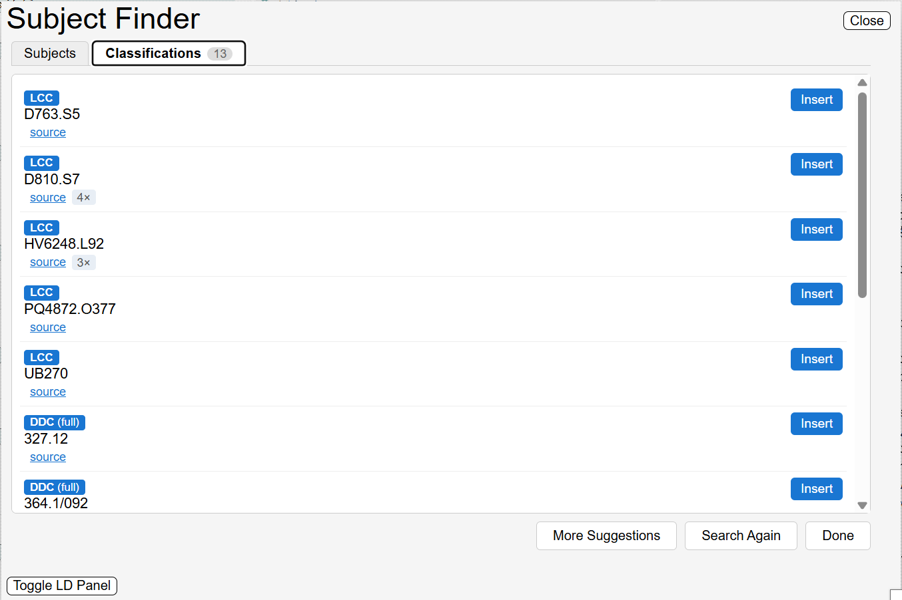

# Subjects Finder Pilot 

This is a pilot to test if a system that suggests subjects headings based on similar resources in the system is a good approach and help with subject assignment.

The feature is currently restricted by username, if you have supervisor's approval just click on this link under the Tools menu:

This will open a MS Office Form that you can just fill out your email address and the feature will be turned on for you (not a automatic process someone in NDMSO will see it and add you).

Once approved your menu will look like this

You have multiple ways to use this tool:

1. Use the data currently in record (summary and content note)

That will look like this:

You can see the Summary (and title and creator) are auto populated.
If there is no primary contributor it will use the first contributor.

2. If there is no summary or content note in the record open the Linked Data panel:

This will auto search OCLC Worldcat for the record. You can also use the bookseller buttons to try to find the book.

This will allow you to select to use data from different sources if it was able to find anything.

3. Providing your own description. You can type or paste your own description of the book, try to use specific details to get the most granular LCSH headings:

Clicking Get Subject Recommendations will kick off the search.

Results page:

- It will show authorized and pre-coordinated (bib) headings (blue)
- It will try to get usage counts for both types
- It will show non-LCSH and non-authorized headings (red)
- The source link will open a record that used that headings closest to the resource being cataloged.

There is also a Classification Tab that shows the Classification numbers used on the same records
 

These can be inserted into the record in the same way.

You can click the More Suggestions to widen the search to 20 closest resources.

Search again to back to the previous page.

