# Copy Cataloging

Marva can be used to search OCLC and bring in a copy cataloging resource.


The Copy Cat. feature can be used to overlay an existing description in the MARC system, or to import a new description and assign a new LCCN.

The Copy Cat. feature is modeled on the Z-Processor that is used to search for copy cataloging resources through Folio.

---

## Example 1: Using a pcc record in OCLC to overlay an epcn record in MARC

There is an epcn source record in the Cataloging stream.

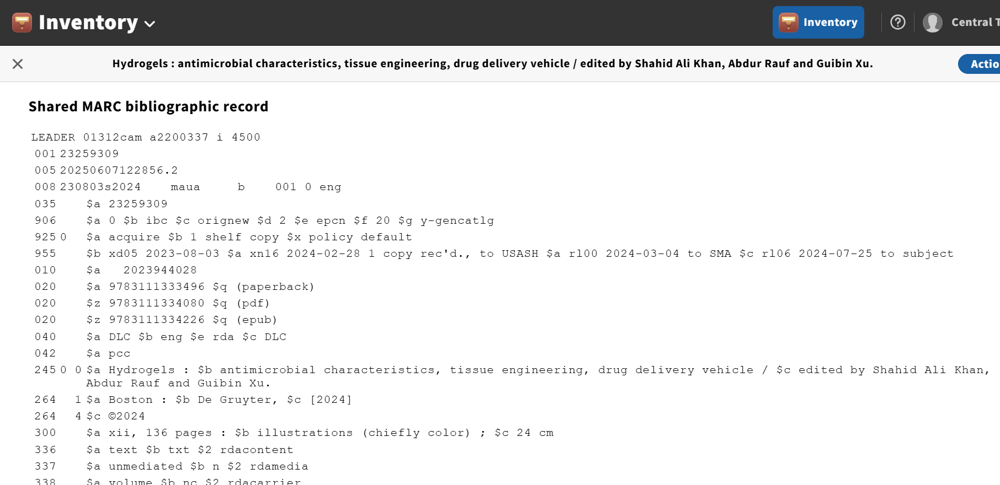

Activate the Copy Cat. feature in Marva by clicking on **Menu > Copy Cat.**

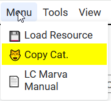

There are four searching options for the Copy Cat. feature:

- Standard Numbers (ISSN, LCCN)
- Title
- Name
- Keyword

Standard Numbers is the default search and is the most precise.

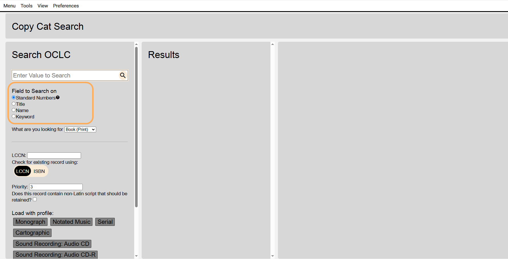

The resource has an ISBN. Input the ISBN in the Enter Value to Search box and click on the search icon (the magnifying glass). The LCCN box can be left blank for now. A priority level was automatically assigned by the Copy Cat. feature. That can be changed if necessary.

### Reviewing Search Results

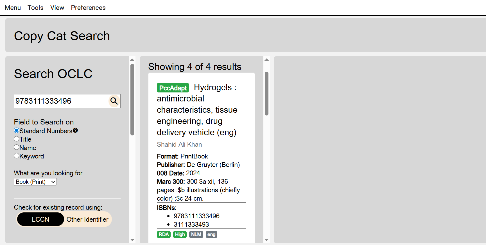

Four matches were found in OCLC for this ISBN. The Results screen gives some important information about the resources:

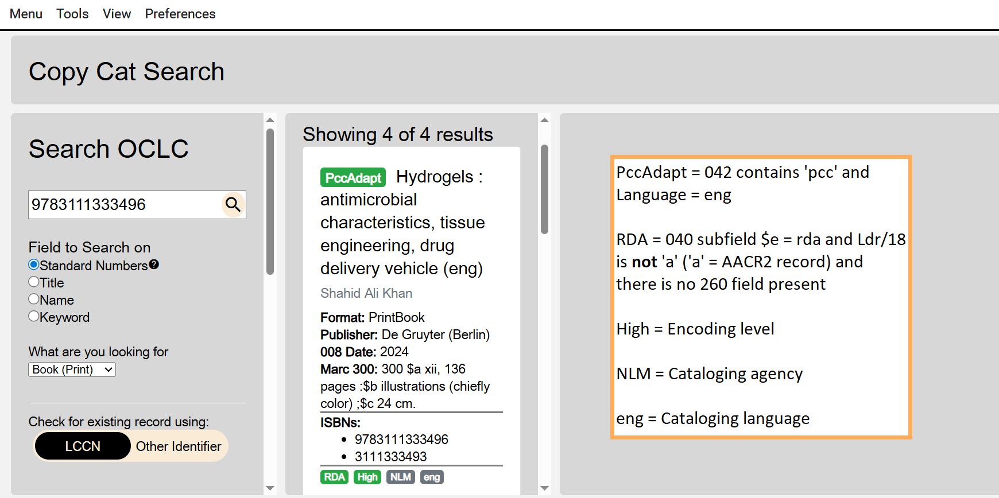

The badges and detail panel provide key information:

- **PccAdapt** = 042 contains 'pcc' and Language = eng
- **RDA** = 040 subfield $e = rda and Ldr/18 is **not** 'a' ('a' = AACR2 record) and there is no 260 field present
- **High** = Encoding level
- **NLM** = Cataloging agency
- **eng** = Cataloging language

If you want to look at the full MARC record, click on the box in the Results panel.

### Selecting a Record and Viewing MARC Preview

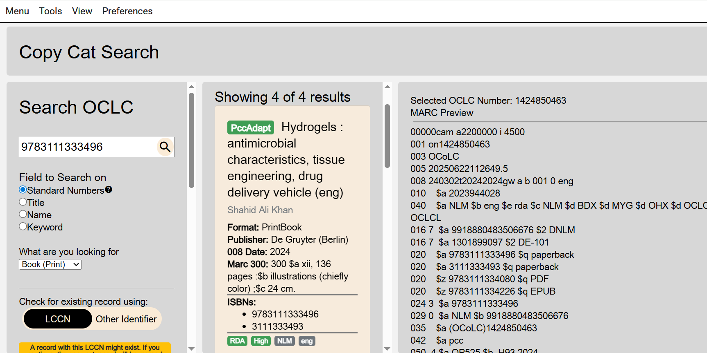

Your cataloger's judgment will determine which of these four records is appropriate for import. PccAdapt is always a good choice for import.

With the selected record highlighted (the beige background shows the highlighted record), insert the LCCN in the LCCN: box and verify that the Priority: value is correct. In this case, the PccAdapt record in OCLC has the LCCN, so it will be automatically populated in the LCCN box.

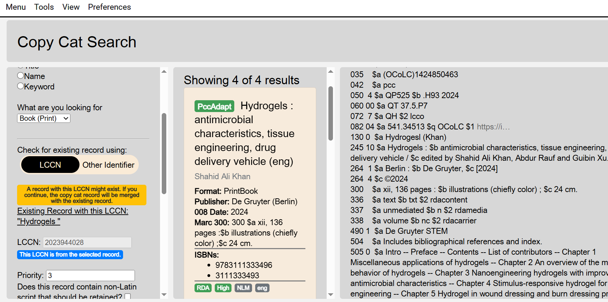

The Copy Cat. feature will check for an existing record with the LCCN. Click on the **Existing Record with this LCCN** to verify. In this case, it is the ibc resource in Folio, so everything is ok.

### Verifying via Linked Data Service

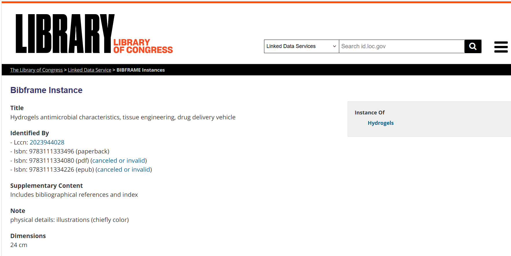

You can also check for an existing record using ISBN. Toggle the LCCN/ISBN button to ISBN and click on **Existing Record with this ISBN**.

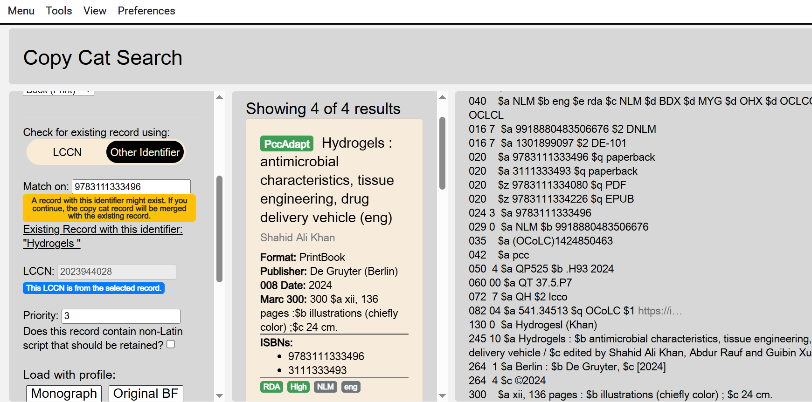

The Copy Cat. feature will check for an existing record with the ISBN. Click on the **Existing Record with this ISBN** to verify. In this case, it is the ibc resource in Folio, so everything is ok.

### Loading the Record

Verify that the Priority level is correct. Adjust if necessary.

Using either LCCN or ISBN, click on Load with profile: Monograph.


A prompt will ask if you want to continue with the merge.

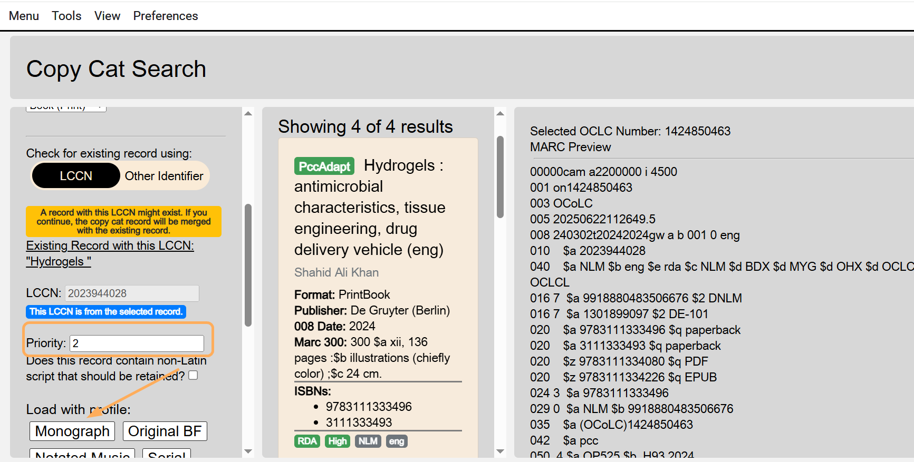

### Editing the Imported Record in Marva

Marva will import the PccAdapt record and overlay it on the existing record.


Edit the description in Marva as needed. Save the updates, Validate, and Post.

Note that the MARC Preview in Marva includes MARC 906, 955, and 925 fields.

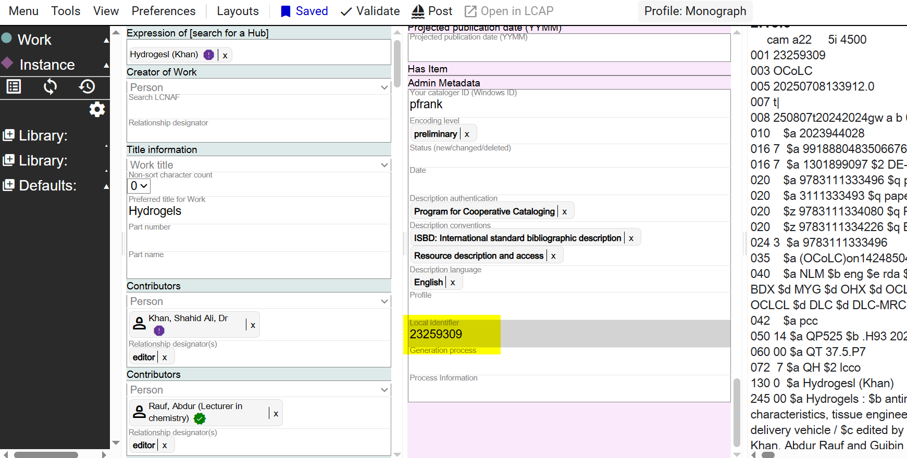

```
906    $a 0 $b ibc $c pccadap $d 2 $e epcn $f 20 $g y-gencatlg
955    $b xd05 2023-08-03 $a xn16 2024-02-28 1 copy rec'd., to
USASH $a rl00 2024-03-04 to SMA $c rl06 2024-07-25 to subject $b
jr03 2025-07-08 z-processor
998    $a 2023944028 $b 2 $c false $d PccAdapt $e overlay bib $f
23259309 $z jr03
925 0  $a acquire $b 1 shelf copy $x policy default
```

These fields will migrate to Folio with the Modern MARC record and merge with the existing 906, 955, and 925 fields in the original record.

The default value in 925 subfield $b is 1 shelf copy. If 2 shelf copies are required, change the value in the Modern MARC record in Folio.

### Sending the Description Back to Folio

Be sure to Save, Validate, and Post the description before you send it back to Folio as a Modern MARC record.

There are two ways to get the BIBFRAME description back to Folio as a Modern MARC record:

#### Method 1: Marva Import App

Use the Marva Import app in the LCAP Productivity Toolkit to send the description back to Folio. Use the Local Identifier in the Marva Import app. You can find the Local Identifier in the Admin Metadata components in Marva.

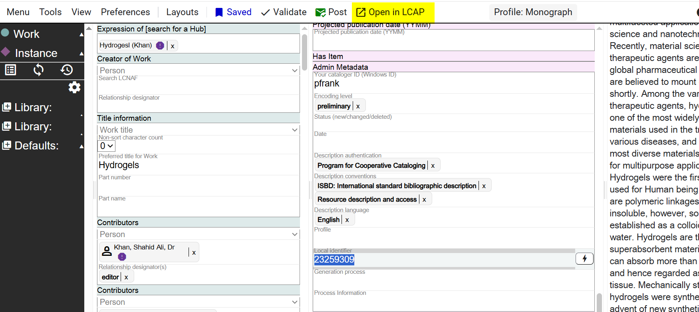

> **Tip:** even though it will look like you can't copy the Local Identifier, you actually can copy it for pasting into the Marva Import app.

#### Method 2: Open in LCAP

Click on the **Open in LCAP** icon in the Navigation Bar.

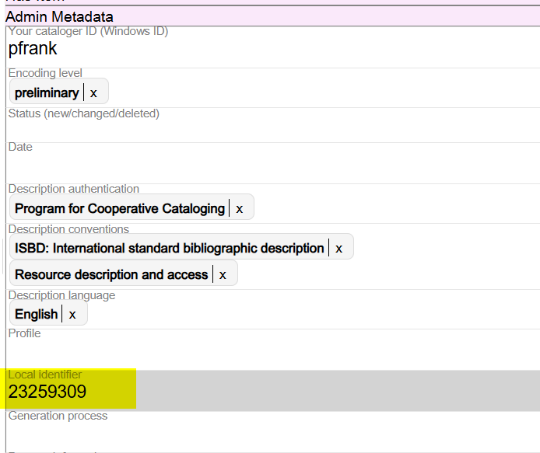

Whichever method you use, both the original MARC record and the Modern MARC record will appear together in a single window in the Productivity Toolkit. This is not the Folio Inventory app!

### Comparing Records in the Productivity Toolkit

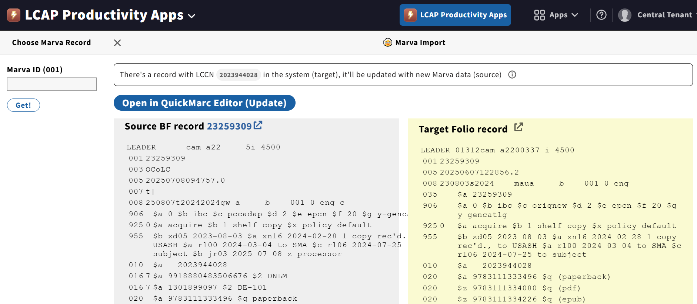

Compare the two versions of the record, and when you are satisfied with the Modern MARC version, click on Open in QuickMARC Editor (Update). You can't edit or save the Modern MARC record in this Productivity Toolkit view.

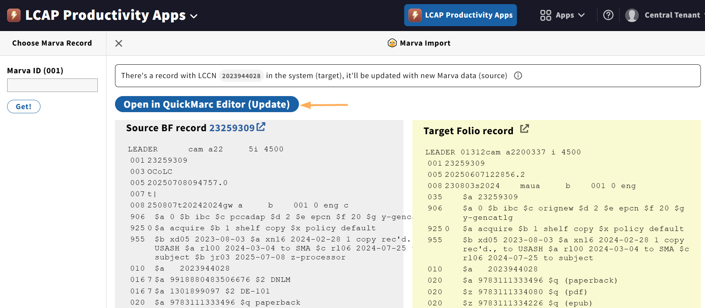

### Completing the Record in Folio

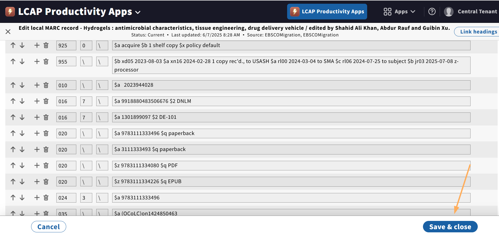

This image shows the record in the Folio Inventory app.

Complete Holdings and Items in Folio.

---

## Example 2: Using a copycat record in OCLC to overlay and IBC record in MARC

There is an ibc source record with origres in the Cataloging stream. origres indicates that the record was a resource record with minimal cataloging completed. In this case the Z-Processor tool was used to bring in some descriptive elements, but the origres resource lacks LC subject headings and a class number.

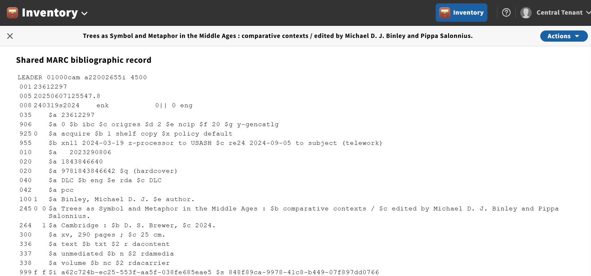

Activate the Copy cat. feature in Marva by clicking on **Menu > Copy Cat.**


There are four searching options for the Copy Cat. feature:

- Standard Numbers (ISSN, LCCN)
- Title
- Name
- Keyword

Standard Numbers is the default search and is the most precise.


The ibc resource has an ISBN. Input the ISBN in the Enter Value to Search box and click on the search icon (the magnifying glass). The LCCN box can be left blank for now. A priority level was automatically assigned by the Copy Cat. feature. That can be changed if necessary.

### Reviewing Example 2 Search Results

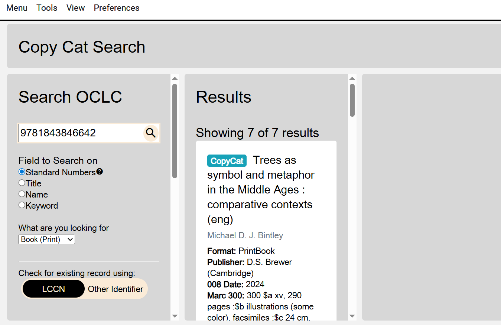

Seven matches were found in OCLC for this ISBN. The Results screen gives some important information about the resources:

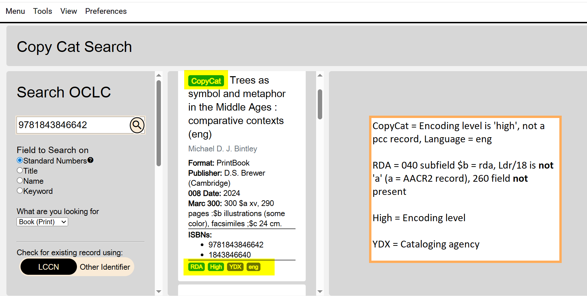

The detail panel explains the badges:

- **CopyCat** = Encoding level is 'high', not a pcc record, Language = eng
- **RDA** = 040 subfield $b = rda, Ldr/18 is **not** 'a' (a = AACR2 record), 260 field **not** present
- **High** = Encoding level
- **YDX** = Cataloging agency
- **eng** = Cataloging language

If you want to look at the full MARC record, click on the box in the Results panel.

### Selecting a Record for Example 2

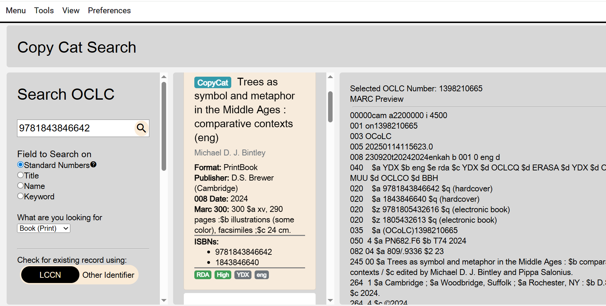

Your cataloger's judgment will determine which of the records is appropriate for import. CopyCat is a good choice for import. PccAdapt would be better, but there is not a PccAdapt record in this result set.

With the selected record highlighted (the beige background shows the highlighted record), insert the LCCN of the ibc record in the LCCN: box and verify that the Priority: value is correct.

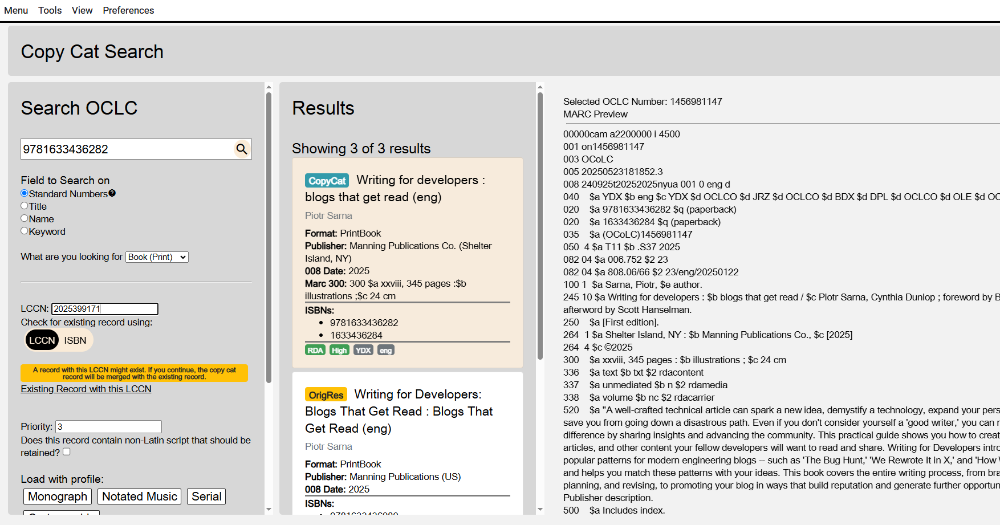

The Copy Cat. feature will check for a resource with the LCCN. Click on **Existing Record with this LCCN** to verify. In this case, it is the ibc resource in Folio, so everything is ok.

### Verifying via Linked Data Service (Example 2)

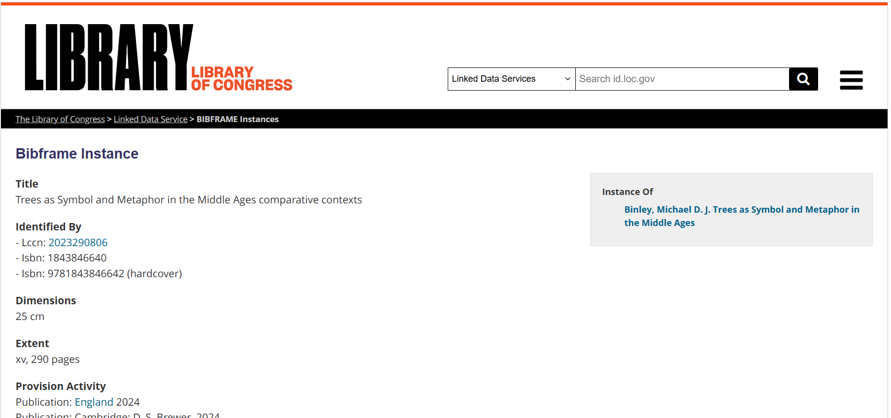

You can also check for an existing record using ISBN, or even another identifier. Toggle the LCCN/ISBN button to ISBN and click on **Existing Record with this ISBN**.

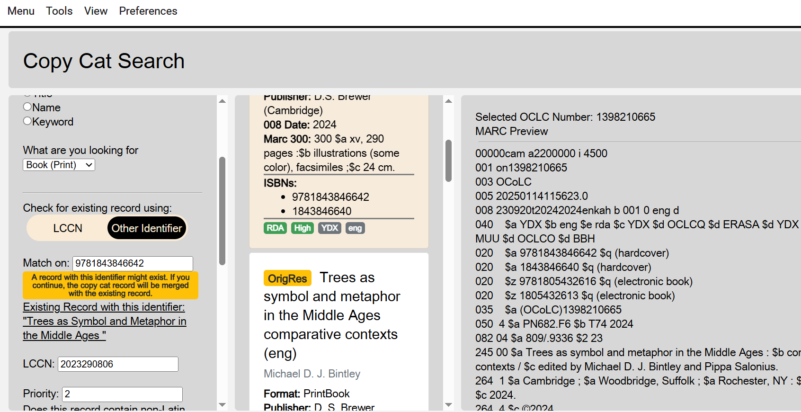

The Copy Cat. feature will check for an existing record with the ISBN. Click on the **Existing Record with this ISBN** to verify. In this case, it is the ibc resource in Folio, so everything is ok.

### Loading the Record (Example 2)


Using either LCCN or ISBN, click on Load with profile: Monograph.

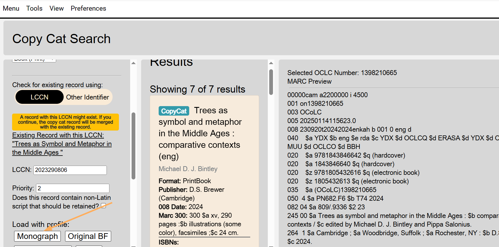

A prompt will ask if you want to continue with the merge.

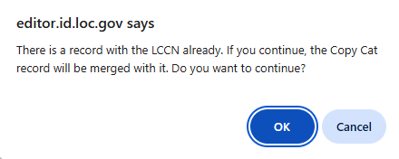

### Editing the Imported Record in Marva (Example 2)

Marva will import the CopyCat record and overlay it on the existing ibc record.

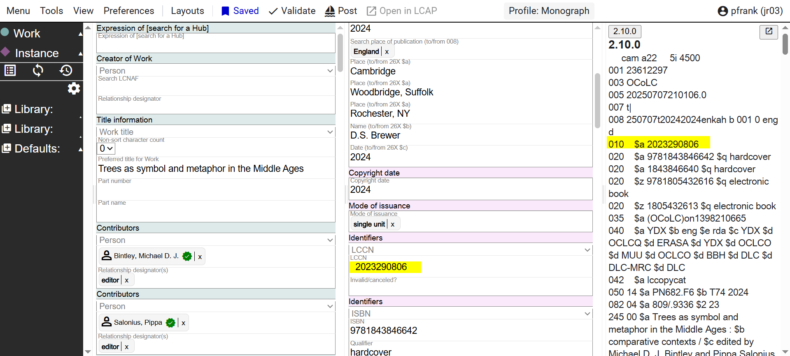

Edit the description in Marva as needed. Save the updates, Validate, and Post.

Note that the MARC Preview in Marva includes MARC 906, 955, and 925 fields.

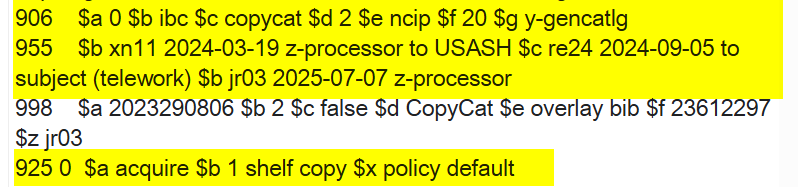

```
906    $a 0 $b ibc $c copycat $d 2 $e ncip $f 20 $g y-gencatlg
955    $b xn11 2024-03-19 z-processor to USASH $c re24 2024-09-05 to
subject (telework) $b jr03 2025-07-07 z-processor
998    $a 2023290806 $b 2 $c false $d CopyCat $e overlay bib $f 23612297
$z jr03
925 0  $a acquire $b 1 shelf copy $x policy default
```

These fields will migrate to Folio with the Modern MARC record and merge with the existing 906, 955, and 925 fields in the original record.

The default value in 925 subfield $b is 1 shelf copy. If 2 shelf copies are required, change the value in the Modern MARC record in Folio.

### Sending the Description Back to Folio (Example 2)

Be sure to Save, Validate, and Post the description before you send it back to Folio as a Modern MARC record.

There are two ways to get the BIBFRAME description back to Folio as a Modern MARC record:

#### Method 2: Marva Import App

Use the Marva Import app in the LCAP Productivity Toolkit to send the description back to Folio. Use the Local Identifier in the Marva Import app. You can find the Local Identifier in the Admin Metadata components in Marva.

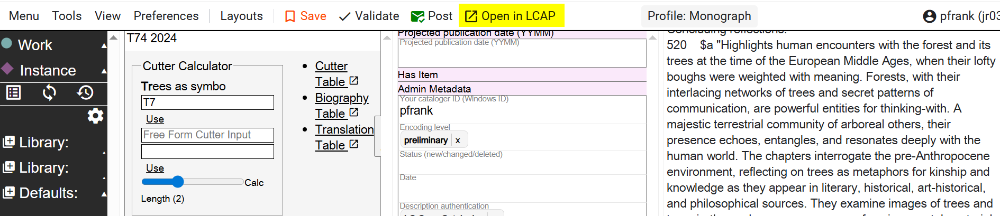

> **Tip:** even though it will look like you can't copy the Local Identifier, you actually can copy it for pasting into the Marva Import app.

#### Method 3: Open in LCAP

Click on the **Open in LCAP** icon in the Navigation Bar.

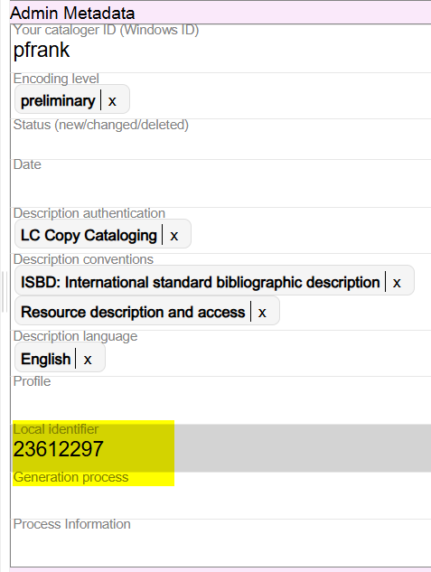

Whichever method you use, both the original MARC record and the Modern MARC record will appear together in a single window in the Productivity Toolkit. This is not the Folio Inventory app!

### Comparing Records in the Productivity Toolkit (Example 2)


Compare the two versions of the record, and when you are satisfied with the Modern MARC version, click on Open in QuickMARC Editor (Update). You can't edit or save the Modern MARC record in this Productivity Toolkit view.

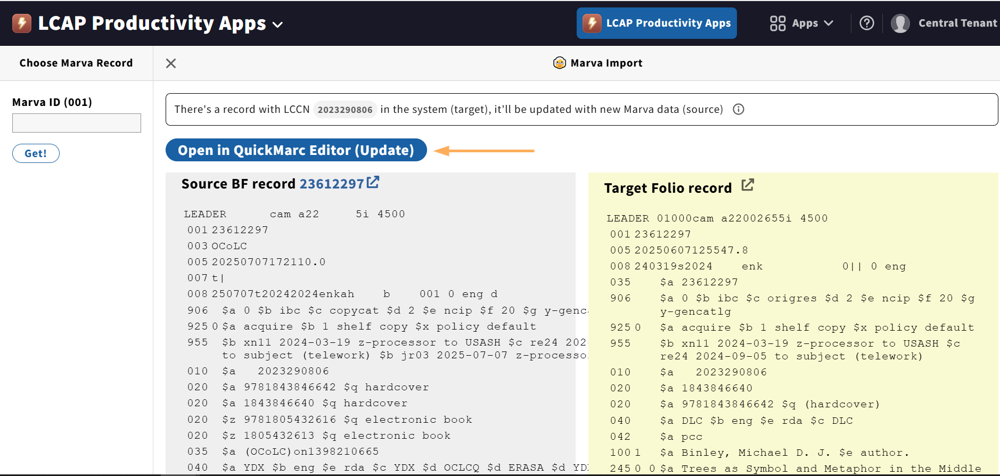

### Completing the Record in Folio (Example 2)

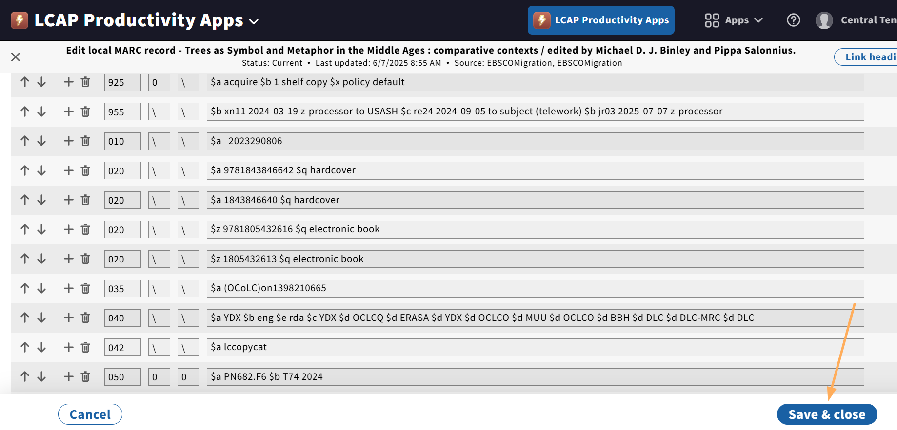

This image shows the record in the Folio Inventory app.

Complete Holdings and Items in Folio.

---

## Copy Cat Preferences

Preferences for Copy Cat. can be set using **Preferences > Copy Cat**

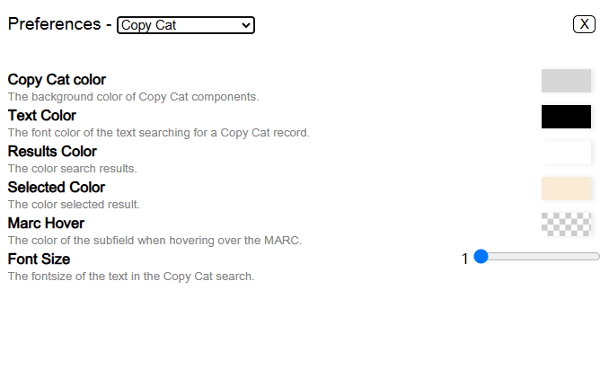

The preferences include:

- **Copy Cat color** - The background color of Copy Cat components
- **Text Color** - The font color of the text searching for a Copy Cat record
- **Results Color** - The color search results
- **Selected Color** - The color selected result
- **Marc Hover** - The color of the subfield when hovering over the MARC
- **Font Size** - The fontsize of the text in the Copy Cat search

---

See also [Appendix G: MARC to Marva Mappings](./g-marc-to-marva-mappings.md) for how MARC fields map to Marva components.

[Back to Table of Contents](../index.md)
