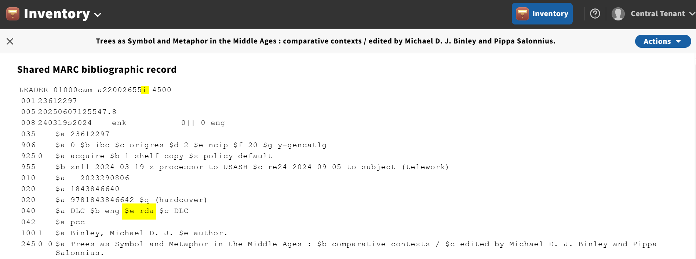
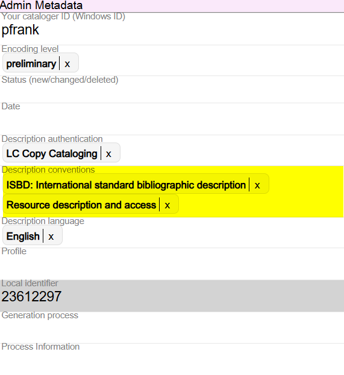
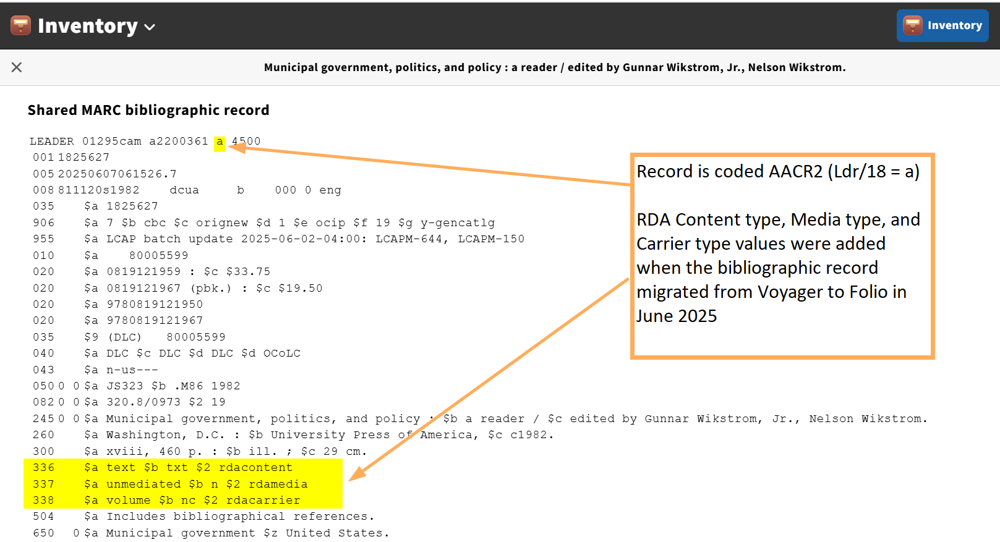
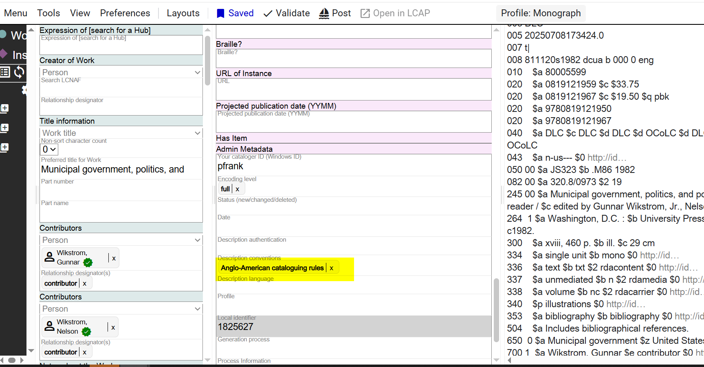
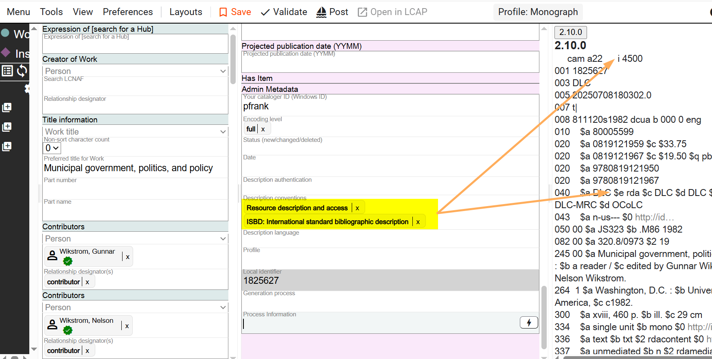
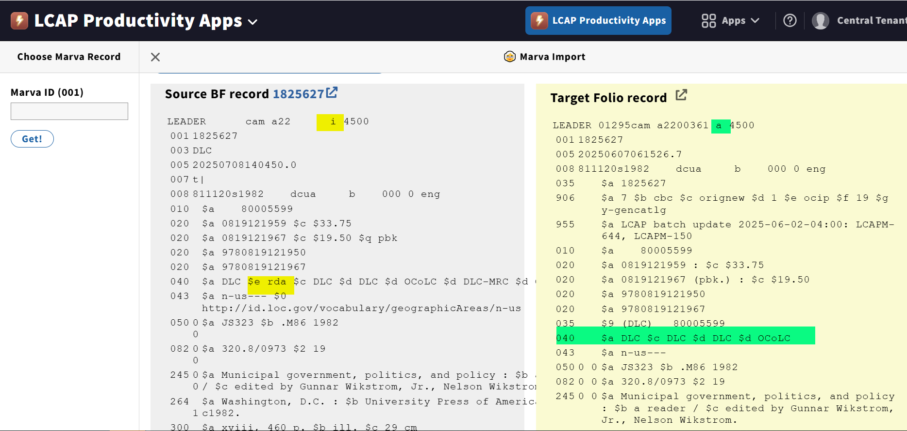

# Appendix I: Working with Non-RDA Records in Marva

The Library of Congress has been using *Resource Description & Access*, RDA, as its cataloging code and standard since 2012. In the MARC Bibliographic Format, all new bibliographic descriptions created since 2012 will be coded "rda" in the 040 field, subfield $e, and will have the Ldr/18 value, Descriptive cataloging form, set to i: ISBD punctuation included.

## RDA Data Elements in Marva

In Marva, these data elements will appear in the Admin Metadata part of the description.

Data flows for RDA bibliographic records are seamless between the BIBFRAME Database (BFDB) and Folio.

## The AACR2 Challenge

But bibliographic records created under other codes or standards do not work as easily. This is because MARC Ldr/18 value, Descriptive cataloging form, has a code for AACR2 records: code **a: AACR2**. From the MARC Bibliographic Format:

> **a - AACR 2**
>
> Descriptive portion of the record is formulated according to the description and punctuation provisions as incorporated into the *Anglo-American Cataloging Rules*, 2nd Edition (AACR 2) and its manuals.

There is no corresponding Ldr/18 value for **RDA**. The decision was made when RDA was implemented, that the Ldr/18 value would be set to i: ISBD punctuation included, and RDA would be recorded as a Description convention in the 040 field, subfield $e.

This decision effectively separated the cataloging code or standard, RDA, from the input conventions, ISBD, that would be used.

In Ldr/18 value **a**, AACR2, the cataloging code or standard, AACR2, is integrated with the input conventions, ISBD.

Because Modern MARC bibliographic records do not follow complete ISBD punctuation as prescribed in AACR2, Modern MARC records cannot be coded with Ldr/18 = a.

**When working with AACR2 bibliographic records, re-code the records to RDA in Marva so the Modern MARC record will be represented accurately.**

## RDA Content Type, Media Type, and Carrier Type

When LC transitioned to Folio in June 2025, RDA Content Type, Media Type, and Carrier Type values were added to all bibliographic records. Using these values in AACR2 records is acceptable, so AACR2 records were not routinely recoded to RDA at the time the RDA Content Type, Media Type, and Carrier Type values were added.

## Example: AACR2 Record in Folio

AACR2 record in Folio:

Same record in Marva:

## Re-coding to RDA

Record evaluated for RDA and Description conventions value changed in Marva:

Description sent back to Folio as a Modern MARC description:

---

See also:
- [Appendix G: MARC to Marva Mappings](./g-marc-to-marva-mappings.md) for details on how Ldr/18 maps to Marva's Description conventions
- [Appendix H: Copy Cataloging](./h-copy-cataloging.md) for importing records from OCLC that may need re-coding

[Back to Table of Contents](../index.md)
