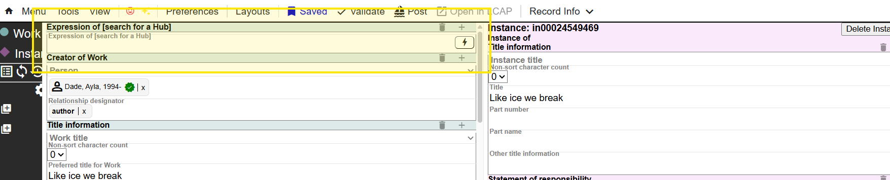
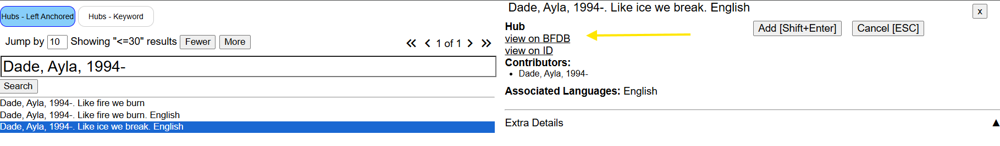
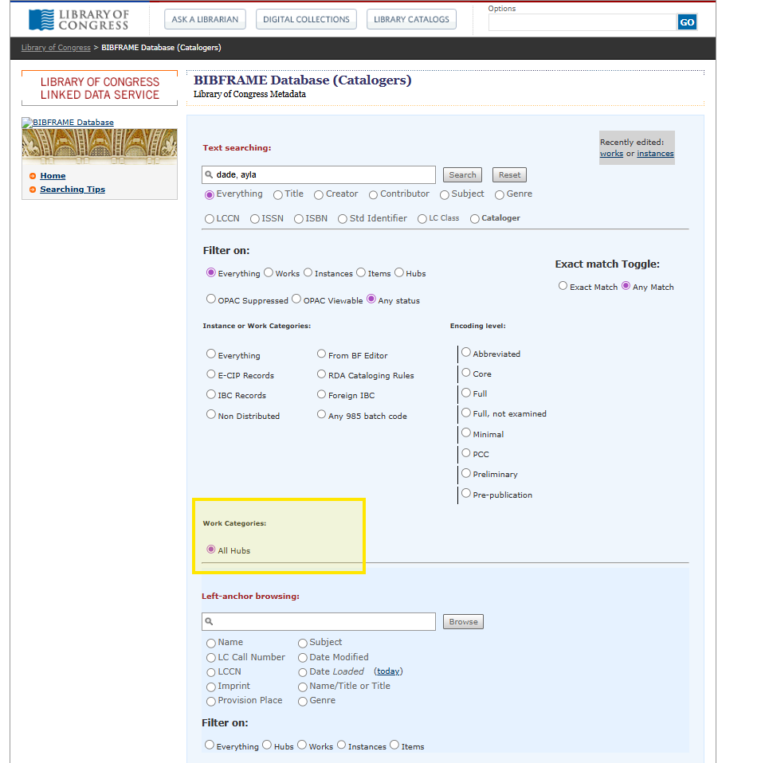
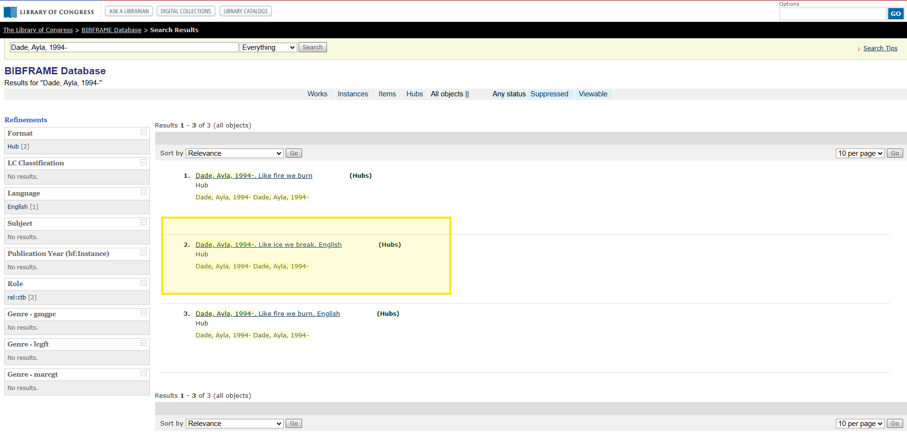
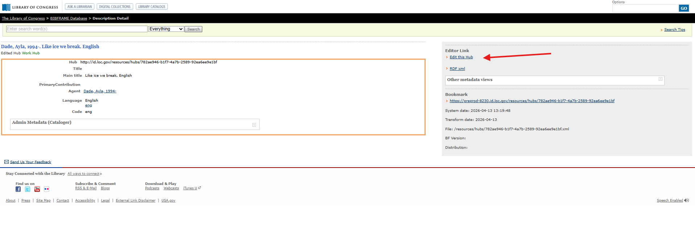
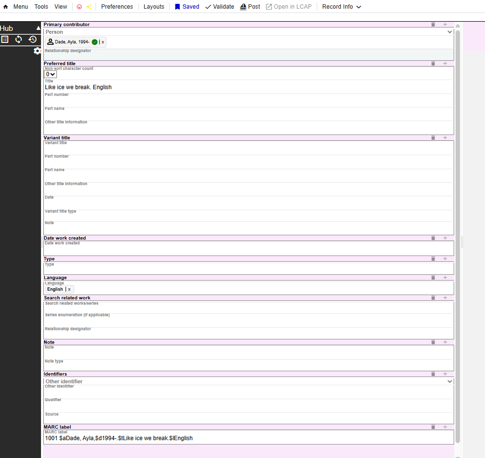

# Editing Hubs [IN PROGRESS]

## Finding your Hub

To edit your hub, search for it in either Marva or directly in BFDB

### In Marva

Search for your hub in the Expression of [search for a Hub] field

Select the Hub you'd like to edit and click on "view in BFDB"

### In BFDB 

Use Text searching to find your Hub and make sure to select All Hubs under Work categories. Once you see the search results, select the Hub you'd like to edit

## Editing your Hub

You can now click on Edit this Hub; this will open a new Marva tab where you can edit the Hub as needed. Once you're done, save, validate and post just like you would with any record in Marva

