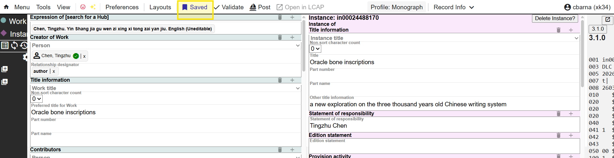
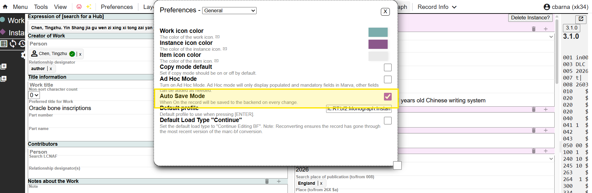
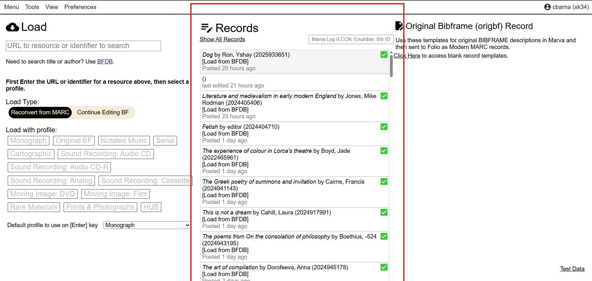
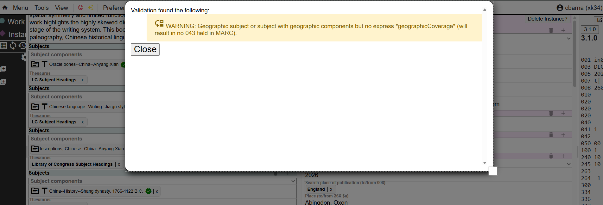
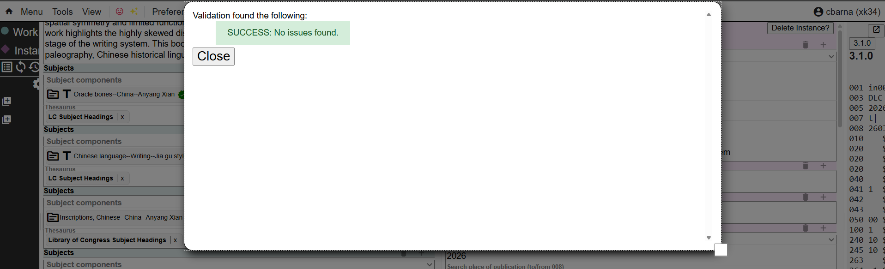
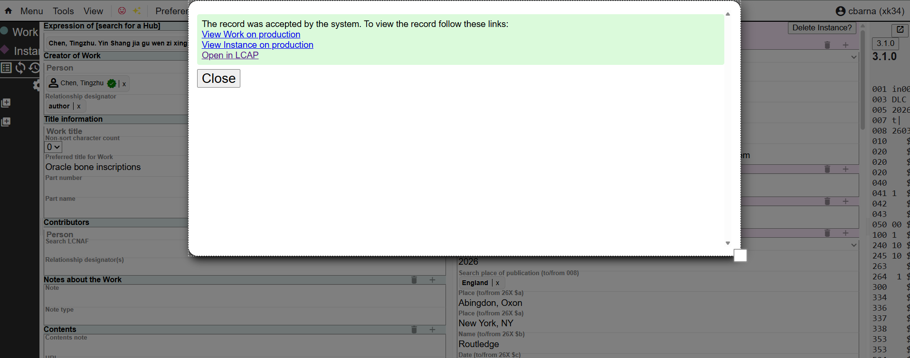
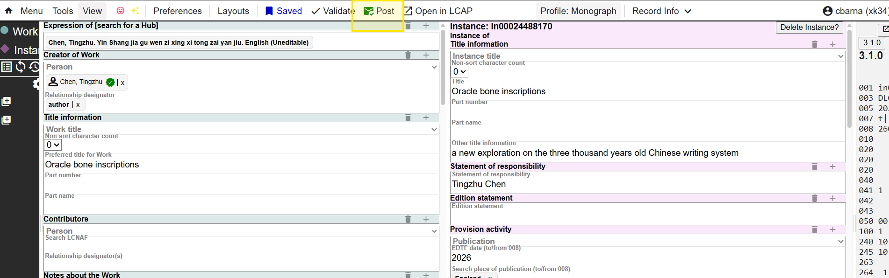

Save

Saves a draft of your record within Marva. Your updates will not be added to the BFDB until the record is posted 

You can also select the Auto Save option which will automatically save your record as you type. You can find this option in Preferences--General

You can retrieve the record from the Records panel on the main site

Validate

This tool looks for empty fields and missing field values. Records can be saved even if the system generates a warning. If there are no issues, you will get a success message

Post

Sends the record to the BFDB. Once a record has been posted to BFDB, a pop-up message confirms that the record has been updated in BFDB. To continue processing your record in Folio, you can either click Open in LCAP from the pop-up hyperlink or from the Marva tool bar. Note if you exit the record, you will need to repeat the save, validate, post process in order to open the record in Folio from Marva 

The Post button will change to a green checkmark to show that the record has been posted

