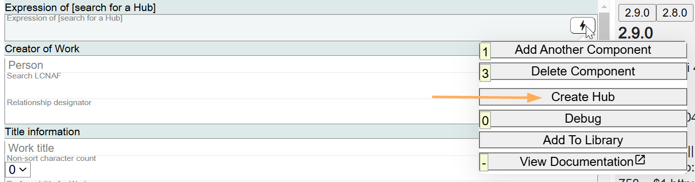
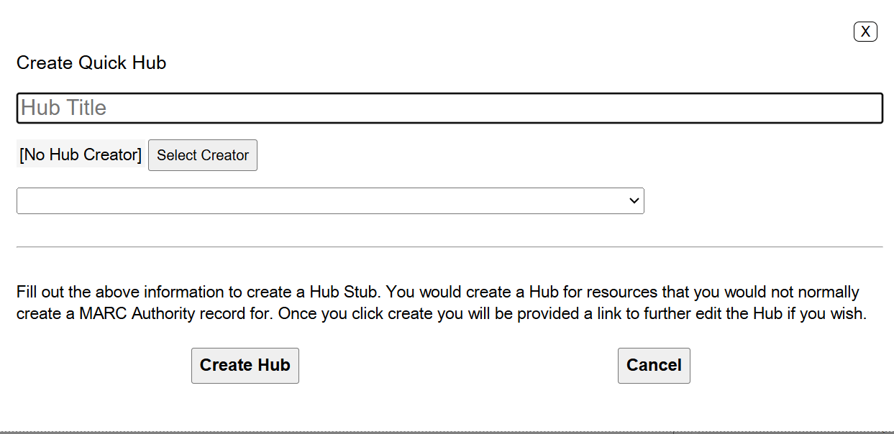
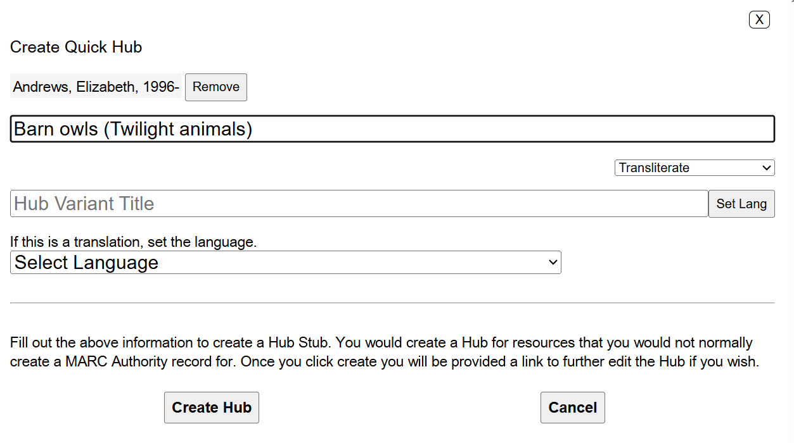
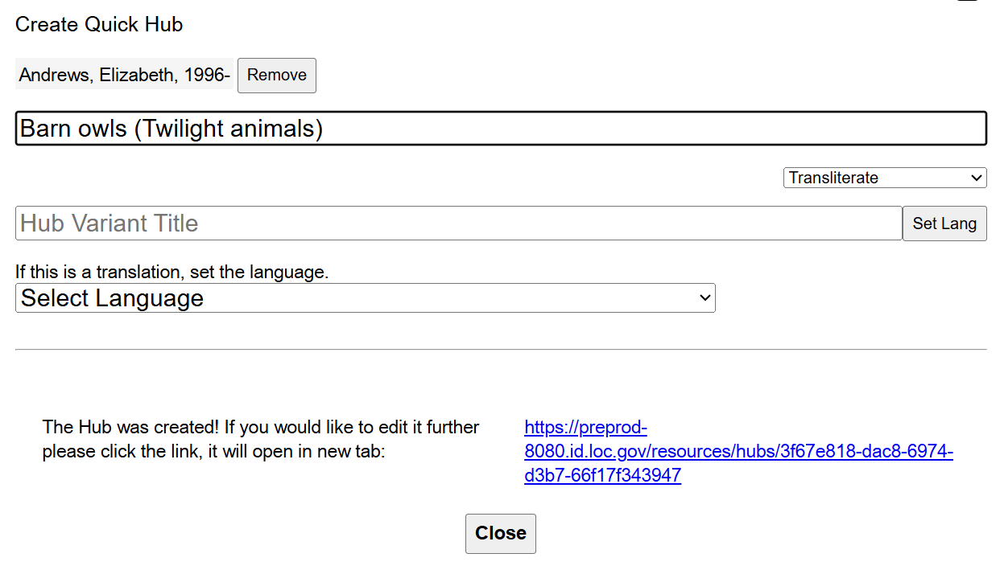
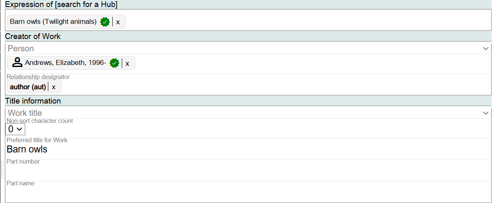

## Creating a Hub in Marva

If a Hub is not found, and according to authority policies and practices, a title or name-title authority record would not be created for the access point, you can create a Hub "Stub" directly in Marva. This is new functionality as of February 2025 and will be improved over time.

Click on Create Hub from the Lightning Bolt feature in the Expression of [search for a Hub] component.

In the Hub Title field, key in the Title only. In the example below, a Hub "Stub" is being created for the title Barn owls published in the series Twilight animals. There are other resources with the title Barn owls, so the series title is chosen as an Other distinguishing characteristic from RDA to make this title unique. Date, publisher name, surname of creator are other options for making this title unique.

If there is a creator associated with the work, click on the Select creator box and search for the creator's name in the modal that will pop up and select it.

Hub language will add a language title in the Hub "Stub." Only select language if you are cataloging a translation.

Click on Create Hub.

