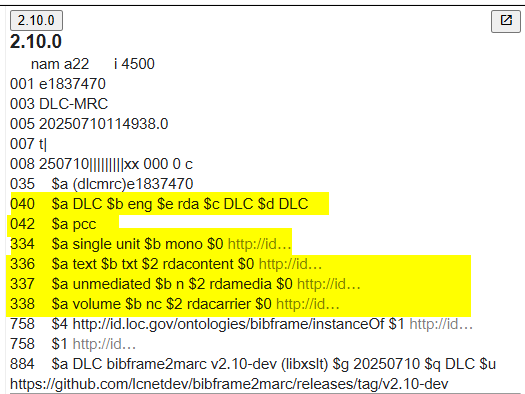
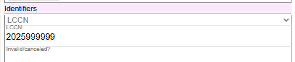
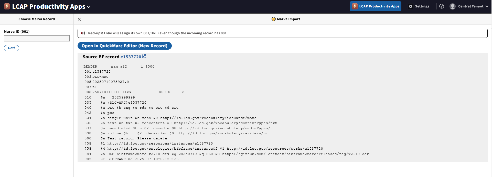
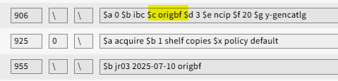

# Creating New Descriptions

Before July 2025, Marva could only work with an existing MARC bibliographic record in the MARC ILS (Voyager, and for a short time starting on June 30, 2025, Folio). This was because Marva required a local system identifier for the MARC bibliographic record to facilitate import, matching, and overlaying the original MARC record with the Modern MARC record.

In July 2025, functionality was added to Marva to allow "native" BIBFRAME descriptions (origbf) to be created in Marva. This functionality will allow Marva to be used as the sole cataloging interface for new descriptions.

There is no limit on the level of bibliographic descriptions that can be created natively in Marva, as long as the format is approved for use in Marva. For example, as of July 2025, only monographic resources are being described in Marva. So any monograph resource that is not represented already by a MARC record in Folio can be described directly in Marva -- IBC description, resource description, completely-cataloged description, etc.

## Creating a New Description from a Template

To create a new description in Marva, use one of the templates in the Create Original BIBFRAME (origbf) Descriptions panel.


Click on **Tools > Add All Defaults**. This will add the RDA Content type, Media type, and Carrier type, the Mode of issuance, and will set the authentication to pcc. It will also identify the cataloging code as RDA.

## The Modern MARC Record

The resulting Modern MARC record will contain the standard fields:



```
2.10.0
   nam a22    i 4500
001 e1837470
003 DLC-MRC
005 20250710114938.0
007 t|
008 250710||||||||xx 000 0 c
035  $a (dlcmrc)e1837470
040  $a DLC $b eng $e rda $c DLC $d DLC
042  $a pcc
334  $a single unit $b mono $0 http://id...
336  $a text $b txt $2 rdacontent $0 http://id...
337  $a unmediated $b n $2 rdamedia $0 http://id...
338  $a volume $b nc $2 rdacarrier $0 http://id...
758  $4 http://id.loc.gov/ontologies/bibframe/instanceOf $1 http://id...
758  $1 http://id...
884  $a DLC bibframe2marc v2.10-dev (libxslt) $g 20250710 $q DLC $u
https://github.com/lcnetdev/bibframe2marc/releases/tag/v2.10-dev
```

## Assigning an LCCN

Be sure to assign an LCCN in the Instance LCCN Identifier component. The spacing values for the LCCN will be correct in the Modern MARC record. There is no need to regularize the spacing in Marva.



Complete work in Marva to the point where you are done with the description.

Save, Validate, Post. Send to Folio by clicking on the Open in LCAP icon in Marva.

## Sending to Folio via LCAP



Open in QuickMarc Editor (New Record) and add 906, 925, and 955 data. Use origbf for the 906 subfield $c value.



```
906    $a 0 $b ibc $c origbf $d 3 $e ncip $f 20 $g y-gencatlg
925 0  $a acquire $b 1 shelf copies $x policy default
955    $b jr03 2025-07-10 origbf
```

---

See also:
- [MARC to Marva Mappings](../Reference/g-marc-to-marva-mappings.md) for understanding how Marva components map to MARC fields in the generated record
- [Copy Cataloging](./h-copy-cataloging.md) for importing existing records from OCLC instead of creating new ones
- [Working with Non-RDA Records](../Reference/i-non-rda-records.md) for handling records that need to be re-coded to RDA

[Back to Table of Contents](../index.md)
