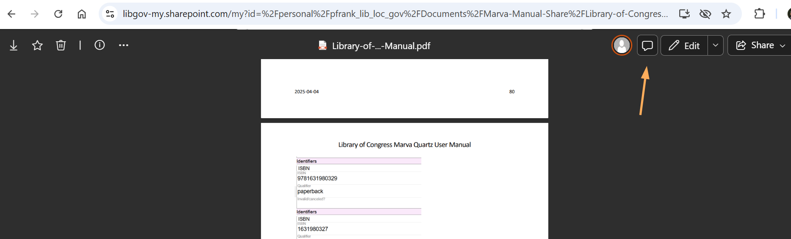
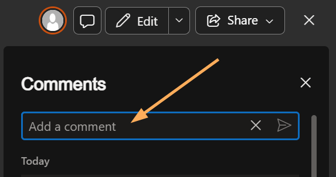

# About the Library of Congress Marva Quartz User Manual

The Library of Congress Marva Quartz User Manual is an integrating resource that is updated weekly. Marva, BIBFRAME, and current LC policies are constantly being changed and reviewed as BFProd moves forward.

Please add comments in the manual for anything you notice is missing, is incorrect, or is outdated. Comments can be added by clicking on the Comment icon in the document, then adding a comment in the box that opens up.

---

[Back to Table of Contents](index.md)
