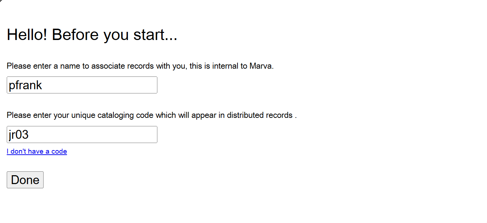
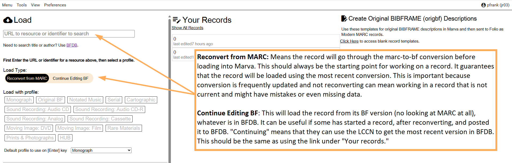
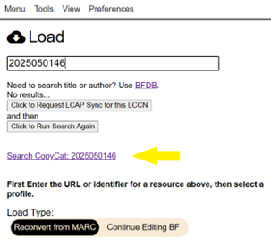
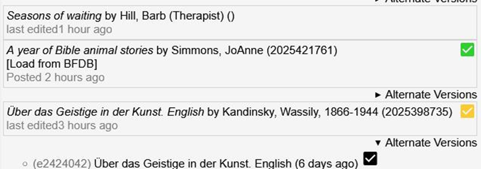
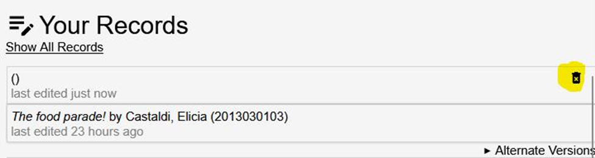
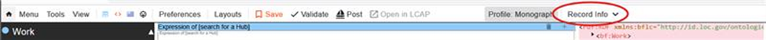
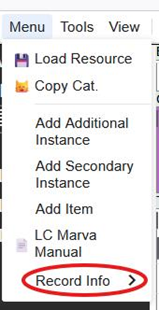

# Accessing Marva

Using Chrome enter [https://editor.id.loc.gov/](https://editor.id.loc.gov/)

In the "This 'quartz' version of Marva is the updated editor for the BF Prod 2024- project." Area, select:

**Marva Production**

Enter user name and code. For user name, use your Windows ID (the part of your LC email address before the @loc.gov). For code, use your cataloger code that you add in the MARC 955 field of records you work on.

On the far upper left of the screen you will see "Load"

In the box that states "URL to resource or identifier to search" scan, copy/paste, or enter the LCCN of the item.

A few lines down from this box (also in the far left panel) select:

**Monograph** if your work is a monograph / book

When a search has 0 results, there will be a link to perform the search in CopyCat

## More About Load Type

The long-term goal is to not have to update the conversion a lot but to prefer regular updates that happen at predicable times during the year. With those updates would come reconversions of the entire database which would mean that the distinction between "reconverting" and "continuing" will become unnecessary. The reason for this change was that reconvert was the default and people kept reloading LCCNs and then reporting that their work was being deleted.

**Reconvert from MARC:** The record will go through the MARC-to-BIBFRAME conversion before loading into Marva. This should always be the starting point for working on a record. It guarantees that the record will be loaded using the most recent conversion. This is important because the conversion software is frequently updated and not reconverting can mean working on a record that might have mistakes or even missing data.

**Continue Editing BF:** The BIBFRAME version of the record is loaded into Marva. This option can be useful if someone has started to edit a record, after reconverting it from MARC, and posted it to BFDB. "Continuing" means that they can use the LCCN to get the most recent version in BFDB. This should be the same as using the link under "Your records."

**Your records**

Your records will list all records edited or posted within the last two weeks.

Alternate Version Posted: If there are multiple versions of a record and one of the earlier records was posted, there will be an icon to indicate this and the alternate version that was posted will have an icon.

green: the most recent version was posted
yellow: an alternate, older version was posted
black:  the alternate version that was posted

Empty records under can be deleted. "Empty" means they don't have a title or an LCCN

Record histories for individual records can be accessed from within each record. This is legacy data from voyager. The history is available from the nav bar under “Record Info”

If you don't see it, it is because your screen is too narrow. To not make the nav bar cluttered and difficult to use, the record info will be under "Menu."

You can return to the Load record screen by clicking on the house button in the navigation bar without going through "Menu"

---

[Back to Table of Contents](index.md)
