# Appendix C: ScriptShifter

## About ScriptShifter

ScriptShifter is an open source tool that is used in Marva to romanize non-Latin script according to the ALA/LC Romanization Tables, and to generate non-Latin scripts from data romanized according to the ALA/LC Romanization Tables.

ScriptShifter uses AI and user input to improve its responsiveness. Anyone working with ScriptShifter in Marva is welcome to provide feedback to the developers on ScriptShifter.

## Setting ScriptShifter Scripts and Script Options

Access ScriptShifter under Preferences in the Navigation Bar in Marva.

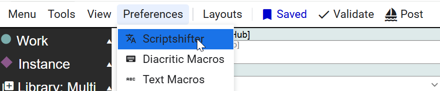

In the pop-up box, you will see multiple options for selecting Scripts and Actions.

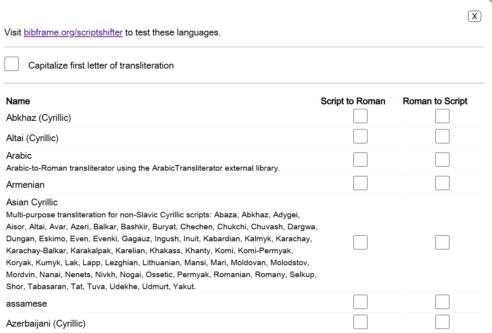

Visit [bibframe.org/scriptshifter](https://bibframe.org/scriptshifter) to test these languages.

**Capitalize first letter of transliteration** is "off" by default. If the script and language you are working with uses capitalization, you can click on this box so ScriptShifter will capitalize the first letter of the text that is generated.

In the Name, Script to Roman, and Roman to Script columns, you can select the languages and scripts that you will be working with in Marva from the A-Z list.

For most languages and scripts, ScriptShifter offers both transliteration from non-Latin script to romanized script, and the generation of non-Latin script from romanized script. Check the appropriate boxes. There is no limit on the number of boxes you can check.

For some languages and scripts, ScriptShifter does not offer both transliteration from non-Latin script to romanized script, and the generation of non-Latin script from romanized script. For these scripts, one of the boxes will be greyed-out, meaning that the option is not available in ScriptShifter. For example, ScriptShifter does not have an option to generate Korean script from romanized Korean script, and ScriptShifter does not have an option to romanize Kurdish script.

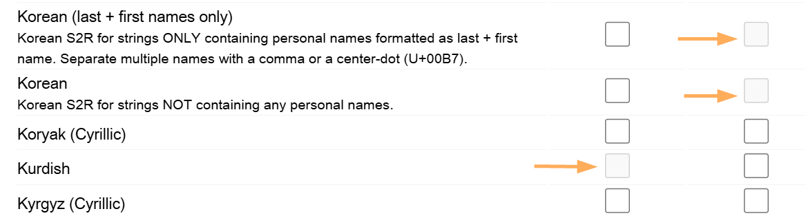

## Using ScriptShifter in Marva

### Script to Roman

Set the value in ScriptShifter. Click the Esc button to exit the ScriptShifter panel.

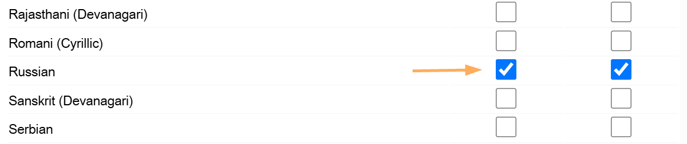

In Marva, the options that you selected in the ScriptShifter panel will be visible in the Lightning Bolt feature for each literal component.

In a Literal field, key in or paste Russian script. If you are using the MARC Preview Panel, you will see that the Russian title in Cyrillic script shows up in the MARC 245 field.

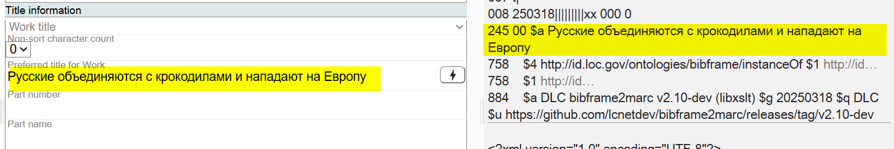

Click on the Lightning Bolt and select the **Russian S2R** option.

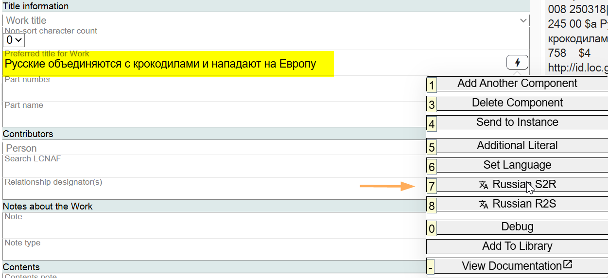

The romanized title will be added to a second Preferred title for Work in the Marva Title information component, and the values in the MARC Preview will reflect current cataloging policy, with the romanized title in the 245 field, and the Russian Cyrillic script title in the corresponding 880 field. The non-Latin title and the romanized title will be connected with a bracket in Marva.

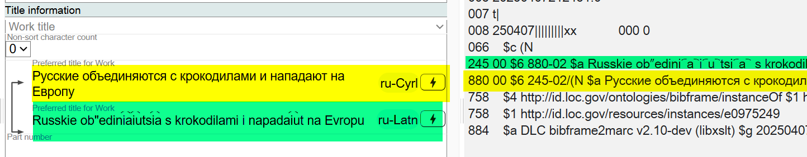

### Roman to Script

Set the value in ScriptShifter. Click the Esc button to exit the ScriptShifter panel.

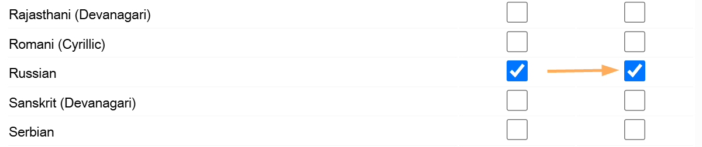

In Marva, the options that you selected in the ScriptShifter panel will be visible in the Lightning Bolt feature for each literal component.

In a Literal field, key in or paste romanized Russian script. If you are using the MARC Preview Panel, you will see that the romanized Russian title shows up in the MARC 245 field.

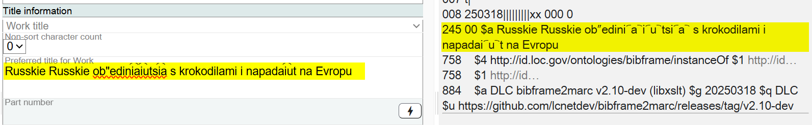

Click on the Lightning Bolt and select the **Russian R2S** option.

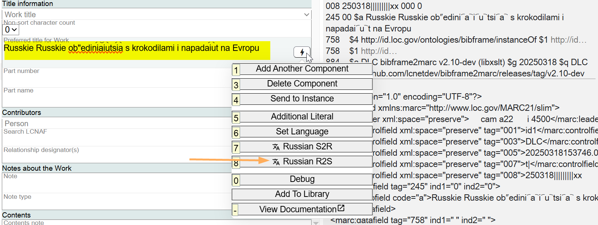

The Russian script title will be added to a second Preferred title for Work in the Marva Title information component, and the values in the MARC Preview will reflect current cataloging policy, with the romanized title in the 245 field, and the Russian Cyrillic script title in the corresponding 880 field. The non-Latin title and the romanized title will be connected with a bracket in Marva.

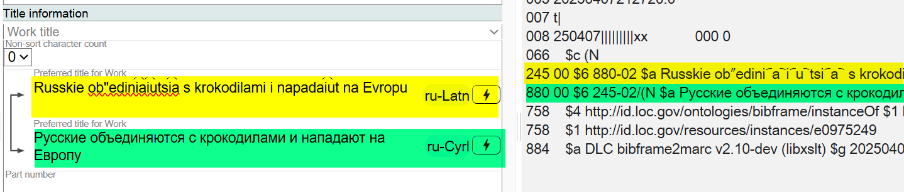

## Language and Script Tags

### Component Level

When ScriptShifter is used in Marva, language and script tags are added by default to both romanized text and text in Non-Latin script.

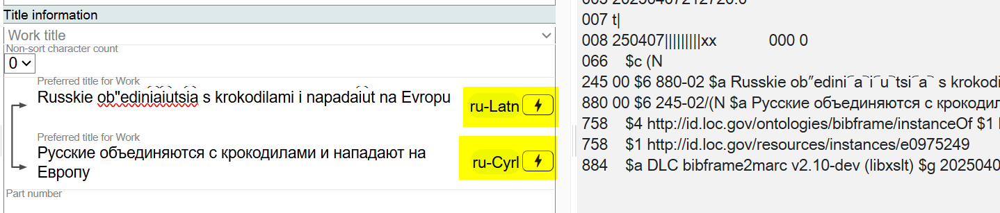

These values can be changed if needed by clicking on the Lightning Bolt and selecting Set Language.

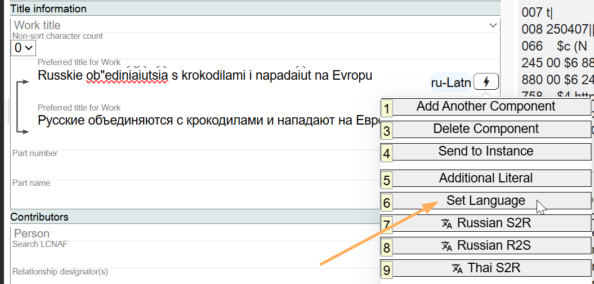

Under each literal value, there will be a Language tag and a Script tag. Use the dropdown lists under Language and Script to change the values.

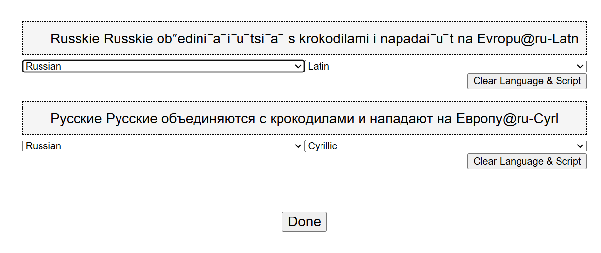

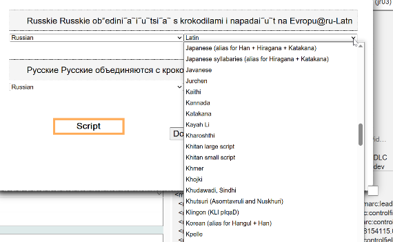
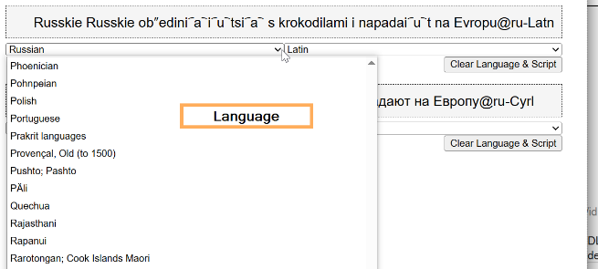

### Global Level

You can select Language and Script tags for all literal values in a description by clicking on Tools --> Non-Latin Literals in the Navigation Bar.

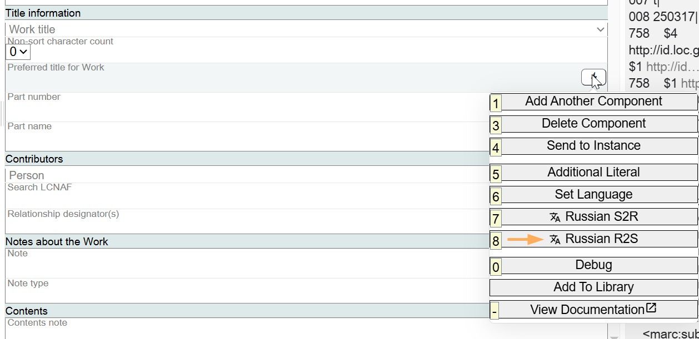

This will open a box that will show all non-Latin Literal values in the description and you can manage all of them in one screen.

## Non-Latin Agents

Non-Latin Agents (Tools --> Non-Latin Agents) allows you to manage access points in Non-Latin scripts. This feature works with non-Latin variant access points in authority records.

When a name authority has multiple Non-Latin authorized labels. For example: [n2010057779](http://id.loc.gov/authorities/names/n2010057779):

(id.loc.gov is "selecting" a Non-Latin variant label to be the "authorized" label for that script)

When added to Marva the editor will try to select which Non-Latin authorized label to use to build an 880 field. It does this by looking at the language tags set for the literals in the record. It selects the most common one and then chooses that language + script combination to build the 880. This works fine if there is only one Non-Latin authorized label to select. But if there are multiple it could potentially select the incorrect one to use. This modal window allows you to overwrite that logic and force Marva to use a specific script to build the 880. After I added this name authority, and a Non-Latin title, and went to Tools -> Non-Latin Agents I see this:

For this name it has selected the Hani script to build the 880. I can force it however to use the Hang script instead:

This will force the conversion to use the Hang script label when building the 880 in the MARC output. To summarize you will likely never need to modify these selections as Marva should pick the best fit. But if it doesn't this is how you can overwrite it.

---

[Back to Table of Contents](../index.md)
