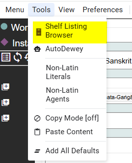
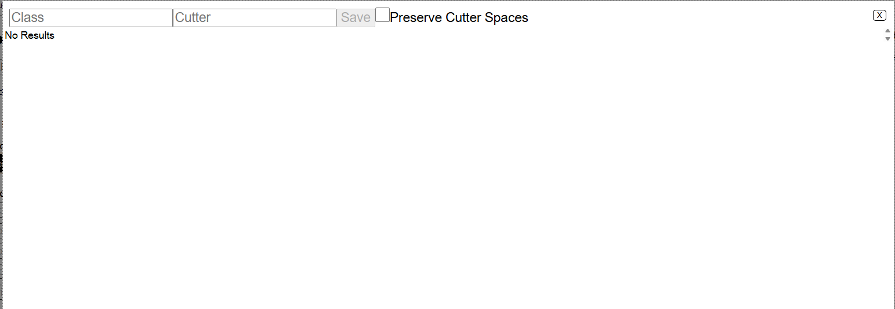
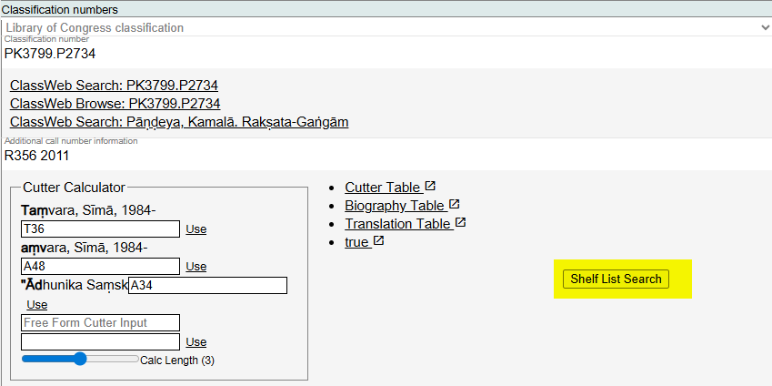
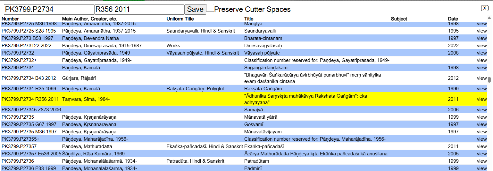
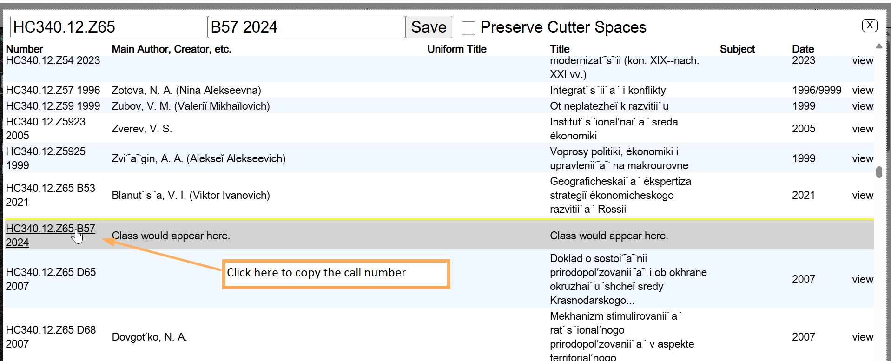
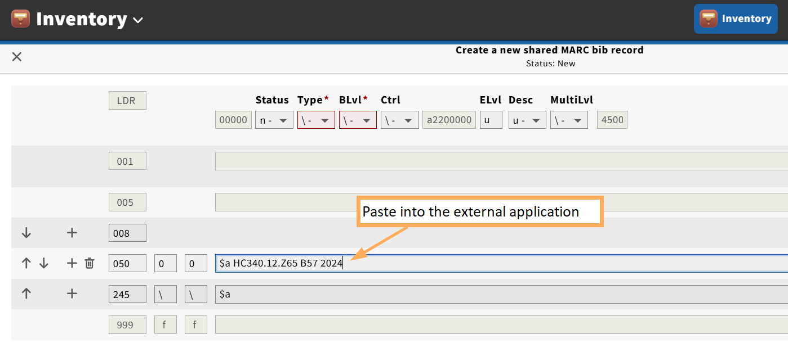
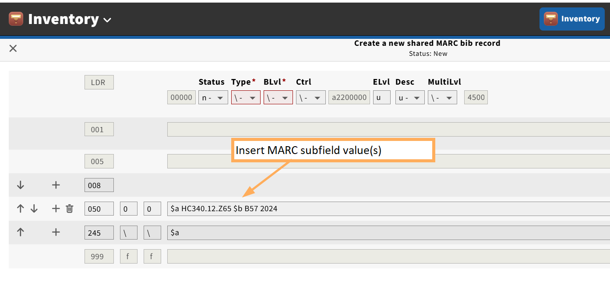

# Appendix K: Shelf Listing Browser

Marva has a shelflisting tool that allows users to assign complete LC Classification call numbers to bibliographic resources. Library of Congress shelflisting is based on the LC Classification numbers assigned in the bibliographic description (Marva: Work: Classification numbers; MARC Bibliographic: 050, Library of Congress Call Number). Shelflisting based on LC Classification numbers assigned in bibliographic descriptions is a unique need for the Library of Congress. Many libraries shelflist against the Library of Congress Call Number assigned in Holdings records, since Holdings records represent resources that are present and accessible in a library's collections. Library of Congress bibliographic resources do not always have associated Holdings records. For example, CIP policies do not require a Holdings record for a bibliographic resource until the resource is received. But the shelflisting needs to be done in anticipation of receiving the resource. Bibliographic descriptions for Do Not Acquire resources are accessible in the LC catalog, but do not have associated Holdings records.

---

## Accessing the Shelf Listing Browser

The Shelf Listing Browser may be accessed in three ways:

1. As a stand-alone tool outside of Marva: [https://editor.id.loc.gov/bfe2/quartz/#shelflisting](https://editor.id.loc.gov/bfe2/quartz/#shelflisting)

2. As a stand-alone tool in Marva at: **Tools > Shelf Listing Browser**

If you access the Shelf Listing Browser from Tools > Shelf Listing Browser from the Navigation Bar on the Marva landing page, the Class and Cutter boxes will be empty.

3. As a link identified as "Shelf List Search" integrated into the Marva: Work: Classification numbers component

If you access the Shelf Listing Browser from the Classification component, the classification numbers already in the component will appear in the Class and Cutter boxes.

---

## Components of the Shelf Listing Browser

**Class**: the Library of Congress Classification number as it appears in the LC Classification schedules. In some cases, when working with complex Library of Congress Classification numbers, the Class box might include some "Item" number or "Book" number information. In MARC terms, the Class box will include the complete contents of the 050 subfield $a.

**Cutter**: the "Item" or "Book" number. The Cutter serves to organize works on one subject (in one classification number) by reflecting, normally, an alphabetical arrangement by the resource's creator and/or title. Since 1982, monograph call numbers contain a third element, a date.

**Save**: clicking on Save will add the information from the Class box and the Cutter box to the bibliographic description in the Classification numbers component of the Marva Work.

**Preserve Cutter Spaces**: the Preserve Cutter Spaces toggle prevents the system from removing the spaces from the beginning of the Cutter.

### Browse Display Columns

**Number**: this is the shelflist browse, showing complete call numbers in shelflist order for Library of Congress resources.

**Main Author, Creator, etc.**: If there is a creator (Marva: Work: Creator of Work; MARC 1XX) associated with the resource, it will appear here.

**Uniform Title**: If there is a uniform title (Marva: Work: Expression of; MARC 130 or 240) associated with the resource, it will appear here.

**Title**: the title proper of the resource (Marva: Instance: Instance title: Title, Part number, Part name; MARC 245 subfield $a, $n, $p).

**Subject**: subject headings associated with the resource.

**Date**: the date(s) associated with the resource (Marva: Instance: Provision Activity: EDTF date; MARC 008/Date 1, Date 2).

**view**: click to see the complete description of the resource in BFDB.

---

## Using the Shelf Listing Browser

Input an LC Classification number in the Class box. This is the broadest search and will give results for every resource in that class. The search will begin automatically. Scroll through the results to find the correct location for the resource you are shelflisting. When you identify a unique "Item" or "Book" number, input that information in the Cutter box. Click Save and the complete call number will be added to the Marva description.

If you are using the Shelf Listing Browser tool when working in an external application such as the Folio Inventory app, you can copy the call number from the display list and paste it into the external application. If the external application is a MARC system, remember to insert the subfield values!

### Using with External Applications

When using the call number in an external application like the Folio Inventory app, paste the call number into the appropriate field:

---

See also:
- [Appendix G: MARC to Marva Mappings](./g-marc-to-marva-mappings.md) for how the 050 Library of Congress Call Number maps to Marva's Classification numbers component

[Back to Table of Contents](../index.md)
