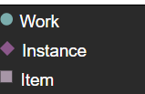
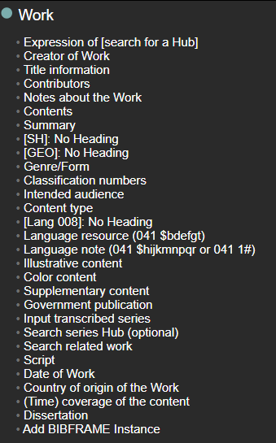
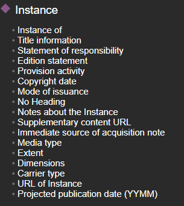
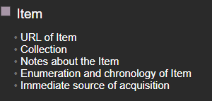
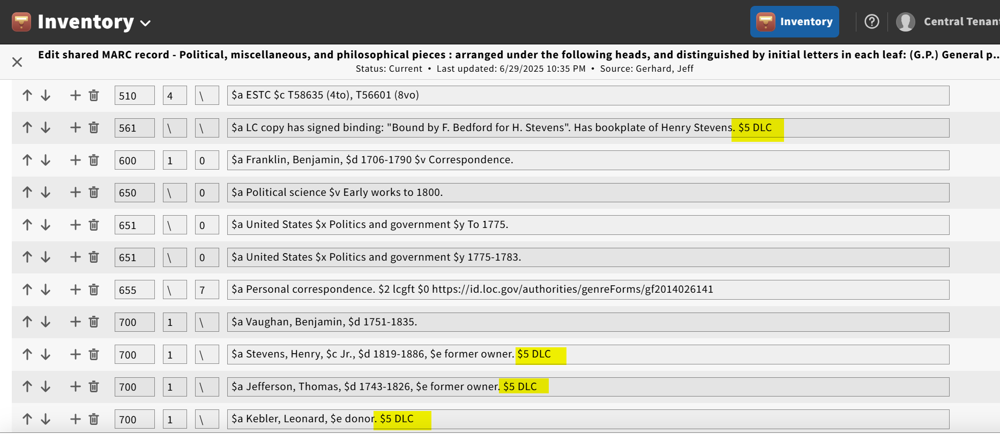
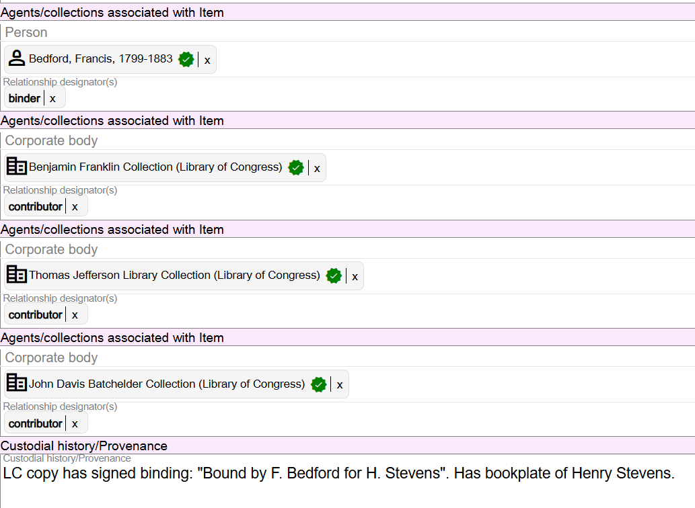

# BIBFRAME Work, Instance, and Item Descriptions and MARC Bibliographic Records

## Work and Instance Descriptions

MARC bibliographic records are "flat" representations or visualizations of the application of different entity models. For example, using Resource Description & Access (RDA) as an example, a MARC bibliographic record contains RDA Work attributes, RDA Expression attributes, RDA Manifestation attributes, and often RDA Item attributes in one "flat" record. The limitations of MARC have prevented a full visualization of RDA as a content standard. BIBFRAME is another model that has different entities. BIBFRAME has Works, Instances, and Items. When working in BFProd, in Marva, these different BIBFRAME entities are broken into their own separate areas. That is why you see this layout in Marva:

When a MARC bibliographic record is brought into Marva for editing, the different BIBFRAME entities will be extracted from the MARC record and put in the corresponding BIBFRAME entity.

For now, for every MARC bibliographic record, there will be one BIBFRAME Work and one BIBFRAME Instance. In some cases, a BIBFRAME Item will be generated, but for the most part, Item level information will continue to be recorded in Folio only using the Folio Holdings Format and Folio Items.

## Item Descriptions

Although BIBFRAME Items are not currently a part of BFProd, and Item information continues to be recorded in Folio using Folio Holdings and Item records, there are some cases even now where BIBFRAME Items are used in BFProd.

Many MARC bibliographic fields have subfield $5 defined. Subfield $5 is used to show the Institution to which field applies. MARC Organization Codes are used in subfield $5.

When a MARC record with subfield $5 DLC is brought into Marva for editing, the values in the fields with the subfield $5's will map to a BIBFRAME Instance.

When a Modern MARC record is generated from a description in Marva that has information in the Item record, the information will map back to MARC in regular MARC bibliographic fields, but without subfield $5 DLC added.

**These subfield $5 values should be added back manually to the appropriate fields in the Modern MARC record.**

When creating a native description (origbf) in Marva, if you want to record information that is specific to LC, create an Item record to add this information, if an Item record does not already exist.

---

[Back to Table of Contents](index.md)
