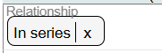
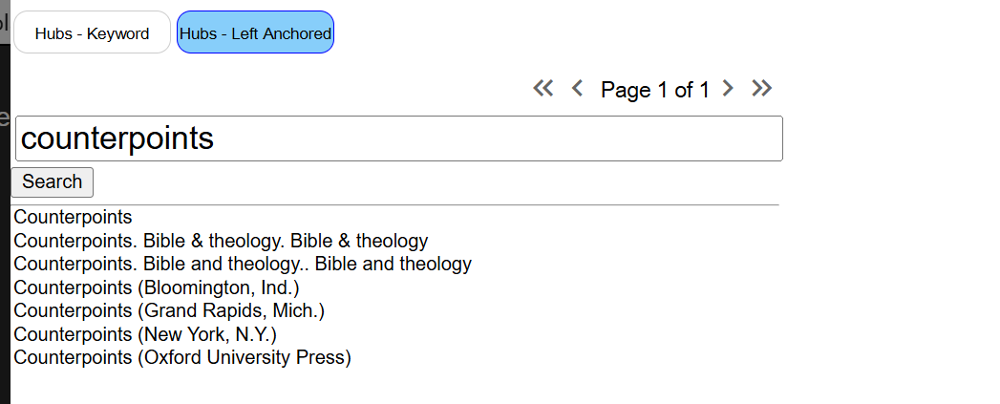
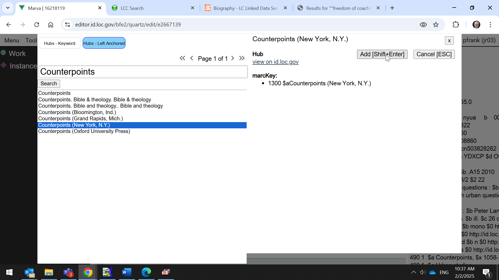
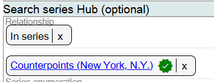
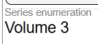
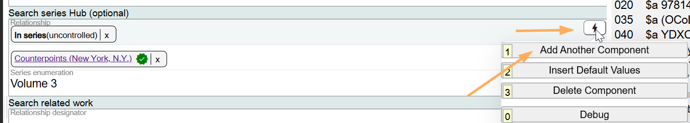
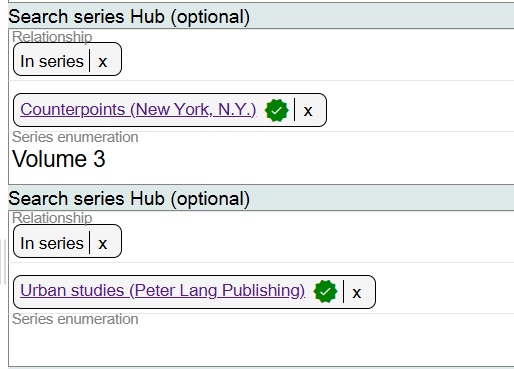

# Search Series Hub (optional)

## Scope

This is an optional lookup search for controlling a series access point to an authorized access point for the series. Because LC policy does not require controlled access points for series, this search is optional. But in a linked data environment, there is a value in being able to point to an actionable URI for the series heading.

## Folio / MARC

- 8XX fields, Series Added Entry

## Relationship

This is a drop-down list. Select the appropriate value. The default value is "in series."

## Search Series Hub

This is a lookup to the LC/NACO Authority File and to BIBFRAME Hubs.

The selected series Hub will be linked in the component:

## Series Enumeration

Record a designation of the sequencing of a part or parts within a series in this field. Use the structured value as indicated in the authority record or Hub.

If you want to search for an additional series Hub, add an additional component.

To change information in the Relationship, click on the **X** next to the term, and search for a new value. To change information in the Search Series Hub, delete the existing series by clicking on the **X** at the end of the series name, and search for the correct series. To change information in the Series enumeration, use the keyboard since this is a literal field.

If you do not find the Hub that is needed, create a Hub in Marva.

See [Appendix E: Hubs](../Reference/e-hubs.md) for more information.

[Back to Table of Contents](../index.md)
