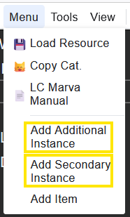

# Additional Instances/Secondary Instances

In Marva, you can add additional instances and create secondary instances for a record under the "Menu" option.

---

[Back to Table of Contents](../index.md)