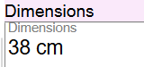
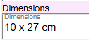
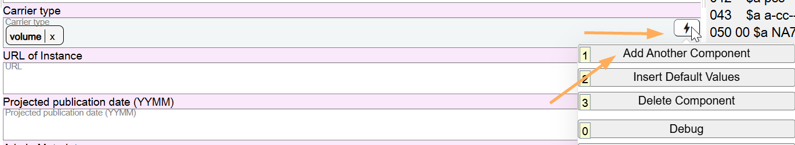

# Carrier Type

## Scope

Carrier Type is a core element in Original RDA and must be recorded in all bibliographic descriptions. If you are working with an AACR2 bibliographic description in Marva, and that description does not have a Carrier type, you should add it.

## Folio / MARC

- 338 field, Carrier Type

## Carrier Type

Select the appropriate value from the dropdown list. volume is the default value for monographs. Selecting Insert Default Values will populate the field with the correct value.

If an additional Carrier type is needed, use the Add Another Component option to repeat the component.

---

[Back to Table of Contents](../index.md)
