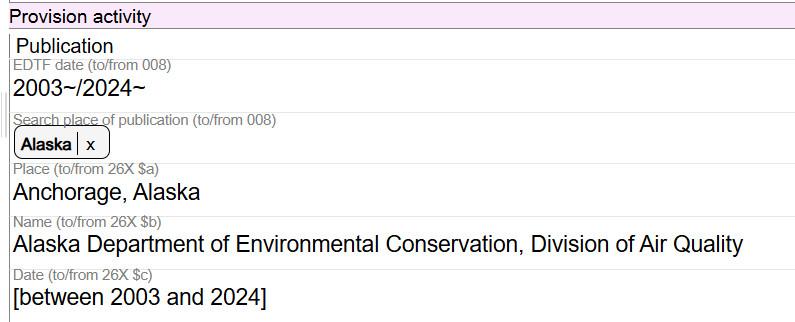

# Copyright Date

## Scope

Record Copyright date in this component.

## Folio / MARC

- 264 field, Production, Publication, Distribution, Manufacture, and Copyright Notice

## Copyright Date

Record Copyright date here. This is a literal value. There is no need to precede the date by the copyright symbol (&#169;). The symbol is implicit in the Copyright date component.

If an additional Copyright date is needed, use the "Additional Literal" action button option to add the additional copyright date in a new field within the same component.

If you need to delete or edit a copyright date, use the delete key on your laptop. This is a literal component and there are no lookups or drop-down values.

---

[Back to Table of Contents](../index.md)
