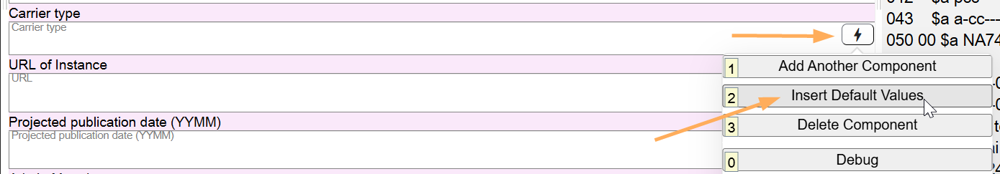

# Dimensions

## Scope

Dimensions is a core element for LC for resources other than serials and online resources.

## Folio / MARC

- 300 field, subfield $c, Dimensions

## Dimensions

Record the dimensions of the Instance here. Follow traditional punctuation guidelines but do not use ISBD punctuation. Do not add ending punctuation, even if the last element is cm. This is a literal field.

---

[Back to Table of Contents](../index.md)
