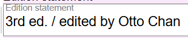
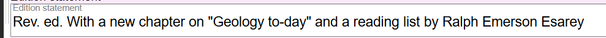
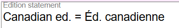

# Edition Statement

## Scope

This is a transcribed value from the Instance being described.

## Folio / MARC

- 250 field, Edition Statement

## Edition Statement

Transcribe an edition statement as it appears on the source of information. Use the slash (/) to separate the Edition statement from a [Statement of responsibility](statement-of-responsibility.md). Use the equals sign (=) to separate parallel edition statements.

---

[Back to Table of Contents](../index.md)
