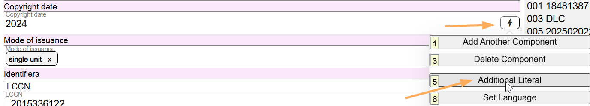
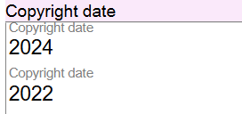
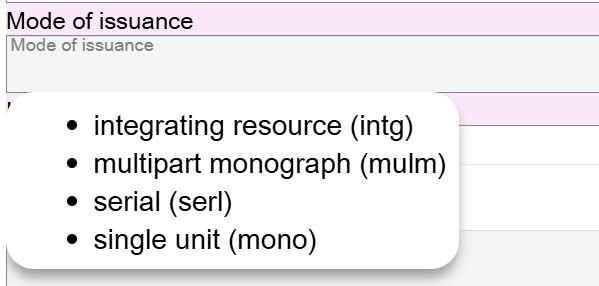
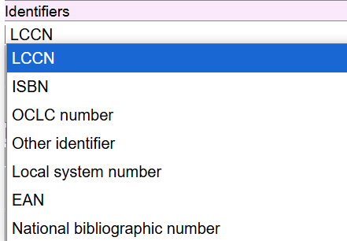
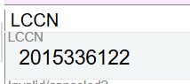
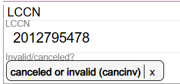
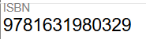
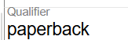
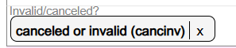

# Identifiers

## Scope

There are seven values for Identifier:

Each recorded identifier value appears in its own Identifier component.

## Folio / MARC

- 010 field, Library of Congress Control Number
- 020 field, International Standard Book Number (ISBN)
- 024 field, Other Standard Identifier
- 035 field, System Control Number

## LCCN

Key in or scan the LCCN in this field.

Follow the MARC spacing conventions for LCCN values. There are two leading spaces before 2015336122 in the example above.

### Invalid/canceled?

If the LCCN is invalid or has been canceled (the LCCN in MARC would appear in the subfield $z of the 010 field), from the drop-down list, select "canceled or invalid." If the LCCN is valid, do not select a value for this field.

## ISBN

Key in the ISBN number without an internal punctuation.

### Qualifier

Add any qualification here. Do not include parentheses.

### Invalid/canceled?

This is a drop-down list to controlled values. If the ISBN is invalid or canceled, select the value "canceled or invalid" from the drop-down list.

If an additional ISBN is recorded, add a new component.

Follow this guidance for recording any other identifiers associated with the Instance.

---

[Back to Table of Contents](../index.md)
