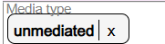
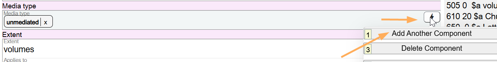
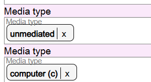
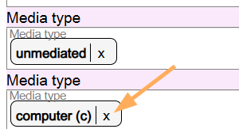

# Media Type

## Scope

Media Type is a core element in Original RDA and must be recorded in all bibliographic descriptions. If you are working with an AACR2 bibliographic description in Marva, and that description does not have a Media type, you should add it.

## Folio / MARC

- 337 field, Media Type

## Media Type

Media type is a drop-down list. Select the appropriate value from the list. The default value for a monograph is unmediated. The default value can be searched from the drop-down list or populated using the Insert Default Values option.

Add additional components if more than one Media type is needed.

Marva does not accommodate the Materials specified option (subfield $3 in Folio / MARC).

To change information in this component, click on the X next to the term and search for the new value.

If the component is no longer needed, delete it.

---

[Back to Table of Contents](../index.md)
