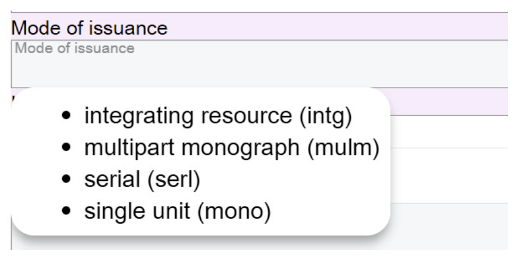

# Mode of Issuance

## Scope

This component is a categorization reflecting whether an Instance is issued in one or more parts, the way it is updated, and whether its termination is predetermined or not. This is a required component.

## Folio / MARC

- Ldr/07, Bibliographic level

## Mode of Issuance

Select the appropriate value from the drop-down list.

The available values are:

- **integrating resource (intg)**
- **multipart monograph (mulm)**
- **serial (serl)**
- **single unit (mono)**

---

[Back to Table of Contents](../index.md)
