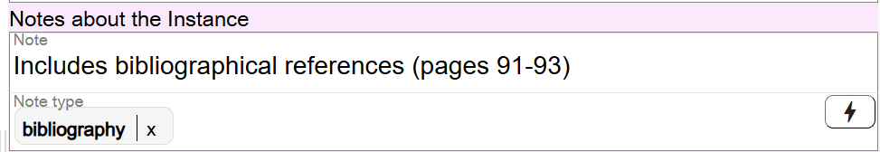
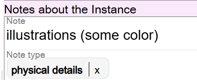
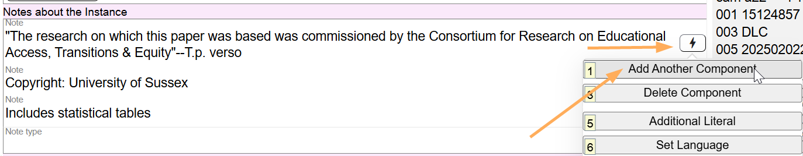

# Notes about the Instance

## Scope

**Notes in Marva are in flux. Most Notes will be recorded in the Instance description, not in the Work description. In Folio / MARC, each 5XX note has a specific definition. Being aware of the definition will help determine where the note goes, with the [Work description](../work-description/), or with the Instance description.**

Record Notes relating to the **language** of the Work in this component in Marva. All other notes are recorded in the Instance description.

## Folio / MARC

- 5XX fields, Note Fields
- 300 field, subfield $e, Accompanying material

## Note

Notes related to the RDA Manifestation are recorded here. In addition, notes about supplementary content of a resource such as the presence of bibliographical references and/or indexes are recorded here, even though in RDA, supplementary content is an Expression attribute (RDA 7.16). A controlled value for the presence of bibliographical references and/or indexes is recorded in the Work entity, in the Supplementary content component.

Note is a literal field. Notes are keyed in. Ending punctuation is optional.

**Controlled values for the presence of bibliographical references and index are recorded in the BIBFRAME Work:

## Note Type

Because MARC 5XX fields define the type of note being recorded, and Marva does not use MARC, Notes are categorized by selecting a value from the drop-down list. If the note is a General Note (General Notes are recorded in the MARC 500 field), do not select a value from the drop-down list. For all other notes, select a value.

Notes that are all related to one of the Note type values may be recorded in the same component but in different fields.

Notes that have a unique Note type value must appear in separate components.

Accompanying material that is placed in the MARC 300 $e field is treated as a note on the Instance in Marva.

---

[Back to Table of Contents](../index.md)
