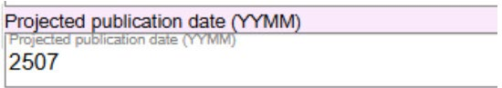

# Projected Publication Date (YYMM)

## Scope

Projected publication date is used for bibliographic data in the Cataloging in Publication Program (CIP). Projected publication date is maintained in the description until the resource is published and the item is received.

## Folio / MARC

- 263 field, Projected Publication Date

## Projected Publication Date (YYMM)

Enter the date in the form YYMM, for example, 2507 = July 2025.

---

[Back to Table of Contents](../index.md)
