# Provision Activity

## Scope

This component is used to transcribe and record information about the Production, Publication, Manufacture, and/or Distribution of the Instance being described.

## Folio / MARC

- 008/06, Type of date/Publication status
- 008/07-10, Date 1
- 008/11-14, Date 2
- 008/15-17, Place of publication, production, or execution
- 260, Publication, Distribution, etc. (Imprint)
- 264, Production, Publication, Distribution, Manufacture, and Copyright Notice

**Note:** Data now coded in the MARC 264 field formerly was recorded in the MARC 260 field. The MARC 264 field was introduced in 2011. Bibliographic records created before 2011 will use the 260 field. The MARC 260 field may continue to be used in cases where the content standard or institutional policies used do not make a distinction between functions.

Library of Congress bibliographic records created after 2011 use the MARC 264 field.

## Provision Activity

The Provision activity component consists of four values for recording Production, Publication, Distribution, and/or Manufacture data. The appropriate value may be selected by clicking on the carrot at the end of the first field in the Provision activity component. The default value is Publication.

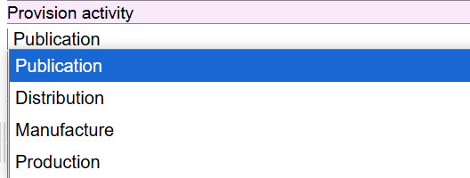

### EDTF date (to/from 008)

The data recorded here will populate the MARC 008/06 (Type of date/Publication status), MARC 008/07-10 (Date 1), and MARC 008/11-14 (Date 2).

The Extended Date/Time Format (EDTF) standard is used for this field.

**EDTF date coding:**

- **YYYY** for simple years. Example: 1925.
- **YYYX** to indicate unknown (currently 'u' is used). Example: 192X (for 192u).
- **YYYY/YYYY** to indicate to/from ranges. Example: 1925/1935
- **YYYY/..** to indicate a range with a defined start date but no current end date. Example: 1925/.. (for 1925- in the 264 or 19259999 in the 008). Note, EDTF syntax is two dots.

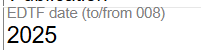

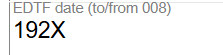

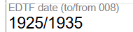

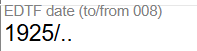

### Search place of publication (to/from 008)

This is a drop-down controlled value that in MARC would be recorded in the 008/15-17 (Place of publication, production, or execution) area. Values in this dropdown are for countries, unless the place of publication is in the U.S., Canada, Great Britain, or Australia. For these places, the value recorded is the first-level administrative division (state, province, or constituent country).

Multiple places may be selected from the drop-down and added to the same field, but only the first record value will populate the 008/15-17.

### Place (to/from 26X $a)

This is a transcribed value from the resource being described. If two places are being transcribed, use the "Additional Literal" action button from the lightning bolt to add a new field. Do not transcribe both places in one field.

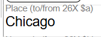

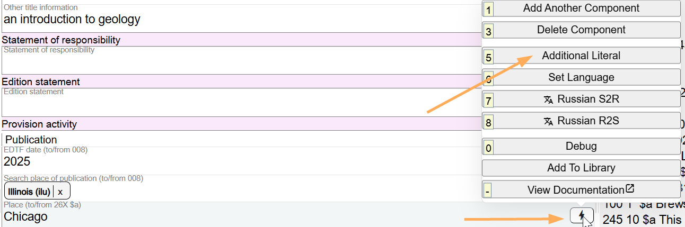

### Name (to/from 26X $b)

This is a transcribed value from the resource being described. If two names are being transcribed, use the "Additional Literal" action button from the lightning bolt to add a new field. Do not transcribe both names in one field.

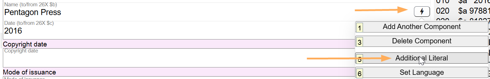

### Date (to/from 26X $c)

This is a transcribed value from the resource being described. Follow conventions used in the 264 subfield $c for recording multiple dates or dates in other calendar systems.

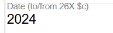

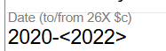

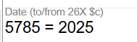

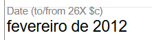

If an additional component is needed for a different function (Production, Manufacture, Distribution), use the Add Another Component feature.

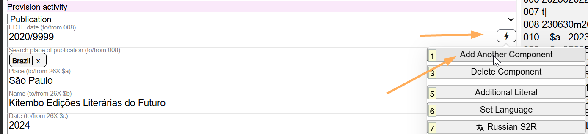

## Best Practices for Recording Provision Activity

### MARC 264 Field

Although the introduction of the 264 field with second indicator values indicating specific functions (Production, Publication, Distribution, Manufacture) eliminated mixing of functions in one field as in the 260 field, there still is semantic meaning in the order of MARC subfields in the 264 field. For example, one 264 field might have this presentation:

> 264 #1 $a [Toronto, Ont.] : $b Fields Institute for Research in the Mathematical Sciences ; $a New York : $b Springer, $c [2013]

where the publisher name Fields Institute for Research in the Mathematical Sciences is connected to [Toronto, Ont.], and the publisher Springer is connected to New York. The semantic meaning is lost in Marva if all this information is included in one component. In Marva, two components are needed to keep the semantic meaning. In a Modern MARC record, using the example above, there will be two 264 fields:

> 264 #1 $a [Toronto, Ont.] : $b Fields Institute for Research in the Mathematical Sciences, $c [2013]

> 264 #1 $a New York : $b Springer.

### When to Use One Provision Activity Component

Use **one** Provision Activity Component for a function (Production, Publication, Distribution, Manufacture) when:

- There is **one** Place of production, publication, distribution, manufacture, **one** Name of producer, publisher, distributor, manufacturer, and **one** Date of production, publication, distribution, manufacture. This includes resources in non-Latin script. Use the "Additional Literal" option in the Lightning Bolt to add fields for the non-Latin script data. The non-Latin data will show up in the paired 880 field in the Modern MARC record.

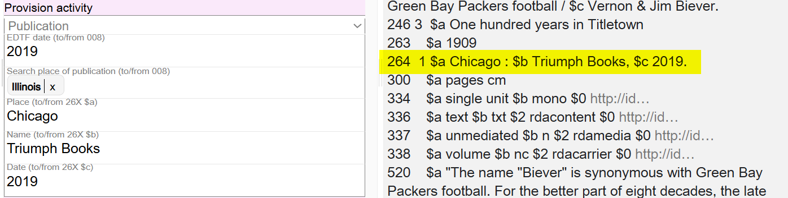

The brackets in Marva connecting the non-Latin fields with the romanized fields are intended to group the fields and have no impact on the Modern MARC view.

- There are **two or more** Places of production, publication, distribution, manufacture, **one** Name of producer, publisher, distributor, manufacturer, and **one** Date of production, publication, distribution, manufacture. This includes resources in non-Latin script. Use the "Additional Literal" option in the Lightning Bolt to add fields for the non-Latin script data. The non-Latin data will show up in the paired 880 field in the Modern MARC record.

![Example showing one Provision Activity component for Publication with two Places: "Chicago, IL" and "Minneapolis, MN", one Name "Kaleidoscope Publishing, Inc", Date "[2021]", with MARC 264 field highlighted](../images/page081_img01.png)

The brackets in Marva connecting the non-Latin fields with the romanized fields are intended to group the fields and have no impact on the Modern MARC view.

- There is **one** Place of production, publication, distribution, manufacture, **two or more** Names of producer, publisher, distributor, manufacturer, and **one** Date of production, publication, distribution, manufacture. This includes resources in non-Latin script. Use the "Additional Literal" option in the Lightning Bolt to add fields for the non-Latin script data. The non-Latin data will show up in the paired 880 field in the Modern MARC record.

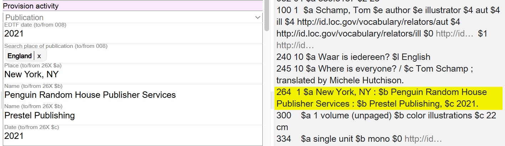

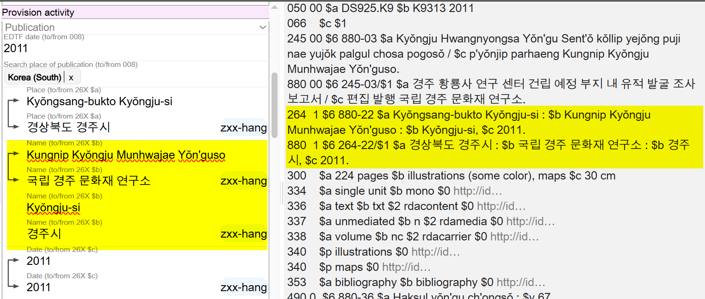

The brackets in Marva connecting the non-Latin fields with the romanized fields are intended to group the fields and have no impact on the Modern MARC view.

### When to Use Two Provision Activity Components

Use **two** Provision Activity Components for a function (Production, Publication, Distribution, Manufacture) when:

- There are **two or more** Places of production, publication, distribution, manufacture, **two or more** Names of producer, publisher, distributor, manufacturer, and **one** Date of production, publication, distribution, manufacture. This includes resources in non-Latin script. Use the "Additional Literal" option in the Lightning Bolt to add fields for the non-Latin script data. The non-Latin data will show up in the paired 880 field in the Modern MARC record.

The brackets in Marva connecting the non-Latin fields with the romanized fields are intended to group the fields and have no impact on the Modern MARC view.

### Marva Import

When importing a MARC record with complex Provision Activity information, Marva will separate the data into two components. The second component will carry the 008 information and the transcribed date information. There is no need to change this arrangement.

When inputting Provision Activity information natively in Marva, if there are two Provision Activity components, the transcribed date (Date (to/from 26X $c)) should only be given once, in the component that contains the 008 information.

If there is non-Latin data in the Provision Activity component(s), the transcribed date (Date (to/from 26X $c)) is given in both the non-Latin field and the romanized field.

## Other Examples

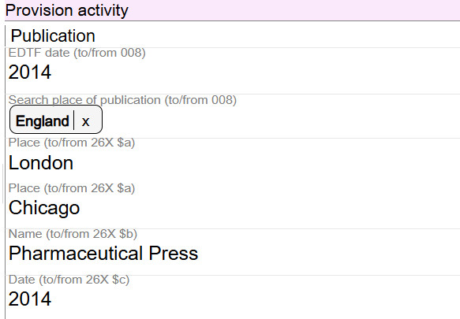

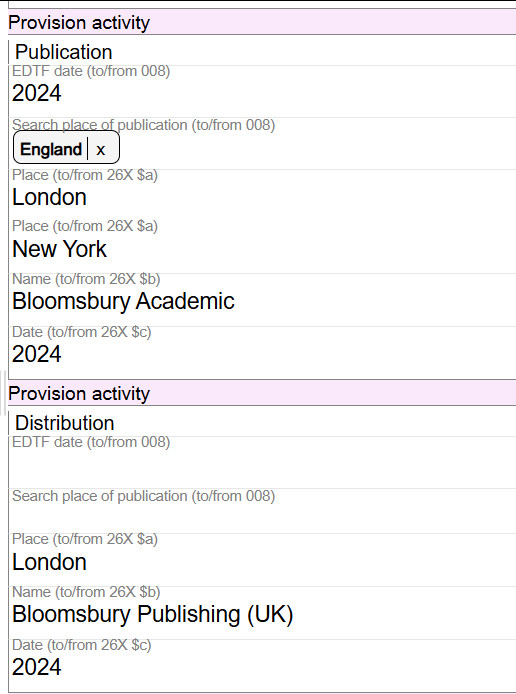

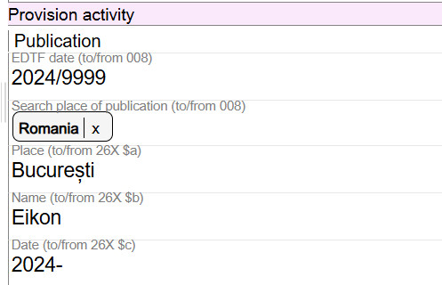

![Publication with EDTF date "2003~/2024~", Search place "Alaska", Place "Anchorage, Alaska", Name "Alaska Department of Environmental Conservation, Division of Air Quality", Date "[between 2003 and 2024]"](../images/image-1772569217612.png)

![Publication with EDTF date "2024", Search place "Brazil", Place "Curitiba, PR", Name "Kotter Editorial", Date "[2024]", with Copyright date "2023"](../images/image-1772569249276.png)

---

[Back to Table of Contents](../index.md)
