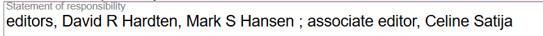

# Statement of Responsibility

## Scope

Transcribe statement of responsibility here. This is the content of MARC 245 field, subfield $c. Because of the limitations of the MARC 245 field, often titles may appear in subfield $c as well. To facilitate BIBFRAME to MARC conversions, transcribe information in the Statement of responsibility just as you would transcribe it in the MARC 245 field, subfield $c, including ISBD punctuation.

## Folio / MARC

- 245 field, subfield $c - Statement of responsibility, etc.

## Statement of Responsibility

Separate more than one statement of responsibility with a space - semi-colon - space. Record the statements in the order indicated by the sequence, layout, or typography of the source of information from which the corresponding title is taken.

![Statement of responsibility example with parallel text: "editore Marco Trulli ; testi Hans Baumann [and ten others] = La Serpara : der Garten von Paul Wiedmer / herausgeber Marco Trulli ; Texte Hans Baumann [and ten others] = La Serpara : the garden of Paul Wiedmer / editor Marco Trulli ; texts Hans Baumann [and ten others]"](../images/page075_img02.png)

Only include one Statement of responsibility component. To delete text in the Statement of responsibility, use the delete key on the keyboard. If you want to delete all the content of the Statement of responsibility component, delete the component.

---

[Back to Table of Contents](../index.md)
