# Title Information

## Scope

Title information is used to transcribe title information from the Instance. All the values in this component are literals.

## Folio / MARC

- 245 field, Title Statement
- 246 field, Varying Form of Title

## Title Information

There are three values for this component.

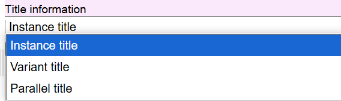

Instance title is the default value.

### Non-sort character count

This numerical value indicates initial words and marks of punctuation that are not to be considered in title searching. The Non-sort character count is identical to the MARC 245 Indicator 2 value.

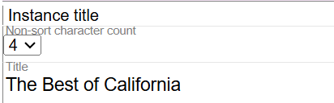

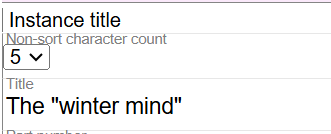

### Title

Transcribe the Title proper of the Instance in this field. Include initial articles and set the Non-sort character count to disregard the initial article in searching. This is a literal field. Do not use ISBD punctuation.

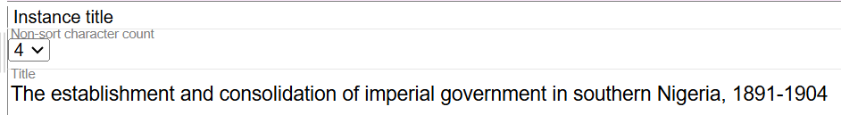

### Part number

If there is a part designation in the title, transcribe it here. Do not use ISBD punctuation.

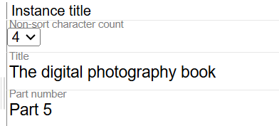

### Part name

If there is a part name in the title, transcribe it here. Do not use ISBD punctuation.

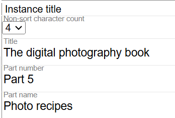

### Other title information

If there is other title information for the title, transcribe it here. Do not use ISBD punctuation.

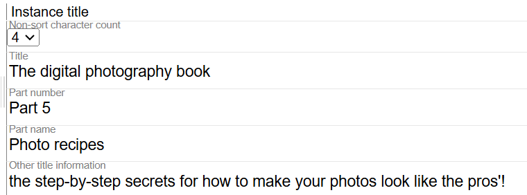

When there is Other title information in the instance title there will be a second option, "Send Subtitle to Work Variant" that will create a variant title in the work with the information

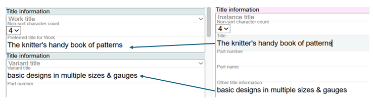

There can only be one Instance title. If you need to record a Parallel title or a Variant title, add a new Title component in the [Work description](../work-description/) and select the appropriate value. Parallel titles and Variant titles are recorded in the Work description. Titles that are dependent on a location, such as a Spine title or a Caption title, are recorded in the Instance description.

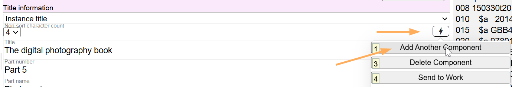

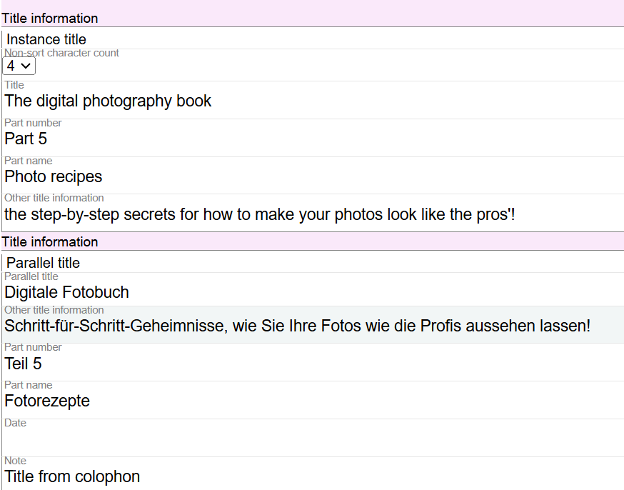

### Send Subtitle to Work Variant 

This feature allows you to send the subtitle from the Instance to the Work forcing it to copy over as a Variant Title.

Found in the action button:

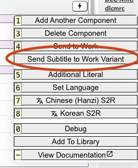

Clicking this will copy any value in the Instance Subtitle, often labeled "Other title information" to the Work as a new component.

You can highlight a portion of Subtitle and this function will only send the highlighted portion to the work

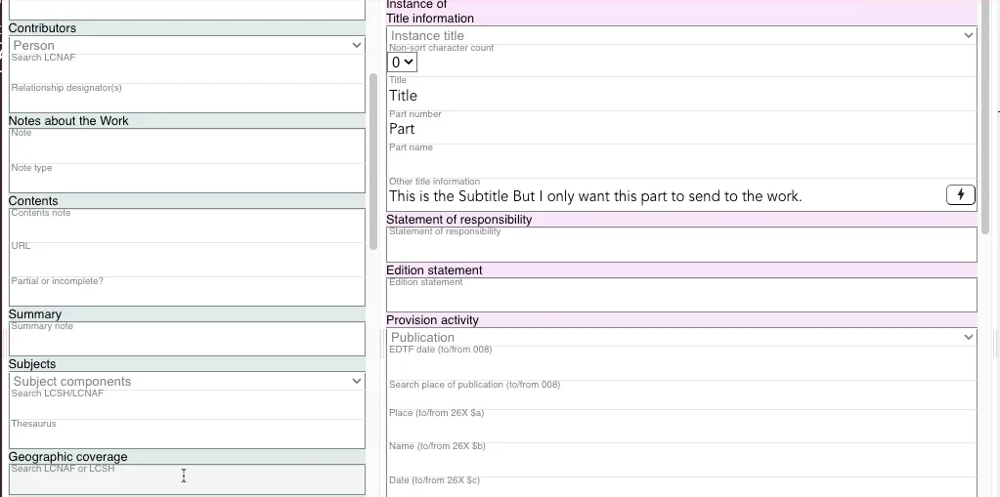

### Date

Leave this field blank.

### Note

This is a literal field to show information about the title.

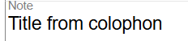

To delete a component, select Delete Component.

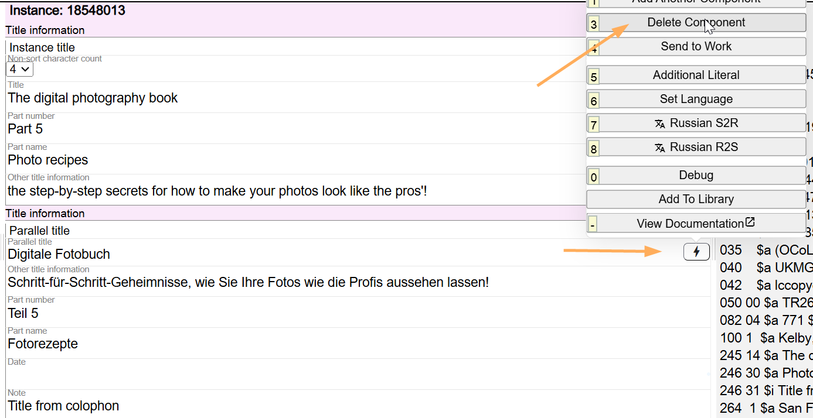

> **See also:** [Title Information: Best Practice for Non-Latin Titles](title-non-latin.md) for guidance on recording non-Latin script titles.

---

[Back to Table of Contents](../index.md)
