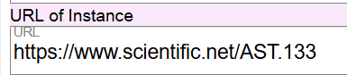

# URL of Instance

## Scope

This component gives the electronic access location for an online resource.

## Folio / MARC

- 856 field, Electronic Location and Access

## URL of Instance

Record the URL for electronic access here.

Do not record a URL that is restricted for use at a specific institution (e.g., proxy URL) in a master utility record unless it is the only URL available. When an existing 856 field URL is in a MARC source record, when that record is imported into Marva for editing, the 856 information will be added to a Secondary Instance.

---

[Back to Table of Contents](../index.md)
