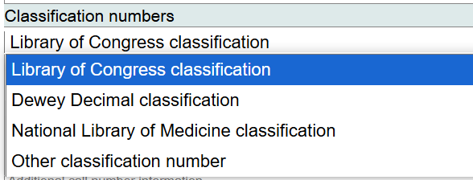
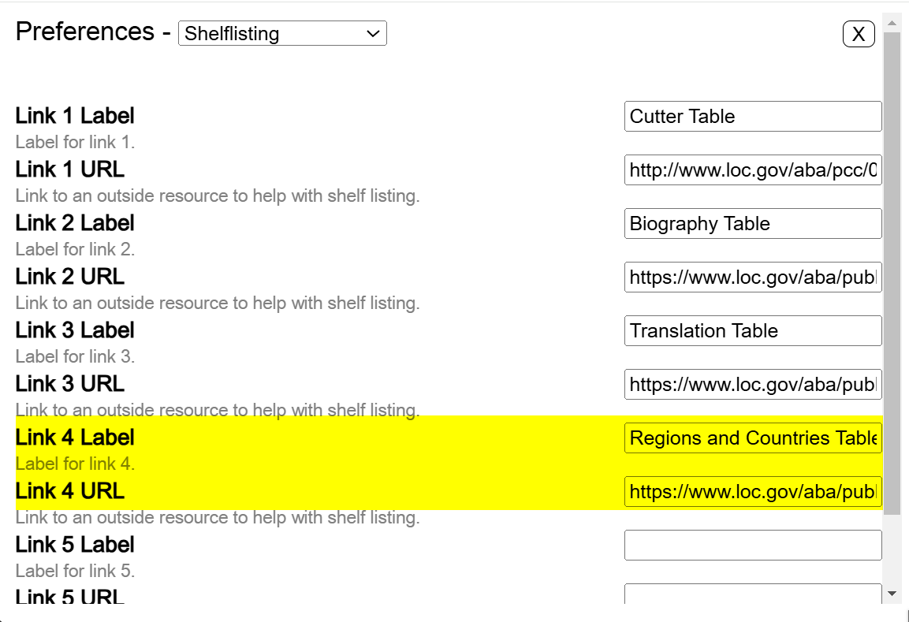
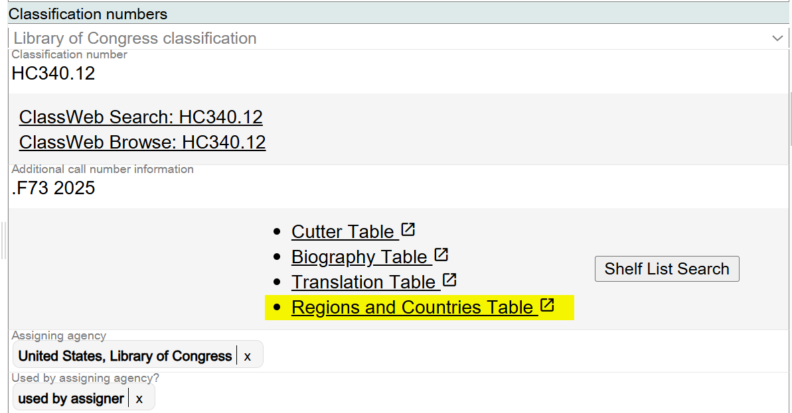
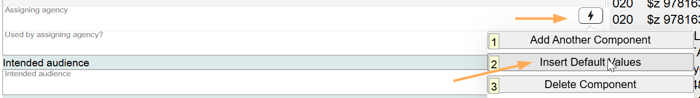
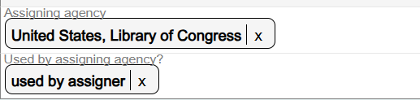
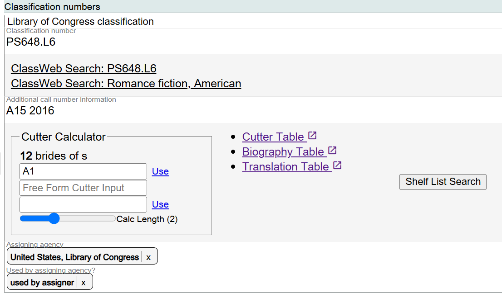
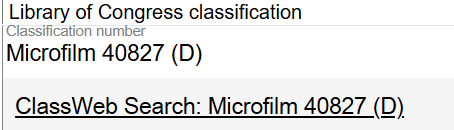
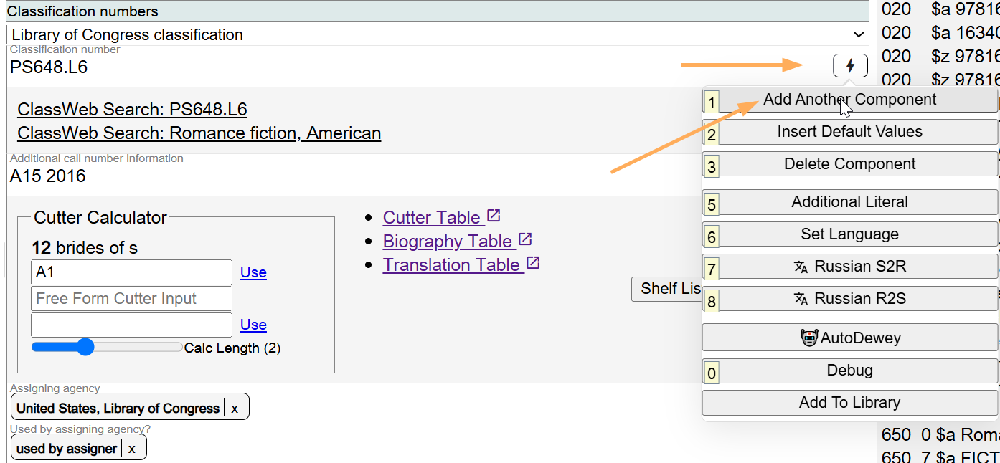
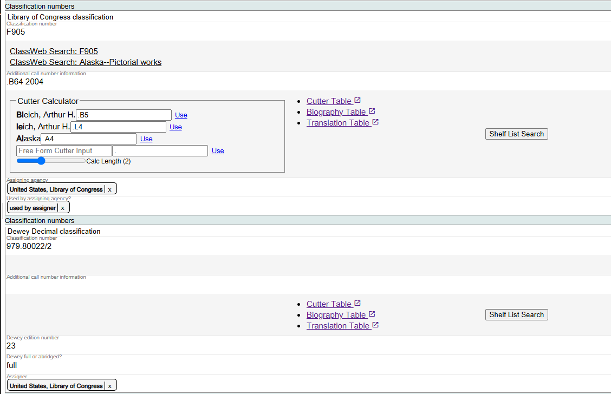

# Classification Numbers

## Scope

This component is used for the classification and call number assigned to the Work.

## Folio / MARC

- 050 field, Library of Congress Call Number
- 051 field, Library of Congress Copy, Issue, Offprint Statement
- 082 field, Dewey Decimal Classification Number

## Classification Numbers

There are four possible values for this component. The default value is Library of Congress classification.

---

## Library of Congress Classification

Marva has built-in tools to assist with the assignment of LC Classification numbers and to assist with the shelflisting aspect of completing call numbers.

An LC Classification number entered into the Library of Congress Classification field generates two links to ClassificationWeb, the source of LC Classification data.

- **The first link** points to the LC Classification number in ClassificationWeb. Clicking on the link will take the user to the LC Classification schedules, where the hierarchy of the number can be checked, and other classification numbers may be searched.
- **The second link** points to the ClassificationWeb Correlations feature. The first assigned LCSH subject string in the BIBFRAME work description will appear as the link. Clicking on the link takes users to ClassificationWeb, where the Correlations feature can be used to confirm the LC Classification number based on the first assigned LCSH subject string.

### Additional Call Number Information

The elements added to the classification number to complete the call number appear here, including the year of publication. This information is informally called the "book number." The book number serves to organize works on one subject (in one classification number) by reflecting, normally, an alphabetical arrangement by the creator and/or the preferred title. Since 1982, monograph call numbers contain a third element, a date. Copy information is not included in this field.

### Cutter Calculator, Cutter Table, Biography Table, Translation Table, Shelf List Search

These tools assist in completing the call number for a resource, and for assuring that the call number files correctly within the class in the LC Online Shelflist.

#### Cutter Calculator

This interactive tool works with the Cutter Table to build Cutter numbers based on any of the possible shelflisting elements in the bibliographic resource. Always refer to the LC Classification schedule to determine the element in the bibliographic resource that will be used to create the book number, and always follow the existing shelflist order in the LC Online Shelflist. The Cutter Calculator is used as a guide, but the existing array in the LC Online Shelflist takes precedence over the information provided by the Cutter Calculator.

#### Cutter Table

A link to the Cutter Table for creating an alpha-numeric Cutter to be assigned in the book number. The Cutter Table is only a guide! All Cutters must fit into the arrangement in the LC Online Shelflist. The existing array in the LC Online Shelflist takes precedence over the Cutter Table.

#### Biography Table

LC Classification schedules have Biography class numbers. A biography class number is a class number established specifically for biographical works. A collection of an individual's letters or compilation of a person's speeches may be classed in a biography class number. Sometimes separate class numbers are provided for these topics, as well as for autobiography or dictionaries and indexes.

When shelflisting biographies in biography classes, the Biography Table is used when an individual biographee is represented by the first Cutter, the Biography Table is used to subarrange materials, unless the schedule provides otherwise.

#### Translation Table

The Library of Congress uses a Translation Table when assigning Cutter numbers for translations, including texts in parallel languages.

Use the Translation Table when assigning a Cutter number for a translation only when entry is under personal author or title and the preferred title plus the language is provided. Distinguish translations from the original work by using the Cutter number of the original work modified by the application of the Translation Table.

As with the Cutter Table, all Cutters for translations must fit into the arrangement in the LC Online Shelflist. The existing array in the LC Online Shelflist takes precedence over the Translation Table.

#### Shelf List Search

The Shelf List Search is the "source of truth" for adding book numbers to classification number to form a full call number. Use the Shelf List Search to assure that the call number fits into the existing array in the LC Online Shelflist. Although the Cutter Table and the Translation Table may be used as a guide, the call number for a resource must always follow the arrangement in the LC Online Shelflist.

### Add Additional Documentation

You can add other documentation that you use in the shelflisting process by going to **Preferences > Shelflisting**.

The Regions and Countries Table from the Classification and Shelflisting Manual (CSM) instruction sheet G 300 (https://www.loc.gov/aba/publications/FreeCSM/G300.pdf) was added above.

### Assigning Agency

The name of the assigning agency based on the MARC Organization Code for the agency is given here. Searching DLC (the Library's MARC Organization Code) is the easiest way to add this value.

### Used by Assigning Agency?

This is a drop-down list to the Status codes vocabulary in ID.LOC.GOV. "used by assigner" is the default value for a valid LC call number.

The Insert Default Values may be used to populate both the Assigning agency and Used by assigning agency? values: United States, Library of Congress, and used by assigner.

These two values generate first indicator 0 and second indicator 0 in the MARC 050 field.

If an additional classification number is needed, for example, a Dewey number, add a new component and select Dewey Decimal classification.

---

## Dewey Decimal Classification

The Dewey Decimal classification component includes fields for:

- Classification number
- Additional call number information
- Dewey edition number
- Dewey full or abridged?
- Assignor

---

## Alternate Classification Numbers

Except for bibliographies of law and music and those topics classed in Z1-Z1200, the Library of Congress classification provides for the classification of bibliographies in class Z. Many libraries that use LC cataloging records prefer to classify bibliographies in topical numbers rather than in the bibliography numbers in class Z. As a service to these libraries, LC provides in its cataloging records for bibliographies both the Z classification number and an alternate topical class number. The latter number is not used to shelve LC's own copy(ies) of the work.

In traditional MARC bibliographic records, alternate class numbers appear in a second subfield $a in the 050 field.

**Example:** `050 00  $a Z7914.C75 $b J34 1984 $a T385`

When a traditional MARC bibliographic record with an alternate classification number is imported into Marva, the alternate classification number will appear in its own Classification component, and the Modern MARC record will record the alternate classification number in a separate 050 field with both indicators set to 00.

---

Classification and call numbers that would be recorded in the MARC 051 field will be recorded in the Marva Item record.

To change any value in the Classification component, delete the value and add the new one. The Classification component is fully interactive.

[Back to Table of Contents](../index.md)
