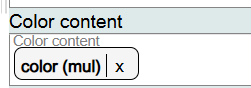
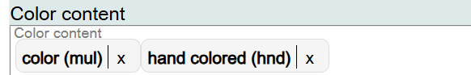
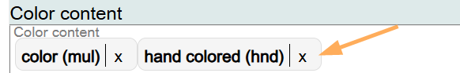
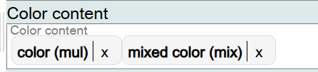
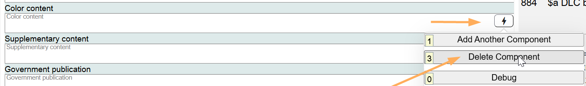

# Color Content

## Scope

This component is used to identify the presence of color illustrations in the Work.

## Folio / MARC

- 300 subfield $b, Other physical details

## Color Content

This is a drop-down list for controlled values. **Color (mul)** is the default value for recording the presence of color illustrations in a Work.

If you want to record additional values for Color content in the Work, they can be added in the same field.

To change information in this component, click on the **X** next to the Color content value, and search for the new value.

If the component is no longer needed, delete it.

[Back to Table of Contents](../index.md)
