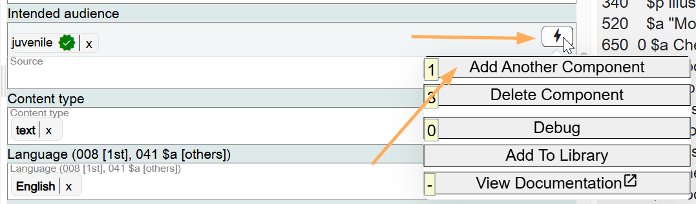
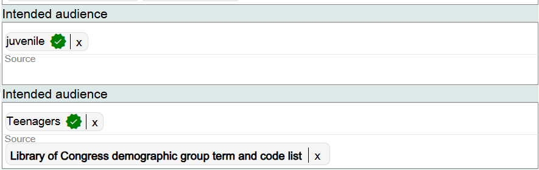
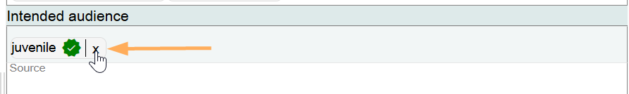
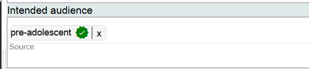
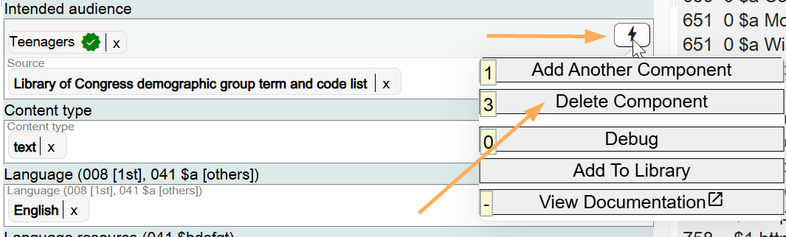

# Content Type

## Scope

This component is used for the RDA Content type of the Work. RDA Content type is a Core requirement for all bibliographic records, not just RDA bibliographic records. If you are working with an AACR2 bibliographic description in Marva, and that description does not have a Content type, you should add it.

## Folio / MARC

- 336 field, Content Type

## Content Type

This is a drop-down list. The default value for a monograph is **text**. The default value can be searched from the drop-down list or populated using the Insert Default Values option.

Additional values for Content type can be added in the same field.

Marva does not accommodate the Materials specified option (subfield $3 in Folio / MARC).

To change information in this component, click on the **X** next to the term and search for the new value.

If the component is no longer needed, delete it. But remember that Content type is a Core value.

[Back to Table of Contents](../index.md)
