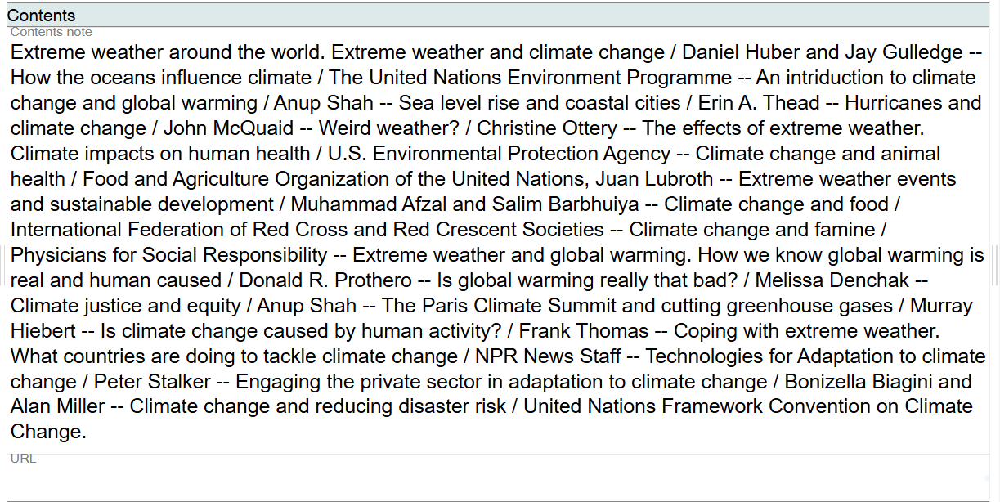

# Contents

## Scope

This component is used for the contents of the Work.

## Folio / MARC

- 505 field, Formatted Contents Note

## Contents Note

This is a literal field. Key in the contents here. Follow ISBD practice as illustrated in LC-PCC PS 25.1.1.3 for separating sections with `--` and separating titles from statements of responsibility with a `/`.

Ending punctuation is optional.

## URL

Leave this field blank.

To change information in this component, use the delete key. This is a literal value so treat it as regular text.

[Back to Table of Contents](../index.md)
