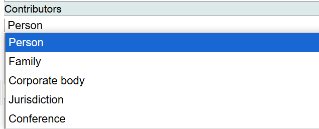
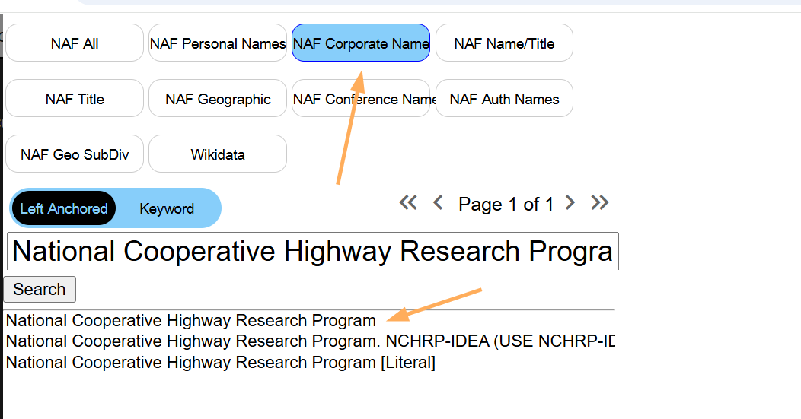
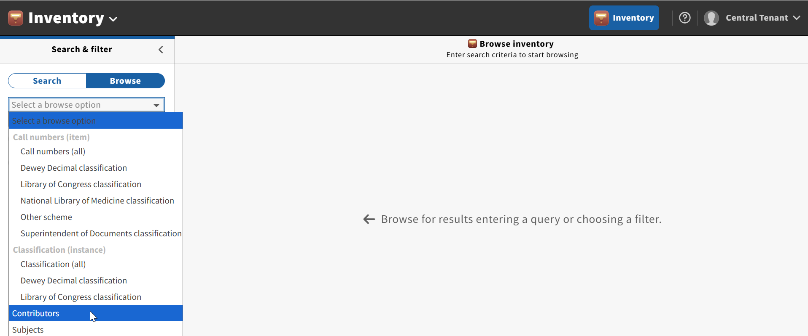
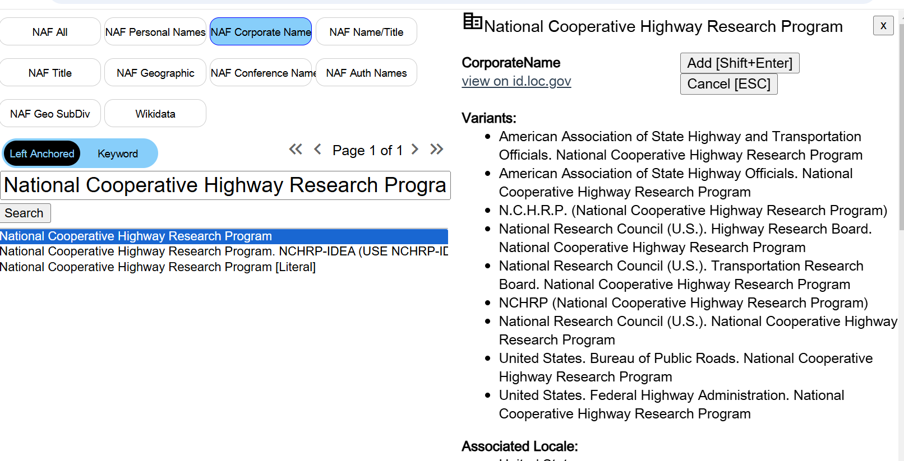
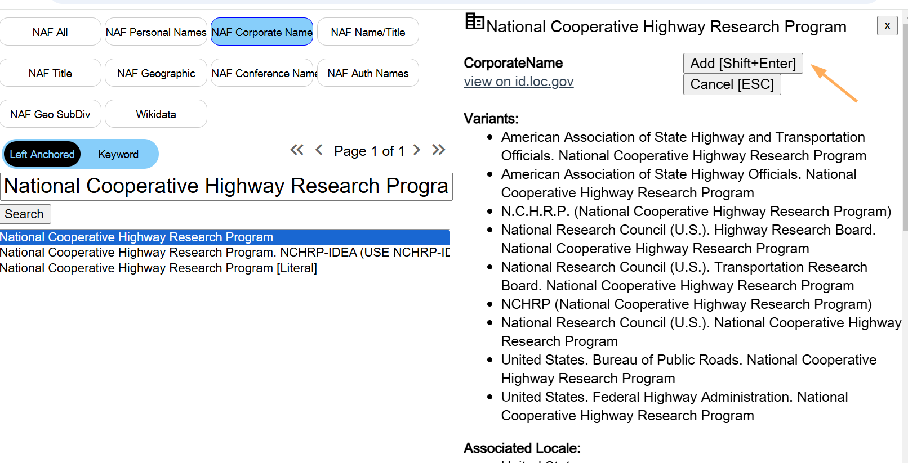
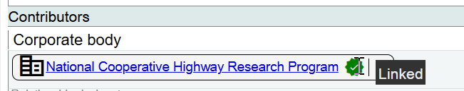
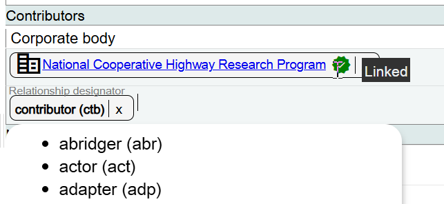
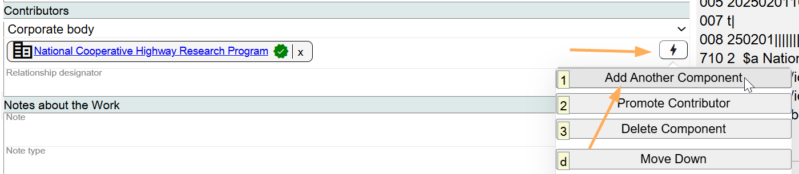
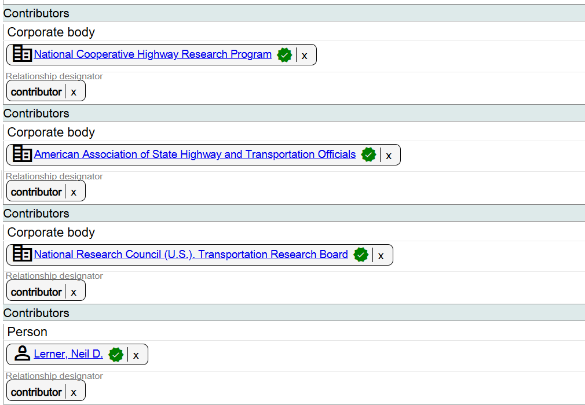
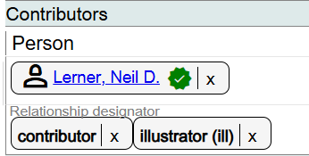

# Contributors

## Scope

This area is used for the person(s), family(ies), corporate body(ies), jurisdiction(s), or conference(s) that are contributors to the work.

## Folio / MARC

- 1XX field (Primary contributor/Creator only)
- 7XX field(s)

## Contributors

The available categories are:

- Person
- Family
- Corporate body
- Jurisdiction
- Conference

## Search LCNAF

Key in the person, family, corporate body, jurisdiction, or conference that you are searching for.

In Folio this would be the same as Browse Contributors.

To see the full authority record for any name in the list, highlight the name and the authority record will appear in the right-hand panel.

When you have identified the correct name, click on **Add [Shift+Enter]**.

The URI associated with the name will be added to Marva.

## Relationship Designator

Select a value from the drop-down list.

To add additional Contributors, add additional components for Contributor.

If there is a second appropriate relationship designator for any of the contributors, just add it in the same field.

To change any of the names you selected as the Contributors, click on the **X** next to the name and search for the correct name. To change or delete the relationship designator, click on the **X** next to the term.

[Back to Table of Contents](../index.md)
