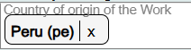
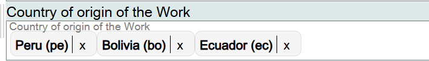
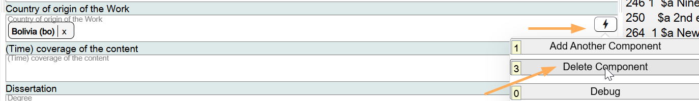

# Country of Origin of the Work

## Scope

In Original RDA, Place of Origin of Work is a core element when needed to differentiate a work from another work with the same title or from the name of an agent.

## Folio / MARC

- 370 field, Associated Place, subfield $g, Place of origin of work or expression

This value is not the same as the Place of Publication.

## Country of Origin of the Work

This is a drop-down list for controlled values from the MARC List for Countries and First-Order Political Divisions.

To add another value for Country of origin of the Work, just add it to the same field.

To change information in this component, click on the **X** at the end of the value and select the appropriate value from the drop-down.

If the component is not needed, delete it.

[Back to Table of Contents](../index.md)
