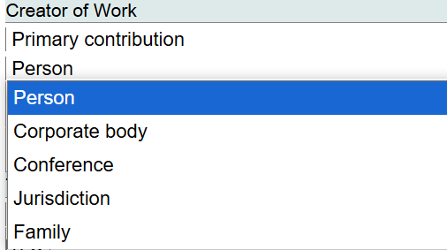
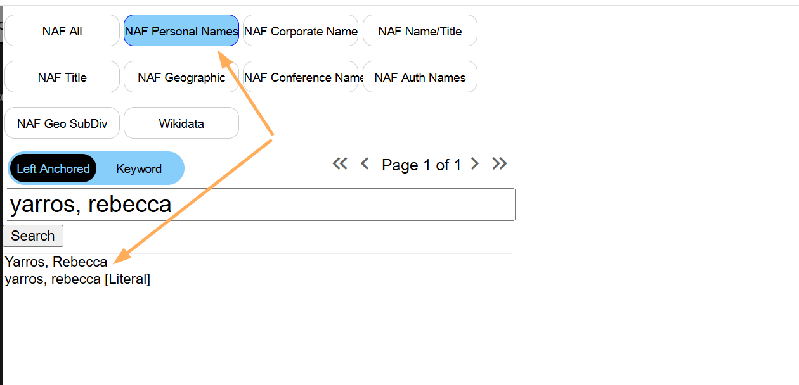
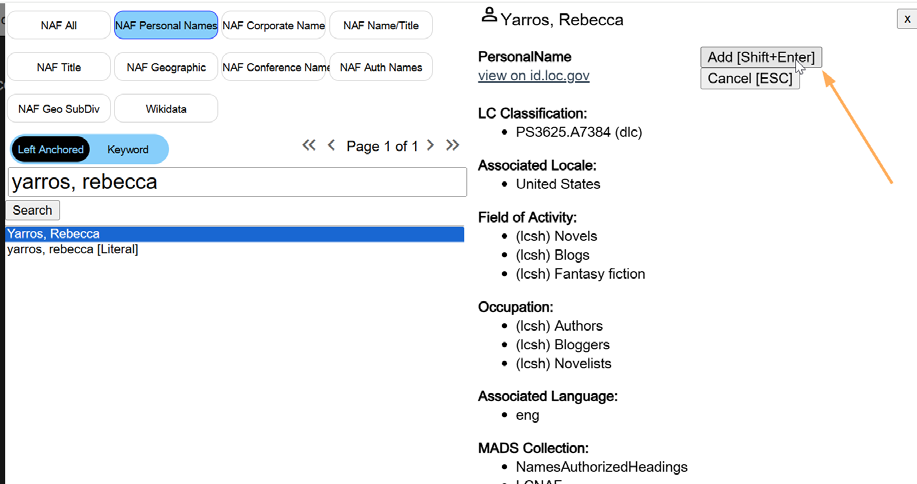
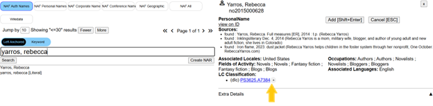
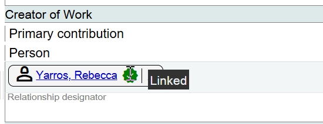
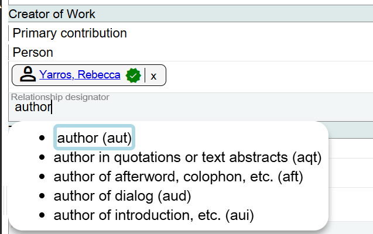
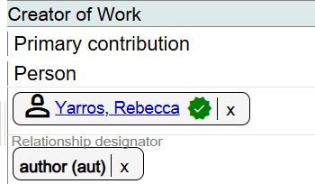
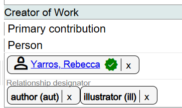
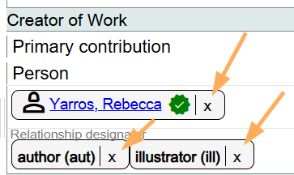
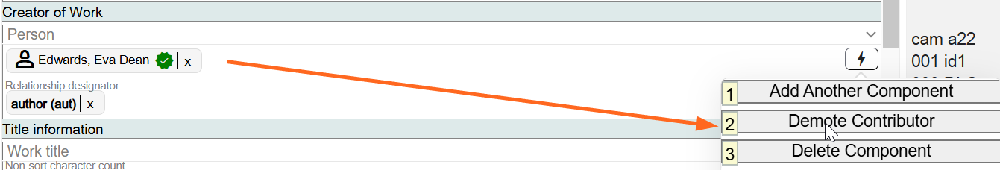

# Creator of Work

## Scope

This area is used for the person, family, corporate body, jurisdiction, or conference that is the creator of the work. There can only be one Creator of Work.

## Folio / MARC

- 1XX field

## Primary Contribution

Select the appropriate category from the drop-down list.

The available categories are:

- Person
- Corporate body
- Conference
- Jurisdiction
- Family

## Search LCNAF

Key in the person, family, corporate body, jurisdiction, or conference that you are searching for.

In Folio this would be the same as Browse Contributors.

To see the full authority record for any name in the list, highlight the name and the authority record will appear in the right-hand panel.

When you have identified the correct name, click on **Add [Shift+Enter]**.

The URI associated with the name will be added to Marva.

You can also add the classification number from the NAR

The icon changes to give some feedback: + >> ✓  

## Relationship Designator

Select a value from the drop-down list.

The drop-down list includes values such as:

- author (aut)
- author in quotations or text abstracts (aqt)
- author of afterword, colophon, etc. (aft)
- author of dialog (aud)
- author of introduction, etc. (aui)

If there is a second appropriate relationship designator, just add it in the same field.

To change the name you selected as the Primary contribution, click on the **X** next to the name and search for the correct name. To change or delete the relationship designator, click on the **X** next to the term.

## Demoting the Primary Contribution

To demote the primary contributor, use the lightning bolt icon and select **Demote Contributor**. This will move the current primary contributor down among the other contributors, allowing you to select the appropriate contributor to assign as the Creator of Work.

[Back to Table of Contents](../index.md)
