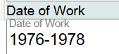

# Date of Work

## Scope

In Original RDA, Date of Work is a core element when needed to differentiate a work from another work with the same title or from the name of an agent. Date of Work is not the same as Date of Publication (RDA 2.8.6).

## Folio / MARC

- 046 field, Special Coded Dates, subfield $k, Beginning or single date created

## Date of Work

Date of Work is recorded as a literal value.

This component can be duplicated, but one component should be sufficient to record Date of Work information.

To change information in this component, delete using the keyboard since this is a literal value.

If the component is not needed, just delete the information in the component.

[Back to Table of Contents](../index.md)
