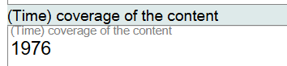
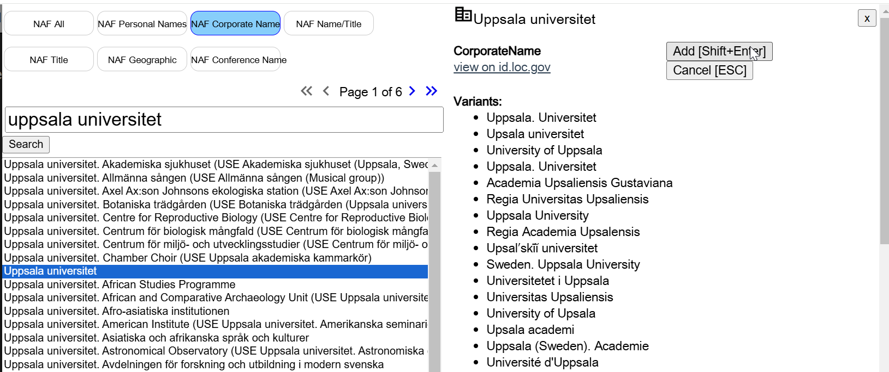
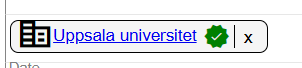
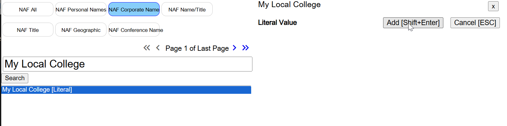
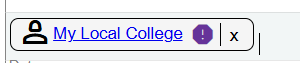
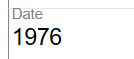
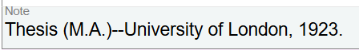
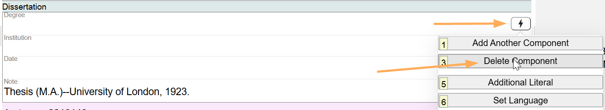

# Dissertation

## Scope

This component is used to record information about a dissertation or thesis related to the Work. A Dissertation statement can be structured by recording information in the Degree, Institution, and Date fields, or it can be unstructured by recording all the information in a Note.

## Folio / MARC

- 502 field, Dissertation Note

---

## Structured Description

### Degree

Record a value from any source. This is a literal field.

### Institution

This is an optional lookup to the LC/NACO Authority File. But the granting institution does not need to be recorded in the authorized access point from the LC/NACO Authority File. If the granting institution is not represented in the LC/NACO Authority File, record a value from any source in this field.

If the granting institution is not in the LC/NACO Authority File, a literal value can be used:

### Date

Record a value from any source. This is a literal value.

---

## Unstructured Description

Use the Note field. There is no prescribed punctuation for this information.

---

To change information in structured description, delete values in the Degree and Date by using the keyboard since these are literal values. To delete the Institution, click on the **X** next to the name.

If the component is not needed, delete the component.

[Back to Table of Contents](../index.md)
