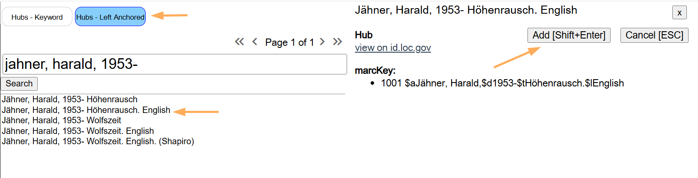
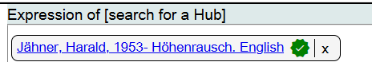
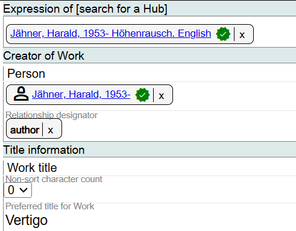
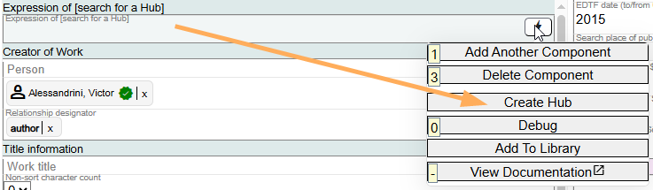

# Expression of [search for a Hub]

## Scope

This lookup search is used to add a uniform title to a Work description.

## Folio / MARC

- 130 field, Main Entry - Uniform Title
- 240 field, Uniform Title

## Expression of [search for a Hub]

Use this component if you would add a 130 field or a 240 field in a MARC record.

Search for the Hub by keying in the name or title. Marva will search the Hubs database and display matching results. Use the **Hubs - Left Anchored** filter to arrange results alphabetically.

When you have identified the correct Hub, click on **Add [Shift+Enter]**. The Hub will be linked in the Expression of field with a green verification icon.

The selected Hub will appear in the Expression of field, and related components such as Creator of Work and Title information may be auto-populated based on the Hub data.

## If You Do Not Find the Hub

If you do not find the Hub that is needed:

1. If you would create a title or name-title authority record in the LC/NACO Authority File for the expression, create a NAR in Folio and wait for the record to migrate to the Marva view of the LC/NACO Authority File. This should take 5 minutes.

2. If you would not create a title or a name-title authority record in the LC/NACO Authority File for the expression, create a Hub in Marva.

See [Appendix E: Hubs](../appendices/e-hubs.md) for more information.

[Back to Table of Contents](../index.md)
